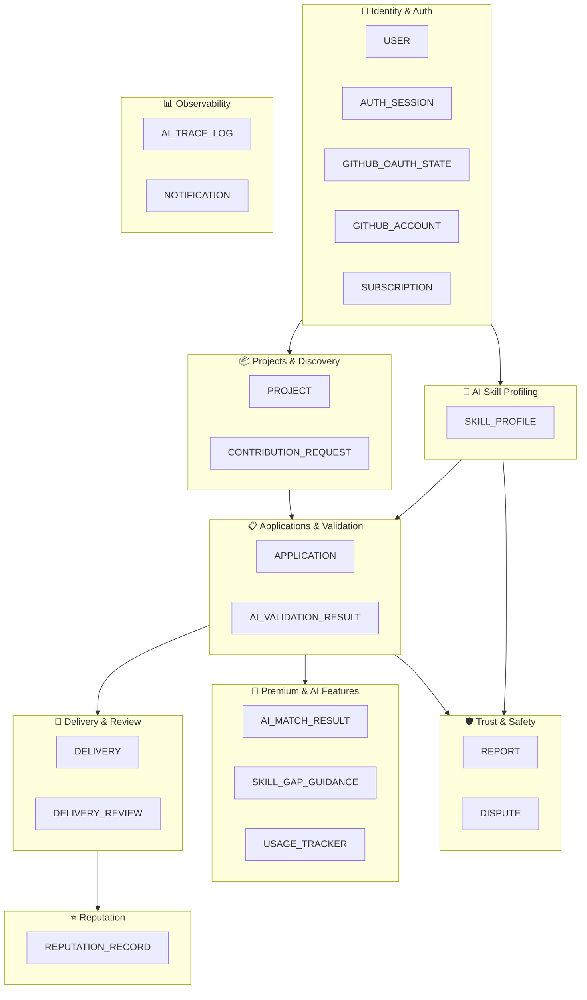

# Share-k — Entity Relationship Diagram (ERD)

## Complete System ERD

```mermaid
erDiagram

    %% ──────────────────────────────────────────────
    %% CORE IDENTITY & AUTH
    %% ──────────────────────────────────────────────

    USER {
        UUID id PK
        VARCHAR email UK "NOT NULL"
        VARCHAR password_hash "NOT NULL"
        VARCHAR first_name "NOT NULL"
        VARCHAR last_name "NOT NULL"
        VARCHAR avatar_url
        ENUM role "owner | contributor | admin"
        ENUM status "pending | active | suspended | deactivated"
        VARCHAR preferred_language "ar | en, DEFAULT en"
        TIMESTAMP created_at "NOT NULL"
        TIMESTAMP updated_at "NOT NULL"
        TIMESTAMP last_login_at
    }

    AUTH_SESSION {
        UUID id PK
        UUID user_id FK "NOT NULL"
        VARCHAR access_token_hash UK "NOT NULL"
        VARCHAR refresh_token_hash UK "NOT NULL"
        VARCHAR user_agent
        VARCHAR ip_address
        TIMESTAMP expires_at "NOT NULL"
        TIMESTAMP refresh_expires_at "NOT NULL"
        TIMESTAMP revoked_at
        TIMESTAMP created_at "NOT NULL"
        TIMESTAMP updated_at "NOT NULL"
    }

    GITHUB_OAUTH_STATE {
        UUID id PK
        UUID user_id FK "NOT NULL"
        VARCHAR state_hash UK "NOT NULL"
        TIMESTAMP expires_at "NOT NULL"
        TIMESTAMP consumed_at
        TIMESTAMP created_at "NOT NULL"
    }

    GITHUB_ACCOUNT {
        UUID id PK
        UUID user_id FK "NOT NULL, UNIQUE"
        VARCHAR github_id UK "NOT NULL"
        VARCHAR username "NOT NULL"
        VARCHAR access_token "NOT NULL, ENCRYPTED"
        VARCHAR refresh_token "ENCRYPTED"
        VARCHAR avatar_url
        VARCHAR profile_url
        JSONB raw_profile_data
        ENUM ingestion_status "pending | in_progress | completed | failed"
        TIMESTAMP token_expires_at
        TIMESTAMP connected_at "NOT NULL"
        TIMESTAMP last_synced_at
    }

    SUBSCRIPTION {
        UUID id PK
        UUID user_id FK "NOT NULL"
        ENUM plan_type "bronze | silver | gold"
        ENUM user_role_context "owner | contributor"
        ENUM status "active | cancelled | expired"
        TIMESTAMP starts_at "NOT NULL"
        TIMESTAMP expires_at
        TIMESTAMP cancelled_at
        TIMESTAMP created_at "NOT NULL"
        TIMESTAMP updated_at "NOT NULL"
    }

    %% ──────────────────────────────────────────────
    %% PROJECT & DISCOVERY
    %% ──────────────────────────────────────────────

    PROJECT {
        UUID id PK
        UUID owner_id FK "NOT NULL"
        VARCHAR title "NOT NULL"
        TEXT description
        VARCHAR github_repo_url UK "NOT NULL"
        VARCHAR github_repo_id
        JSONB languages "e.g. JS 60pct, Python 40pct"
        JSONB tags "e.g. react, fastapi, docker"
        JSONB technologies "Detected tech stack"
        JSONB repo_statistics "Stars, forks, issues, etc."
        ENUM category "web | mobile | ai_ml | devops | tools_utilities"
        ENUM difficulty "beginner | intermediate | advanced"
        ENUM status "draft | published | archived"
        TEXT readme_content
        TIMESTAMP published_at
        TIMESTAMP created_at "NOT NULL"
        TIMESTAMP updated_at "NOT NULL"
    }

    %% ──────────────────────────────────────────────
    %% CONTRIBUTION REQUESTS (ORDERS)
    %% ──────────────────────────────────────────────

    CONTRIBUTION_REQUEST {
        UUID id PK
        UUID project_id FK "NOT NULL"
        UUID owner_id FK "NOT NULL"
        VARCHAR title "NOT NULL"
        TEXT description "NOT NULL"
        JSONB required_technologies "NOT NULL"
        ENUM difficulty "beginner | intermediate | advanced"
        DATE deadline
        DECIMAL reward "Optional monetary reward"
        VARCHAR reward_currency "USD, etc."
        ENUM status "draft | published | assigned | completed | cancelled"
        INTEGER max_applicants "DEFAULT 1"
        TIMESTAMP published_at
        TIMESTAMP created_at "NOT NULL"
        TIMESTAMP updated_at "NOT NULL"
    }

    %% ──────────────────────────────────────────────
    %% APPLICATION & AI VALIDATION
    %% ──────────────────────────────────────────────

    APPLICATION {
        UUID id PK
        UUID contribution_request_id FK "NOT NULL"
        UUID contributor_id FK "NOT NULL"
        TEXT cover_message
        ENUM status "pending_validation | eligible | ineligible | accepted | rejected | withdrawn"
        BOOLEAN is_priority "Gold tier priority flag"
        TIMESTAMP submitted_at "NOT NULL"
        TIMESTAMP validated_at
        TIMESTAMP owner_reviewed_at
        TIMESTAMP created_at "NOT NULL"
        TIMESTAMP updated_at "NOT NULL"
    }

    AI_VALIDATION_RESULT {
        UUID id PK
        UUID application_id FK "NOT NULL, UNIQUE"
        ENUM decision "eligible | ineligible | review_needed"
        FLOAT confidence_score "0.0 to 1.0"
        TEXT justification "AI-generated explanation"
        JSONB matched_skills "Skills that matched requirements"
        JSONB missing_skills "Skills contributor lacks"
        JSONB source_attribution "Evidence sources used"
        VARCHAR model_used "e.g. gpt-4o"
        INTEGER latency_ms
        TIMESTAMP created_at "NOT NULL"
    }

    %% ──────────────────────────────────────────────
    %% AI SKILL PROFILING
    %% ──────────────────────────────────────────────

    SKILL_PROFILE {
        UUID id PK
        UUID user_id FK "NOT NULL"
        VARCHAR skill_name "NOT NULL, e.g. Python, React"
        ENUM proficiency_level "beginner | intermediate | advanced"
        FLOAT confidence_score "0.0 to 1.0"
        TEXT evidence_summary "AI explanation of evidence"
        JSONB evidence_sources "Repos, files, commits used"
        ENUM status "pending | approved | rejected | disputed"
        UUID reviewed_by FK "Admin user id"
        TEXT admin_notes "Optional adjustment notes"
        ENUM original_proficiency "Level before admin adjustment"
        TIMESTAMP reviewed_at
        TIMESTAMP created_at "NOT NULL"
        TIMESTAMP updated_at "NOT NULL"
    }

    %% ──────────────────────────────────────────────
    %% DELIVERY & REVIEW
    %% ──────────────────────────────────────────────

    DELIVERY {
        UUID id PK
        UUID application_id FK "NOT NULL, UNIQUE"
        UUID contribution_request_id FK "NOT NULL"
        UUID contributor_id FK "NOT NULL"
        VARCHAR pr_url "NOT NULL, GitHub PR link"
        TEXT contributor_notes
        ENUM status "submitted | under_review | approved | rejected | revision_requested"
        TIMESTAMP submitted_at "NOT NULL"
        TIMESTAMP reviewed_at
        TIMESTAMP created_at "NOT NULL"
        TIMESTAMP updated_at "NOT NULL"
    }

    DELIVERY_REVIEW {
        UUID id PK
        UUID delivery_id FK "NOT NULL, UNIQUE"
        UUID reviewer_id FK "NOT NULL, Project owner"
        INTEGER rating "1 to 5"
        TEXT feedback "Owner textual feedback"
        ENUM outcome "approved | rejected | revision_requested"
        TIMESTAMP created_at "NOT NULL"
    }

    %% ──────────────────────────────────────────────
    %% REPUTATION
    %% ──────────────────────────────────────────────

    REPUTATION_RECORD {
        UUID id PK
        UUID user_id FK "NOT NULL, UNIQUE"
        FLOAT overall_rating "Aggregated 1.0 to 5.0"
        INTEGER total_contributions "Completed count"
        INTEGER successful_contributions
        FLOAT success_rate "0.0 to 100.0 percent"
        JSONB top_verified_skills "Top N approved skills"
        INTEGER total_ratings_received
        TIMESTAMP last_updated_at "NOT NULL"
        TIMESTAMP created_at "NOT NULL"
    }

    %% ──────────────────────────────────────────────
    %% REPORTS & DISPUTES
    %% ──────────────────────────────────────────────

    REPORT {
        UUID id PK
        UUID reporter_id FK "NOT NULL"
        UUID reported_user_id FK
        UUID reported_content_id "Polymorphic reference"
        ENUM reported_content_type "user | project | contribution_request | application | delivery | skill_profile"
        ENUM reason "fraud | misuse | reputation_manipulation | inaccurate_ai | harassment | other"
        TEXT description "NOT NULL"
        ENUM status "open | investigating | resolved | dismissed"
        UUID resolved_by FK "Admin user id"
        TEXT resolution_notes
        TIMESTAMP resolved_at
        TIMESTAMP created_at "NOT NULL"
        TIMESTAMP updated_at "NOT NULL"
    }

    DISPUTE {
        UUID id PK
        UUID user_id FK "NOT NULL, Contributor who disputes"
        UUID skill_profile_id FK "Disputed skill"
        UUID ai_validation_result_id FK "Disputed validation"
        ENUM type "skill_assessment | validation_decision"
        TEXT reason "NOT NULL"
        TEXT evidence "Supporting evidence from user"
        ENUM status "open | under_review | upheld | overturned | dismissed"
        UUID resolved_by FK "Admin user id"
        TEXT resolution_notes
        TIMESTAMP resolved_at
        TIMESTAMP created_at "NOT NULL"
        TIMESTAMP updated_at "NOT NULL"
    }

    %% ──────────────────────────────────────────────
    %% NOTIFICATIONS
    %% ──────────────────────────────────────────────

    NOTIFICATION {
        UUID id PK
        UUID user_id FK "NOT NULL, Recipient"
        ENUM type "application_status | skill_review | delivery_update | match_found | task_recommendation | plan_limit | system"
        VARCHAR title "NOT NULL"
        TEXT message "NOT NULL"
        JSONB metadata "Links, IDs, extra context"
        BOOLEAN is_read "DEFAULT false"
        TIMESTAMP read_at
        TIMESTAMP created_at "NOT NULL"
    }

    %% ──────────────────────────────────────────────
    %% AI MATCHING & GUIDANCE
    %% ──────────────────────────────────────────────

    AI_MATCH_RESULT {
        UUID id PK
        UUID contribution_request_id FK "NOT NULL"
        UUID contributor_id FK "NOT NULL"
        FLOAT match_score "0.0 to 1.0"
        TEXT justification "Why this contributor matches"
        JSONB matched_skills "Skills aligned with task"
        JSONB reputation_signals "Reputation factors used"
        JSONB source_attribution "Evidence sources"
        INTEGER rank "Position in top-N list"
        VARCHAR model_used
        BOOLEAN notification_sent "DEFAULT false"
        TIMESTAMP created_at "NOT NULL"
    }

    SKILL_GAP_GUIDANCE {
        UUID id PK
        UUID application_id FK "NOT NULL"
        UUID contributor_id FK "NOT NULL"
        UUID contribution_request_id FK "NOT NULL"
        JSONB missing_skills "Skills needed but not met"
        JSONB recommended_technologies "Tech to learn"
        JSONB learning_resources "Tutorials, docs, courses"
        JSONB practice_projects "Suggested projects"
        VARCHAR estimated_improvement_time "e.g. 4-6 weeks"
        TEXT guidance_narrative "Full AI-generated guidance"
        JSONB source_attribution "Evidence sources"
        VARCHAR model_used
        TIMESTAMP created_at "NOT NULL"
    }

    %% ──────────────────────────────────────────────
    %% AI OBSERVABILITY
    %% ──────────────────────────────────────────────

    AI_TRACE_LOG {
        UUID id PK
        ENUM agent_type "skill_profiling | skill_validation | skill_gap_guidance | contributor_matching"
        UUID trigger_entity_id "User, Application, or Request ID"
        ENUM trigger_entity_type "user | application | contribution_request"
        JSONB input_payload "Sanitized input sent to agent"
        JSONB output_payload "Structured output from agent"
        FLOAT confidence_score
        VARCHAR model_used
        INTEGER prompt_tokens
        INTEGER completion_tokens
        INTEGER latency_ms
        ENUM status "success | partial | failure"
        TEXT error_message
        JSONB retrieved_sources "RAG sources retrieved"
        TIMESTAMP created_at "NOT NULL"
    }

    %% ──────────────────────────────────────────────
    %% USAGE TRACKING (PREMIUM LIMITS)
    %% ──────────────────────────────────────────────

    USAGE_TRACKER {
        UUID id PK
        UUID user_id FK "NOT NULL"
        ENUM action_type "order_created | application_submitted"
        DATE period_date "NOT NULL, Date of the action"
        INTEGER count "Number of actions in this period"
        TIMESTAMP created_at "NOT NULL"
        TIMESTAMP updated_at "NOT NULL"
    }

    %% ══════════════════════════════════════════════
    %% RELATIONSHIPS
    %% ══════════════════════════════════════════════
    USER ||--o{ SUBSCRIPTION : "subscribes to"
    USER ||--o{ PROJECT : "owns"
    USER ||--o{ SKILL_PROFILE : "has skills"
    USER ||--o| REPUTATION_RECORD : "builds reputation"
    USER ||--o{ APPLICATION : "applies as contributor"
    USER ||--o{ NOTIFICATION : "receives"
    USER ||--o{ REPORT : "submits report"
    USER ||--o{ DISPUTE : "raises dispute"
    USER ||--o{ USAGE_TRACKER : "tracks usage"
    USER ||--o{ AUTH_SESSION : "has sessions"
    USER ||--o{ GITHUB_OAUTH_STATE : "starts OAuth"
    USER ||--o| GITHUB_ACCOUNT : "connects GitHub"

    PROJECT ||--o{ CONTRIBUTION_REQUEST : "has tasks"

    CONTRIBUTION_REQUEST ||--o{ APPLICATION : "receives applications"
    CONTRIBUTION_REQUEST ||--o{ AI_MATCH_RESULT : "generates matches"
    CONTRIBUTION_REQUEST ||--o{ SKILL_GAP_GUIDANCE : "triggers guidance"

    APPLICATION ||--o| AI_VALIDATION_RESULT : "validated by AI"
    APPLICATION ||--o| DELIVERY : "results in delivery"
    APPLICATION ||--o| SKILL_GAP_GUIDANCE : "may trigger guidance"

    DELIVERY ||--o| DELIVERY_REVIEW : "reviewed by owner"

    SKILL_PROFILE ||--o{ DISPUTE : "may be disputed"
    AI_VALIDATION_RESULT ||--o{ DISPUTE : "may be disputed"

    AI_MATCH_RESULT }o--|| USER : "matches contributor"
```

---

## Entity Summary Table

| # | Entity | Description | Key Relationships |
|---|--------|-------------|-------------------|
| 1 | **USER** | Core identity for all platform participants (owners, contributors, admins) | Parent of most entities |
| 2 | **AUTH_SESSION** | Hashed access/refresh token sessions for logged-in users | Many per USER |
| 3 | **GITHUB_OAUTH_STATE** | Short-lived hashed OAuth state for secure GitHub callback validation | Many per USER |
| 4 | **GITHUB_ACCOUNT** | Linked GitHub OAuth account and encrypted token storage | 1:1 with USER |
| 5 | **SUBSCRIPTION** | Premium plan (Bronze/Silver/Gold) per user role context | Many per USER |
| 6 | **PROJECT** | Published open-source project from a GitHub repository | Many per USER (owner) |
| 7 | **CONTRIBUTION_REQUEST** | Structured task/order created by an owner for a project | Many per PROJECT |
| 8 | **APPLICATION** | Contributor's application to a contribution request | Many per CONTRIBUTION_REQUEST |
| 9 | **AI_VALIDATION_RESULT** | AI eligibility decision for an application | 1:1 with APPLICATION |
| 10 | **SKILL_PROFILE** | Individual AI-generated skill record for a contributor | Many per USER |
| 11 | **DELIVERY** | Contributor's PR submission for accepted work | 1:1 with APPLICATION |
| 12 | **DELIVERY_REVIEW** | Owner's rating, feedback, and approval for a delivery | 1:1 with DELIVERY |
| 13 | **REPUTATION_RECORD** | Aggregated contributor reputation metrics | 1:1 with USER |
| 14 | **REPORT** | Trust & safety report filed by any user | Many per USER |
| 15 | **DISPUTE** | Contributor challenge against AI skill or validation decisions | Many per USER |
| 16 | **NOTIFICATION** | In-app notification for status changes, matches, recommendations | Many per USER |
| 17 | **AI_MATCH_RESULT** | AI-generated contributor ranking for a contribution request | Many per CONTRIBUTION_REQUEST |
| 18 | **SKILL_GAP_GUIDANCE** | AI guidance for Gold-tier rejected contributors | Per APPLICATION |
| 19 | **AI_TRACE_LOG** | Observability trace for all AI agent executions | Standalone audit log |
| 20 | **USAGE_TRACKER** | Daily/monthly action counts for premium limit enforcement | Many per USER |

---

## Entity Detail Files

Each entity has a dedicated detail file with full attribute specifications, constraints, indexes, relationships, and business rules:

| Entity | Detail File |
|--------|------------|
| USER | [USER.md](./USER.md) |
| AUTH_SESSION | [AUTH_SESSION.md](./AUTH_SESSION.md) |
| GITHUB_OAUTH_STATE | [GITHUB_OAUTH_STATE.md](./GITHUB_OAUTH_STATE.md) |
| GITHUB_ACCOUNT | [GITHUB_ACCOUNT.md](./GITHUB_ACCOUNT.md) |
| SUBSCRIPTION | [SUBSCRIPTION.md](./SUBSCRIPTION.md) |
| PROJECT | [PROJECT.md](./PROJECT.md) |
| CONTRIBUTION_REQUEST | [CONTRIBUTION_REQUEST.md](./CONTRIBUTION_REQUEST.md) |
| APPLICATION | [APPLICATION.md](./APPLICATION.md) |
| AI_VALIDATION_RESULT | [AI_VALIDATION_RESULT.md](./AI_VALIDATION_RESULT.md) |
| SKILL_PROFILE | [SKILL_PROFILE.md](./SKILL_PROFILE.md) |
| DELIVERY | [DELIVERY.md](./DELIVERY.md) |
| DELIVERY_REVIEW | [DELIVERY_REVIEW.md](./DELIVERY_REVIEW.md) |
| REPUTATION_RECORD | [REPUTATION_RECORD.md](./REPUTATION_RECORD.md) |
| REPORT | [REPORT.md](./REPORT.md) |
| DISPUTE | [DISPUTE.md](./DISPUTE.md) |
| NOTIFICATION | [NOTIFICATION.md](./NOTIFICATION.md) |
| AI_MATCH_RESULT | [AI_MATCH_RESULT.md](./AI_MATCH_RESULT.md) |
| SKILL_GAP_GUIDANCE | [SKILL_GAP_GUIDANCE.md](./SKILL_GAP_GUIDANCE.md) |
| AI_TRACE_LOG | [AI_TRACE_LOG.md](./AI_TRACE_LOG.md) |
| USAGE_TRACKER | [USAGE_TRACKER.md](./USAGE_TRACKER.md) |

---

## Relationship Summary

### One-to-One (1:1)
- `USER` ↔ `REPUTATION_RECORD` — Each contributor has one aggregated reputation record
- `USER` ↔ `GITHUB_ACCOUNT` — Each user can connect one GitHub account
- `APPLICATION` ↔ `AI_VALIDATION_RESULT` — Each application gets one AI validation
- `APPLICATION` ↔ `DELIVERY` — Each accepted application results in one delivery
- `DELIVERY` ↔ `DELIVERY_REVIEW` — Each delivery gets one owner review

### One-to-Many (1:N)
- `USER` → `SUBSCRIPTION` — A user may have subscription history (one active per role context)
- `USER` → `PROJECT` — An owner can publish many projects
- `USER` → `SKILL_PROFILE` — A contributor has many skill records (one per skill)
- `USER` → `APPLICATION` — A contributor submits many applications
- `USER` → `NOTIFICATION` — A user receives many notifications
- `USER` → `REPORT` — A user can file many reports
- `USER` → `DISPUTE` — A contributor can raise many disputes
- `USER` → `USAGE_TRACKER` — A user has many usage tracking entries
- `USER` → `AUTH_SESSION` — A user can have many active or historical sessions
- `USER` → `GITHUB_OAUTH_STATE` — A user can create short-lived OAuth states
- `PROJECT` → `CONTRIBUTION_REQUEST` — A project has many tasks/orders
- `CONTRIBUTION_REQUEST` → `APPLICATION` — A task receives many applications
- `CONTRIBUTION_REQUEST` → `AI_MATCH_RESULT` — A task generates multiple match results

### Key Business Constraints
- A `SKILL_PROFILE` in `pending` or `rejected` status **cannot** qualify a contributor for any task
- An `APPLICATION` is **blocked** from reaching the owner if `AI_VALIDATION_RESULT.decision = 'ineligible'`
- `SKILL_GAP_GUIDANCE` is **only** generated for Gold-tier contributors
- `AI_MATCH_RESULT` is **only** generated for Silver/Gold owner plans
- `USAGE_TRACKER` enforces owner monthly order limits and contributor daily application limits
- `REPUTATION_RECORD` is computed **only** from approved deliveries and owner ratings

---

## Domain Groupings

