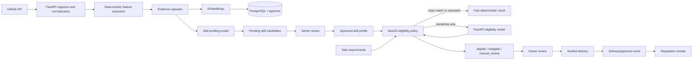

# Share-k AI Architecture and Token-Efficient Product Guide

**Review date:** 2026-07-11

**Audience:** Share-k product owner, backend team, AI team, frontend team

**Decision status:** Recommended MVP direction

This guide answers four questions:

1. How should Share-k define a contributor's skills credibly?
2. Which parts should be deterministic and which parts should use AI?
3. How should the complete AI journey work across the product?
4. How do we keep token cost, latency, and operational complexity under control?

## 1. Executive recommendation

Do not build Share-k as a collection of autonomous agents that repeatedly send raw GitHub data to an LLM. Build it as an **evidence pipeline with small model calls and strong backend policy**:

```text
GitHub OAuth
  -> normalized repository snapshot
  -> deterministic evidence extraction
  -> compact evidence capsules
  -> embeddings in PostgreSQL/pgvector
  -> AI skill-candidate interpretation
  -> admin review
  -> approved skill profile
  -> deterministic application gate
  -> AI only for ambiguity/explanation
  -> owner decision
  -> verified delivery
  -> reputation event
```

The most important rule is:

> AI may interpret evidence and recommend an outcome. NestJS owns authorization, policy, final state, audit records, and reputation.

This matches the accepted Share-k architecture: NestJS modular monolith, separate FastAPI AI service, PostgreSQL/pgvector, Prisma, and BullMQ/Redis for asynchronous jobs.

## 2. Final architecture choice

### Recommended product architecture



### Boundary responsibilities

| Component | Owns | Must not own |
| --- | --- | --- |
| `github` module | OAuth, token references, GitHub snapshots, repository metadata | Skill decisions or project publication policy |
| FastAPI AI service | Prompt/model execution, embeddings, retrieval helpers, AI response contracts | User authorization, final application status, reputation writes |
| `skill-profiles` | Candidate skills, approved skills, evidence references, review history | Provider SDK calls or application acceptance |
| `applications` | Eligibility state, manual review, owner acceptance, status history | Raw model prompts or reputation calculation |
| `ai` module | NestJS AI ports, adapters, schema validation, timeout/retry, audit metadata | Provider-specific prompt implementation |
| `reputation` | Verified completion events, score/history calculation | Raw AI claims or delivery ownership |
| `admin` | Review queues, disputes, reports, moderation actions | Direct writes to another module's private tables |

Do not create one microservice or one autonomous agent per feature. In the MVP, use one FastAPI service with logical pipelines:

- `SkillProfilingPipeline`
- `EligibilityPipeline`
- `GuidancePipeline` (later)
- `MatchingPipeline` (later)

Logical agents can share evidence and tracing without creating four independent systems.

## 3. How Share-k should define contributor skills

### 3.1 Create a controlled skill taxonomy first

Do not let the model invent arbitrary skill names such as `modern backend wizardry`. Store a controlled taxonomy:

```text
Skill
  id: canonical UUID
  canonical_name: "Node.js"
  aliases: ["node", "nodejs"]
  category: backend_runtime
  related_skills: ["Express", "NestJS"]
  evidence_rules: [...]
  proficiency_rubric: beginner/intermediate/advanced definitions
  active: true
```

Suggested initial taxonomy:

- Languages: JavaScript, TypeScript, Python, Java, C#, Go, PHP, Ruby.
- Frameworks: React, Next.js, NestJS, Express, Django, FastAPI, Spring.
- Data: PostgreSQL, MySQL, MongoDB, Redis, Prisma, SQL.
- DevOps: Docker, Docker Compose, Kubernetes, GitHub Actions, AWS.
- AI/data: PyTorch, TensorFlow, Pandas, NumPy, LangChain, embeddings/RAG.
- Engineering practices: testing, REST API design, CI/CD, authentication.

Start with a small taxonomy. Expand it when an admin sees a recurring missing skill; do not generate hundreds of labels before usage data exists.

### 3.2 Evidence hierarchy

Not every GitHub signal is equally trustworthy. Use an evidence hierarchy:

| Evidence | Strength | Why |
| --- | --- | --- |
| Authored code/PR in a relevant file or module | Strong | Direct work signal, if authorship is verified |
| Dependency manifest and configuration used by the project | Strong | Shows actual project usage, but not proficiency alone |
| Tests, CI, Docker, deployment configuration authored by the user | Strong | Shows applied engineering practice |
| Repeated authored commits across multiple repositories | Medium-strong | Shows consistency and recency |
| README explanation written by the user | Medium | Useful context but can be copied or generated |
| Repository language byte count | Medium | Shows presence, not depth or authorship |
| Commit count alone | Weak-medium | Quantity is easy to misinterpret |
| Stars, forks, repository popularity | Weak | Popularity is not contributor skill |
| Forked/tutorial/vendor code | Very weak or excluded | May not represent original ability |

Never treat repository stars, number of repositories, or a single README as proficiency evidence.

### 3.3 Deterministic feature extraction

Before calling an LLM, extract structured features with code and GitHub APIs:

```json
{
  "skill_candidate": "Node.js",
  "signals": {
    "manifest_mentions": 4,
    "authored_files": 83,
    "authored_prs": 7,
    "authored_commits": 142,
    "active_repositories": 3,
    "test_files": 12,
    "ci_files": 2,
    "deployment_files": 1,
    "last_activity_days": 18,
    "fork_ratio": 0.0
  },
  "evidence_ids": ["ev_123", "ev_124"],
  "snapshot_id": "gh_snapshot_2026_07_11"
}
```

Deterministic extraction should answer:

- Is the technology actually present?
- Did this contributor author the relevant work?
- How many independent projects support it?
- Is the evidence recent?
- Is there depth beyond a dependency declaration?
- Is the repository a fork, template, generated project, or tutorial copy?

The model should not spend tokens discovering facts that GitHub/API/parser code can compute more reliably.

### 3.4 Proficiency rubric

Use a transparent rubric rather than asking the model to guess a number.

| Level | Minimum meaning |
| --- | --- |
| Beginner | At least one credible use signal; limited depth; may need guidance |
| Intermediate | Repeated use in an authored project, with meaningful implementation and tests/configuration |
| Advanced | Sustained authored work across projects or complex modules, plus design/testing/deployment evidence |

These are starting definitions, not final thresholds. Calibrate them with admin labels and a locked evaluation set.

A practical initial scoring policy:

```text
evidence_score =
  0.35 * authored_work_signal
  + 0.20 * repeated_project_signal
  + 0.20 * depth_signal
  + 0.10 * recency_signal
  + 0.10 * review/test/deployment_signal
  + 0.05 * documentation_signal
```

Do not let the LLM change this score directly. The LLM can identify missing context or suggest `manual_review`.

### 3.5 Skill candidate output

The profiling service should return compact structured data:

```json
{
  "schema_version": "skill-profile.v1",
  "profile_status": "pending",
  "skills": [
    {
      "skill_id": "skill_nodejs",
      "canonical_name": "Node.js",
      "proposed_level": "intermediate",
      "confidence": 0.84,
      "evidence_ids": ["ev_123", "ev_124"],
      "evidence_summary": "Authored Node.js API work in three repositories with tests and CI.",
      "uncertainty_flags": []
    }
  ],
  "warnings": [],
  "requires_manual_review": true
}
```

Keep `evidence_summary` short. Store evidence IDs, not long repeated excerpts.

## 4. Complete AI journey in Share-k

### Stage A — GitHub onboarding and ingestion

**Trigger:** contributor connects GitHub.

1. NestJS validates OAuth state and stores the encrypted token reference.
2. NestJS emits `GitHubConnected`.
3. BullMQ creates an idempotent ingestion job.
4. GitHub adapter fetches paginated repositories and only the approved scopes.
5. The ingestion service normalizes data and stores a snapshot hash.
6. Unchanged repositories are skipped using repository/commit/content hashes.
7. Deterministic extractors produce evidence capsules.
8. Embeddings are created asynchronously for new/changed capsules.
9. Skill profiling runs only for new/changed evidence.
10. Candidates are persisted as `pending`.
11. Contributor and admin receive status updates.

**No LLM should be called** for OAuth, pagination, deduplication, rate-limit handling, repository metadata normalization, or basic language extraction.

### Stage B — Evidence capsule creation

An evidence capsule is a compact, auditable summary created by code or a small model:

```json
{
  "evidence_id": "ev_123",
  "contributor_id": "user_123",
  "repository_id": "repo_456",
  "source_type": "manifest_and_authored_files",
  "source_ref": "package.json + src/auth/",
  "content_hash": "sha256:...",
  "capsule_text": "Node.js API project; contributor authored JWT middleware, tests, and CI workflow.",
  "facts": {
    "technologies": ["Node.js", "JWT", "Express"],
    "authored_file_count": 31,
    "test_file_count": 6
  },
  "freshness": "2026-07-11",
  "visibility": "derived_from_public_repo"
}
```

Recommended capsule size: approximately 80-220 tokens. The exact size is less important than being short, factual, and traceable.

### Stage C — Skill profiling

**Trigger:** new/changed evidence snapshot is ready.

1. Filter evidence to likely skill candidates with deterministic rules.
2. Retrieve only the relevant capsules, not the entire repository.
3. Ask the model to map evidence to the controlled skill taxonomy.
4. Use strict structured output.
5. Validate every returned `skill_id` against the taxonomy.
6. Save model/provider/schema/service metadata.
7. Save candidates as `pending`.
8. Route low-evidence or contradictory candidates to admin review.

The model is an interpreter and uncertainty detector. It is not the authority that activates a skill.

### Stage D — Admin review

Admin sees:

- canonical skill name;
- proposed level and confidence;
- concise evidence summary;
- evidence links/IDs;
- freshness and repository count;
- uncertainty warnings;
- original model output and final admin decision.

Admin actions:

```text
approve -> approved skill can qualify applications
adjust -> approved with original and final level preserved
reject -> excluded from eligibility
dispute -> excluded until resolved
request_resync -> new snapshot, old decision remains auditable
```

### Stage E — Project import and publication

Do not call an LLM to fetch project title, language bytes, stars, forks, or repository statistics. GitHub APIs and parsers are cheaper and more reliable.

Optional AI use:

- normalize free-form technology names to taxonomy IDs;
- summarize a missing/poor description;
- detect category suggestions for owner confirmation.

These are asynchronous convenience features. A project can publish without them if the owner supplies valid metadata.

### Stage F — Discovery

Use this order:

1. PostgreSQL filters and full-text search.
2. pgvector retrieval over project capsules.
3. Optional lightweight reranking for the top results.

Do not ask an LLM to inspect every project for every search. Embed the query once, retrieve top candidates, apply structured filters, and return results. Use an LLM only if later evaluation proves that reranking improves search quality.

### Stage G — Task creation

Task creation should be mostly deterministic:

- required skills must map to taxonomy IDs;
- minimum level must be valid;
- deadline and capacity must be valid;
- reward/currency rules must be explicit;
- owner must control the project.

Optional AI can suggest normalized skills from free text, but the owner must confirm them before the task opens. Never let a model silently change task requirements.

### Stage H — Application eligibility

This is Share-k's most important AI workflow.

#### Recommended cascade

```text
Application submitted
  -> deterministic hard checks
  -> retrieve approved skill facts only
  -> clear match? eligible without expensive reasoning call
  -> clear mismatch? ineligible with rule explanation
  -> borderline/contradictory? call fast AI model
  -> malformed/timeout/low confidence? manual_review
  -> backend stores final state and audit snapshot
```

#### Deterministic hard checks

- contributor identity is active and permitted to apply;
- task is open, non-expired, and has capacity;
- contributor is not the owner;
- no duplicate active application exists;
- relevant skills are approved and not disputed;
- task requirements and skill snapshot are frozen;
- anti-spam policy passes.

#### Compact eligibility input

```json
{
  "schema_version": "eligibility.v1",
  "task": {
    "task_id": "task_123",
    "requirements": [
      {"skill_id": "skill_nodejs", "minimum_level": "intermediate", "required": true},
      {"skill_id": "skill_jwt", "minimum_level": "beginner", "required": true}
    ],
    "difficulty": "intermediate"
  },
  "contributor": {
    "approved_skills": [
      {"skill_id": "skill_nodejs", "level": "intermediate", "evidence_ids": ["ev_123"]}
    ]
  },
  "policy": {
    "allow_transferable_skill": false,
    "borderline_threshold": 0.70
  }
}
```

Do not send the contributor's whole GitHub history, full README files, raw commit list, or unrelated skills.

#### Outcomes

```text
eligible      -> owner review queue
ineligible    -> contributor explanation, owner cannot see it
manual_review -> admin queue; no automatic owner exposure
```

The AI output is a recommendation. The Applications module owns the final persisted status.

### Stage I — Owner review

No AI is needed for the owner to accept/reject an application. Show:

- approved matching skills;
- short evidence summaries;
- reputation summary and sample size;
- cover note;
- AI recommendation and confidence with a clear “recommendation” label.

The owner keeps final selection authority within task capacity.

### Stage J — Delivery verification

Use deterministic GitHub API checks, not an LLM, to verify:

- PR belongs to the task repository;
- accepted contributor authored the PR/commits;
- PR state and base branch;
- commit SHA and repository identity;
- merged/approved or revision-requested state.

An LLM may later summarize owner feedback, but it must never approve delivery or update reputation.

### Stage K — Reputation

Reputation is deterministic:

```text
DeliveryApproved event
  -> reputation consumes event once
  -> update score/history
  -> publish public summary
```

Do not use an LLM to calculate ratings, success rate, or verified completion count. Store the formula and event history so the user can understand the result.

### Stage L — Skill-gap guidance

This is a later feature. When implemented:

1. Reuse the already-known missing skill IDs from eligibility.
2. Retrieve resources from a curated catalog, not open-ended web search on every request.
3. Generate a concise explanation and practice plan.
4. Cache by `(contributor_profile_version, task_requirement_version, guidance_prompt_version)`.
5. Never promise a guaranteed timeline or make guidance a prerequisite for applying again.

The standard missing-skill explanation should be available to all contributors. Rich guidance can be a later premium benefit without making the basic trust system pay-to-understand.

### Stage M — Matching

Matching should be a retrieval/ranking problem, not a free-form agent loop:

```text
SQL hard filters
  -> pgvector top 50
  -> reputation/availability/privacy filters
  -> top 10/20 candidates
  -> optional fast-model rerank
  -> owner sees reasons and evidence IDs
```

Do not call an LLM once per contributor. Do not use reputation without sample size and anti-gaming controls.

## 5. Model recommendation

The exact model must remain configurable because model availability and pricing change. The current official OpenAI model catalog recommends its flagship model for complex reasoning and a smaller cost-sensitive model for high-volume workloads. For this project, use a model cascade rather than one model everywhere.

### Recommended initial Groq configuration

| Role | Recommended model setting | Why |
| --- | --- | --- |
| High-volume structured extraction | `openai/gpt-oss-120b` through Groq | Current configured model for compact, schema-constrained interpretation |
| Eligibility borderline cases | `openai/gpt-oss-120b` through Groq | Keep the first release on one evaluated contract before introducing a model cascade |
| Offline evals, admin escalation, prompt development | Configurable evaluation model | Pin the exact evaluated model and prompt version instead of inventing an alias |
| Embeddings | `text-embedding-3-small` | Strong MVP retrieval/cost balance; use pgvector |
| Embeddings quality experiment | `text-embedding-3-large` | Only if the eval set proves small is insufficient |
| Moderation | `omni-moderation-latest` or the approved moderation model in the provider catalog | Separate safety check, not skill scoring |

Model availability and limits change. Keep the provider and model in environment
configuration, pin them in evaluation reports, and do not create internal model
names that do not exist in the provider catalog.

### Why not use the most expensive model for every request?

- Most Share-k decisions are structured classification or retrieval, not open-ended reasoning.
- A large model cannot compensate for missing or untrusted evidence.
- Sending raw GitHub content creates more cost and more prompt-injection risk.
- A deterministic policy is more stable and easier to audit than model-only scoring.
- A cascade gives a strong model to the ambiguous minority instead of charging it for every application.

### Provider strategy

For MVP, use one primary provider behind an `AiProviderPort` and keep a provider-neutral contract. Do not integrate OpenAI, Anthropic, and Gemini simultaneously before the evaluation set exists. Multiple providers multiply prompt, schema, tracing, privacy, and failure complexity.

Add a second provider only when a measured requirement justifies it:

- cost reduction at observed volume;
- regional/data-residency need;
- quality gap on a locked eval set;
- availability/fallback requirement.

## 6. Token and cost efficiency rules

### Rule 1 — Never send raw GitHub data by default

The most important saving is data reduction, not prompt cleverness.

Do not send:

- every file;
- every commit message;
- full README content for every application;
- unrelated contributor skills;
- raw GitHub API payloads;
- duplicate snapshots;
- stars/forks/popularity when they do not affect the decision.

Send compact facts, evidence IDs, and at most a few retrieved capsules.

### Rule 2 — Compute once, reuse many times

Persist:

- repository snapshot hash;
- evidence capsule hash;
- normalized taxonomy IDs;
- embedding model/dimensions/hash;
- profile version;
- task requirement version;
- prompt/schema/model versions.

If none of these changed, do not regenerate the profile or embeddings.

### Rule 3 — Use a model cascade

```text
cheap deterministic path
  -> cheap structured model
  -> balanced model for borderline cases
  -> strongest model only for admin/offline evaluation
```

Track escalation rate. If more than a small minority of requests escalate, improve the deterministic features or rubric instead of simply buying a larger model.

### Rule 4 — Use strict structured output

Use a versioned JSON schema with enums for outcomes and canonical skill IDs. Reject unknown keys and validate the response in FastAPI and NestJS.

```json
{
  "decision": "eligible | ineligible | manual_review",
  "confidence": 0.0,
  "matched_skill_ids": [],
  "missing_skill_ids": [],
  "evidence_ids": [],
  "reason_code": "missing_required_skill",
  "explanation_summary": "short safe explanation"
}
```

OpenAI's Structured Outputs documentation recommends strict schema-constrained output over older JSON mode for supported models. Use it, but still validate business meaning because schema-valid output can be factually wrong. See the [Structured Outputs guide](https://developers.openai.com/api/docs/guides/structured-outputs).

### Rule 5 — Keep the output short

For business decisions, store a short explanation summary, not a long chain-of-thought. The application needs reason codes, evidence IDs, and a user-safe explanation—not hidden reasoning text.

Suggested starting output limits:

| Call | Input target | Output target |
| --- | ---: | ---: |
| Skill candidate extraction | 1,500-4,000 tokens | 300-800 tokens |
| Eligibility borderline check | 500-2,000 tokens | 150-350 tokens |
| Matching rerank | 1,000-4,000 tokens | 200-500 tokens |
| Skill-gap guidance | 1,000-3,000 tokens | 500-1,000 tokens |

These are engineering budgets, not provider guarantees. Measure actual usage and lower them when quality remains stable.

### Rule 6 — Structure prompts for caching

Put the stable system instructions, schema, rubric, and examples first. Put task/contributor-specific data last. Exact prefix reuse improves prompt-cache hits. OpenAI documents automatic prompt caching for eligible requests and exposes cached-token usage; do not pad tiny prompts just to reach the cache threshold. See the [prompt-caching guide](https://developers.openai.com/api/docs/guides/prompt-caching).

Recommended prompt order:

```text
1. stable policy/rubric
2. stable JSON schema
3. stable few-shot examples
4. variable task requirements
5. variable approved skill facts/evidence IDs
```

### Rule 7 — Batch offline work

Use asynchronous batch jobs for:

- repository embedding;
- initial skill profiling for many users;
- eval datasets;
- nightly resyncs;
- backfills after taxonomy changes.

Do not use batch for an application result the contributor is waiting for. The official Batch API supports asynchronous Responses/Embeddings jobs, separate capacity, up to a 24-hour completion window, and a 50% cost discount compared with synchronous APIs. See the [Batch API guide](https://developers.openai.com/api/docs/guides/batch).

### Rule 8 — Embed once, retrieve many times

Use `text-embedding-3-small` for compact evidence capsules and task/project summaries. The official embeddings guide documents 1536 dimensions by default for this model and supports shortening dimensions when storage requires it. Start with the default dimension for retrieval quality; reduce only after measuring pgvector storage and recall. See the [embeddings guide](https://developers.openai.com/api/docs/guides/embeddings).

### Rule 9 — Cache by business version

Cache keys should include the versions that can change the answer:

```text
profile_cache_key = hash(
  contributor_id,
  github_snapshot_hash,
  taxonomy_version,
  profiling_prompt_version,
  output_schema_version,
  model_snapshot
)

eligibility_cache_key = hash(
  task_requirement_snapshot,
  approved_skill_snapshot,
  eligibility_policy_version,
  prompt_version,
  model_snapshot
)
```

Never cache only by user ID or task ID; that would return stale decisions after evidence or requirements change.

### Rule 10 — Do not use an LLM for arithmetic or state transitions

The backend should calculate:

- plan usage;
- deadlines and capacity;
- duplicate applications;
- rating averages and success rate;
- task/application/delivery state transitions;
- reputation events;
- permissions.

LLMs are for interpretation, normalization suggestions, explanations, and ranking assistance—not authoritative state changes.

## 7. Suggested request budgets by product feature

These budgets are starting guardrails for the FastAPI service:

| Feature | Synchronous? | Default call policy | Budget guardrail |
| --- | --- | --- | ---: |
| GitHub ingestion | No | No LLM; parsers/API | 0 LLM tokens for facts |
| Evidence capsules | No | Code first; model only for ambiguous extraction | 1 call per changed capsule group |
| Skill profile | No | Fast model on compact new evidence | one profile job per snapshot |
| Admin skill review | Yes/read | No new model call by default; show stored evidence | 0 tokens unless admin asks for clarification |
| Project metadata | Yes | GitHub/parser first; optional short normalization | <= 1 small call per import |
| Project search | Yes | SQL + pgvector | 0 LLM calls per search |
| Task requirements | Yes | taxonomy validation; optional suggestion | <= 1 small call while drafting |
| Application gate | Near-real-time | rules first; model only borderline | <= 1 model call per application |
| Owner review | Yes | stored facts/recommendation | 0 new calls |
| PR verification | Yes | GitHub API and deterministic checks | 0 LLM calls |
| Reputation | Yes | event-driven arithmetic | 0 LLM calls |
| Skill-gap guidance | No/streamed later | cached retrieval + model | max 1 call per versioned request |
| Contributor matching | No/near-real-time | SQL + vector top-K; optional rerank | max 1 rerank call per task refresh |

The strongest cost-saving decision is that most rows have **zero LLM calls**.

## 8. Evaluation and quality gates

Do not claim “90% AI accuracy” without a dataset and a definition.

### Build a locked evaluation set

Create labeled examples from:

- skill candidates with admin-approved final levels;
- clear eligible applications;
- clear ineligible applications;
- ambiguous/manual-review applications;
- fork/tutorial/generated-code cases;
- stale/revoked/disputed evidence;
- malformed and timeout responses.

Keep training/tuning examples separate from the locked final set.

### Metrics

| Area | Metrics |
| --- | --- |
| Skill profile | precision/recall by skill, level agreement, evidence attribution accuracy, admin-adjustment rate |
| Eligibility | false-forward rate, false-block rate, manual-review rate, calibration, decision latency |
| Retrieval | recall@K, precision@K, source freshness, cross-user leakage rate |
| Guidance | resource validity, missing-skill correctness, citation/source coverage, user usefulness label |
| Matching | top-K relevance, diversity, privacy compliance, owner acceptance rate |
| Operations | token usage, cache-hit rate, escalation rate, retry rate, p95 latency, cost per workflow |

The most dangerous metric is false-block rate: rejecting a qualified contributor can harm the marketplace more than routing a borderline applicant to manual review.

### Human review loop

Persist admin corrections as labeled data:

```text
model candidate -> admin decision -> label/evidence -> evaluation dataset
```

Do not automatically fine-tune from every admin action. First inspect disagreement patterns, taxonomy gaps, and evidence quality.

## 9. Failure and safety policy

| Failure | Correct behavior |
| --- | --- |
| GitHub rate limit | retry with backoff, show delayed status, preserve last good snapshot |
| AI timeout | retry once if idempotent, then `manual_review` or explain delayed processing |
| Malformed AI JSON | schema validation, bounded retry, then `manual_review` |
| Unknown skill ID | reject candidate, log contract failure, do not create arbitrary skill |
| Low confidence | manual review, never silent rejection |
| Disputed skill | exclude from eligibility until resolved |
| Retrieval returns another user's evidence | fail closed, alert, never return result |
| Prompt injection in README/code | treat repository content as untrusted data, not instructions |
| Provider outage | deterministic fast path where safe; otherwise queue/manual review |
| Stale evidence | show freshness, resync before high-trust decision if policy requires |

Never log API keys, GitHub tokens, raw private code, or full sensitive prompts. Store redacted audit payloads and evidence IDs.

## 10. What to remove or simplify from the current BMAD AI stories

### Remove or change now

- “Pinecone” as a required MVP dependency; use PostgreSQL/pgvector.
- Binary-only AI outcomes; include `manual_review`.
- Full raw repository/README/code input to every agent.
- AI as the authority that approves skills or accepts applications.
- LLM-generated reputation calculations.
- LLM calls for project statistics, PR validation, or state transitions.
- Full autonomous agent loops for simple retrieval/classification.
- Premium-only basic rejection explanation.

### Defer

- Gold-only rich skill-gap guidance.
- AI matching top-N lists before there is enough marketplace data.
- Streaming for every AI output.
- Multi-provider routing before quality/cost data exists.
- Fine-tuning before the labeled dataset is large and stable.

### Keep

- Evidence-backed skill candidates.
- Admin approval and adjustment.
- Eligibility explanation and source attribution.
- Manual review for uncertainty.
- pgvector retrieval support.
- AI traces with redaction.
- Locked evaluation data.

## 11. Recommended environment configuration

Keep these in `.env.example` and the FastAPI deployment configuration; do not hardcode them:

```env
LLM_PROVIDER=groq
LLM_MODEL=openai/gpt-oss-120b
LLM_TIMEOUT_SECONDS=45
GROQ_API_KEY=replace-with-a-rotated-local-secret
AI_EMBEDDING_MODEL=text-embedding-3-small
AI_EMBEDDING_DIMENSIONS=1536
AI_MAX_INPUT_TOKENS=4000
AI_MAX_OUTPUT_TOKENS=800
AI_TIMEOUT_MS=8000
AI_MAX_RETRIES=1
AI_CONFIDENCE_MANUAL_REVIEW_THRESHOLD=0.70
AI_SERVICE_URL=http://ai-service:8010
AI_SERVICE_AUTH_TOKEN=replace-with-the-same-long-random-token-used-by-fastapi
```

The names are defaults, not permanent truths. The provider/model registry should verify that a configured model supports structured output, embeddings/batch where required, and the account's rate limits.

## 12. Implementation roadmap

### Phase 1 — No model dependency

1. Canonical skill taxonomy.
2. GitHub snapshot hashes and idempotent ingestion.
3. Deterministic evidence extractors.
4. Evidence capsule schema.
5. Approved-skill domain states.
6. Task requirement taxonomy and policy checks.

### Phase 2 — One AI provider, compact contracts

1. FastAPI `SkillProfilingPipeline`.
2. Strict skill-profile response schema.
3. NestJS AI adapter and audit snapshot.
4. Admin review queue.
5. pgvector embeddings and source filters.
6. Profile cache keyed by evidence/prompt/model versions.

### Phase 3 — Eligibility trust loop

1. Deterministic application pre-check.
2. Compact eligibility payload.
3. Fast model for borderline decisions.
4. `eligible`, `ineligible`, `manual_review` policy.
5. Owner queue and contributor explanation.
6. Locked evaluation set and false-block monitoring.

### Phase 4 — Later AI features

1. Curated-resource skill-gap guidance.
2. Vector-assisted project discovery.
3. Rule-based candidate matching.
4. Optional model reranking.
5. Provider fallback only after measured need.

## 13. Final answer: the best solution for Share-k

The best practical solution is:

```text
Rules first
  -> compact evidence second
  -> embeddings for retrieval
  -> small structured model for interpretation
  -> stronger model only for ambiguity/evaluation
  -> admin review for uncertainty
  -> backend policy owns final state
```

For the first implementation, use:

- NestJS modular monolith for workflows and decisions.
- FastAPI for model calls and AI-specific tooling.
- PostgreSQL + pgvector for source-of-truth data and vectors.
- `text-embedding-3-small` for MVP embeddings.
- Groq with `openai/gpt-oss-120b` for the current structured skill-profile call.
- A configurable evaluation model only after a locked dataset proves a need.
- Deterministic backend policy for confidence thresholds and final state changes.
- BullMQ/Redis for ingestion, embeddings, profiling, guidance, and matching jobs.
- Strict JSON schemas, redacted traces, versioned caches, and a locked evaluation set.

Do not optimize by choosing the cheapest model first. Optimize by **not making an unnecessary model call**, then use the cheapest model that passes the evaluation threshold.

## 14. Official references

- [OpenAI model catalog](https://developers.openai.com/api/docs/models)
- [OpenAI pricing](https://developers.openai.com/api/docs/pricing)
- [Structured Outputs](https://developers.openai.com/api/docs/guides/structured-outputs)
- [Prompt caching](https://developers.openai.com/api/docs/guides/prompt-caching)
- [Batch API](https://developers.openai.com/api/docs/guides/batch)
- [Embeddings](https://developers.openai.com/api/docs/guides/embeddings)
