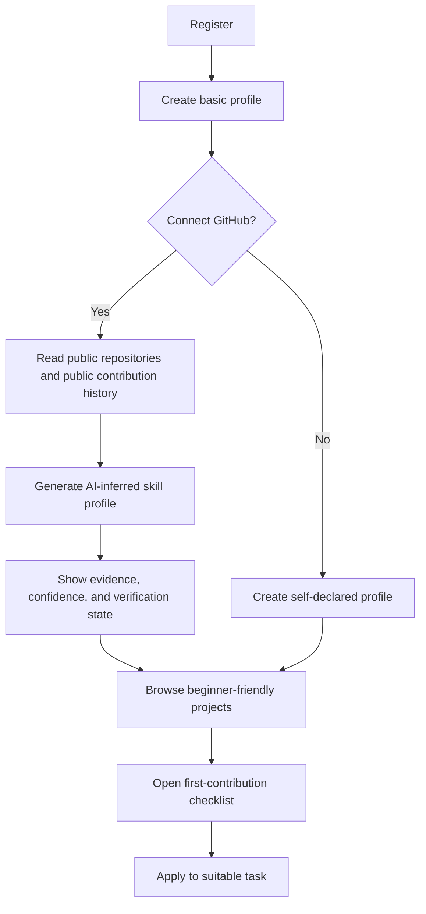
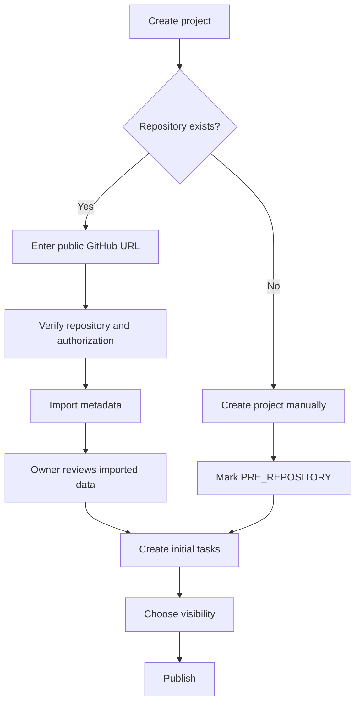
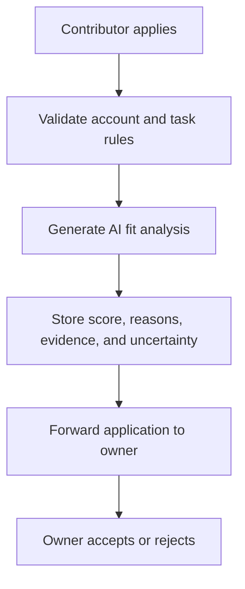
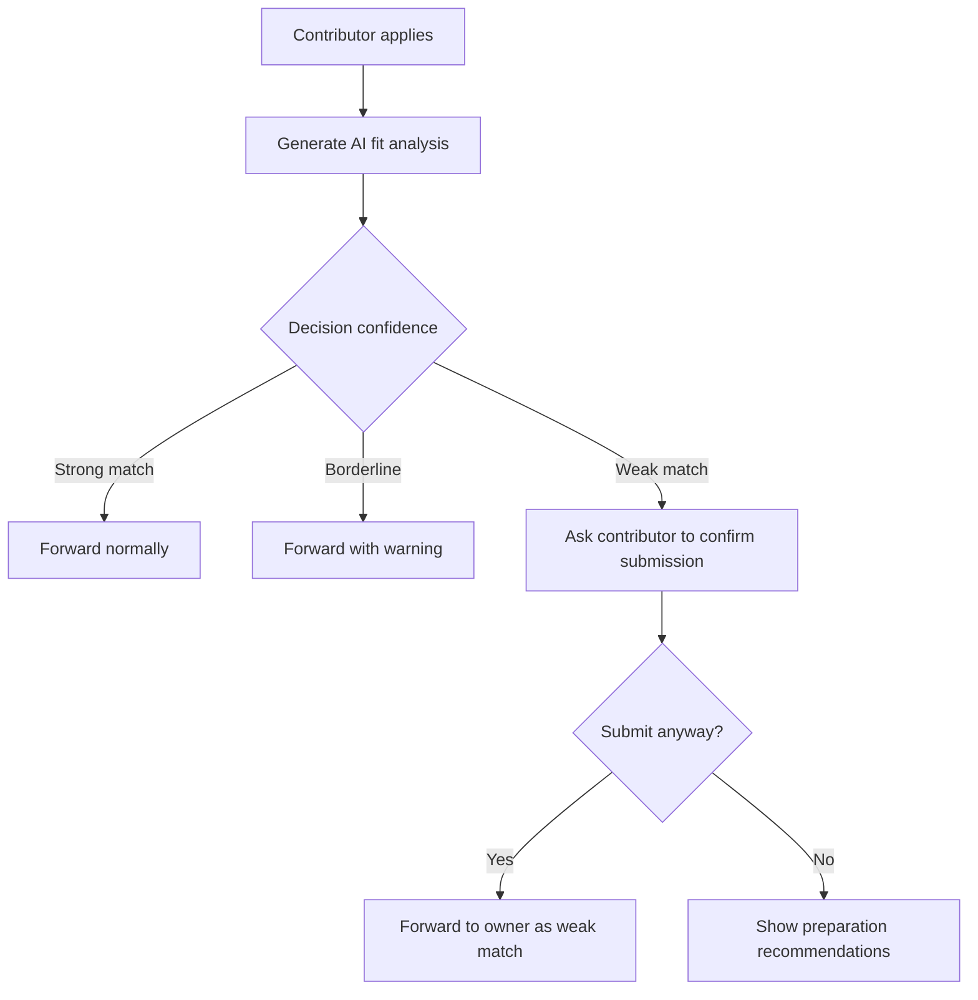
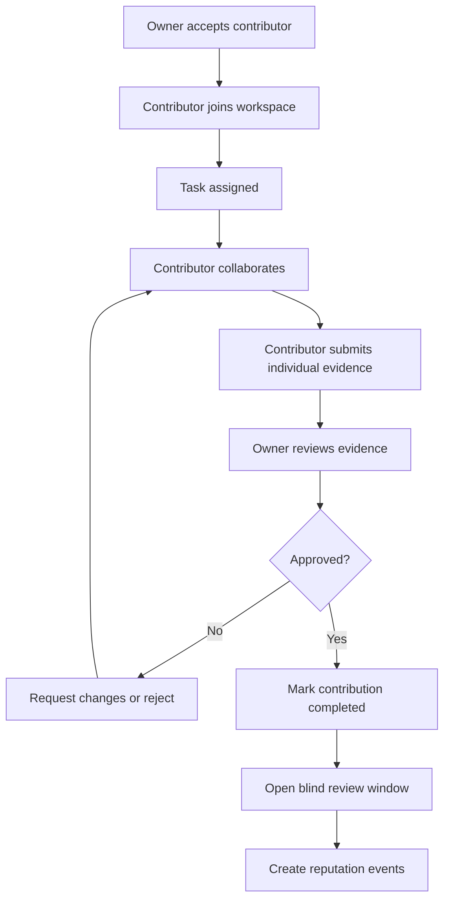
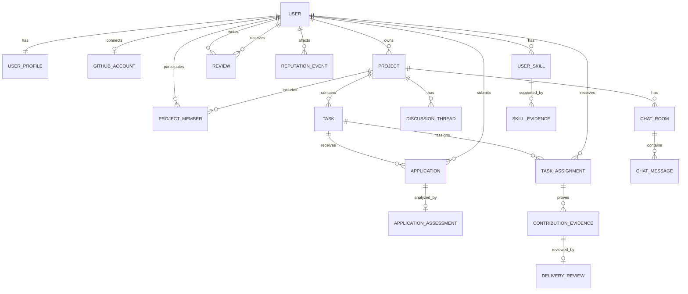
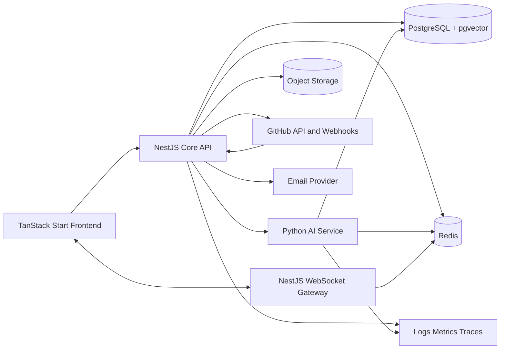

# ShareK — Master Product and Technical Brief

**Version:** 2.0  
**Date:** July 2026  
**Status:** Draft for strategic grilling and implementation planning  
**Purpose:** Product truth first, while remaining suitable for capstone evaluation  
**Working name:** ShareK / Share-k / شارك / شريك  
**Tagline:** Build through contribution. Earn reputation through proof.

---

## 0. Why This Document Exists

This document replaces the previous checklist-heavy specification with a product-first source of truth.

It is intended to:

1. Give the team a coherent definition of ShareK.
2. Give Claude Thinking enough context to challenge and improve the product.
3. Become the source for later `/grilling`, coding specifications, architecture decisions, API contracts, database design, and implementation backlogs.

This document does **not** claim that proposed features are implemented.

### Required status vocabulary

Every later document must use one of these statuses:

- `PROPOSED`
- `APPROVED`
- `DESIGNED`
- `IN DEVELOPMENT`
- `IMPLEMENTED`
- `TESTED`
- `DEPLOYED`
- `DEFERRED`
- `REJECTED`

“Planned confidently” is not “complete.”

---

# Part I — Strategic Product Definition

## 1. Executive Summary

ShareK is a collaboration and reputation platform for developers.

Its purpose is not to host source code and not to replace GitHub. Its purpose is to turn real project participation into credible professional evidence.

A contributor should be able to:

- Discover a suitable real project.
- Understand what the project needs.
- Apply to a defined task.
- Collaborate with the owner and other contributors.
- Submit individual evidence of completed work.
- Receive structured reviews from people who actually worked with them.
- Build a public reputation profile from verified outcomes.

A project owner should be able to:

- Publish an open-source project or a project that does not yet have a repository.
- Define contribution tasks and required skills.
- Review applications with AI assistance.
- Accept contributors manually.
- Collaborate inside a project workspace.
- Review delivered work.
- Rate contributors based on actual collaboration.

A beginner should be able to:

- Discover beginner-friendly projects.
- Follow a first-contribution checklist.
- Receive recommendations appropriate to current evidence-backed skills.
- Understand the steps needed to complete a first open-source contribution.

### Primary product promise

> ShareK helps developers build credible professional reputation through real, evidence-backed contributions.

### Supporting promises

- Owners spend less time finding suitable contributors.
- Beginners receive a structured path to their first contribution.
- Managers and clients can inspect collaboration history, work evidence, and trusted reviews.

---

## 2. Strategic Verdict

The product has a meaningful core, but it becomes weak when it tries to imitate GitHub, Jira, Slack, Upwork, LinkedIn, and an online academy at the same time.

The defensible product is the combination of:

1. Evidence-backed contribution history.
2. Structured owner and peer reviews.
3. AI-assisted discovery and screening.
4. Beginner-oriented open-source onboarding.
5. A collaboration layer connected to GitHub when GitHub exists.

Everything must support this loop:

```text
Owner publishes a project or task
    -> Contributor discovers it
    -> Contributor applies
    -> AI advises; owner decides
    -> Contributor collaborates and delivers
    -> Work is reviewed
    -> Evidence and reputation are recorded
    -> Better future opportunities become available
```

A feature that does not strengthen this loop is not MVP material.

---

## 3. Product North Star

### North-star outcome

A completed contribution with:

- A known contributor.
- A known project owner.
- A defined task or contribution scope.
- Individual evidence.
- An owner review result.
- Ratings from eligible collaborators.
- A permanent reputation event.

### North-star metric

**Verified Contributions Completed per Month**

A verified contribution counts only when:

1. The contributor was accepted.
2. Individual contribution evidence was attached.
3. The owner approved the work.
4. The work is not under unresolved fraud or evidence dispute.
5. A reputation event was created.

Registrations, chat volume, repository imports, and AI calls are not success by themselves.

---

## 4. User Priority

### Primary MVP user: Beginner contributor

The initial experience should optimize for a developer who does not know:

- Which project is suitable.
- What contribution process to follow.
- Whether current skills are enough.
- How to communicate with maintainers.
- How to produce a valid pull request or deliverable.
- How to prove the work later.

### Secondary MVP user: Open-source project owner

The owner needs:

- Structured publishing.
- Clear contributor profiles.
- AI-assisted matching.
- Manageable applications.
- Collaboration tools.
- Reliable evidence.
- Reviews and reputation.

### Later user: Hiring manager, client, or company

This user consumes public reputation and work history.

Company accounts, organization hierarchies, and team hiring are not MVP requirements.

---

## 5. Product Positioning

ShareK is not:

- A Git repository host.
- A replacement for GitHub pull requests.
- A complete Jira clone.
- A general freelance marketplace.
- A job board with AI glitter.
- A conventional code-learning platform.
- A chat app pretending messages are progress.

ShareK is:

> A contribution discovery, collaboration, evidence, and reputation layer that sits above GitHub or supports a project before a repository exists.

---

## 6. Differentiation

GitHub shows repository activity. ShareK explains collaborative value.

GitHub can show commits, pull requests, issues, and code activity.

ShareK adds:

- Why the contributor joined.
- Which task they owned.
- Who reviewed the work.
- How collaborators rated reliability and communication.
- Whether the work was approved.
- Which skills were demonstrated.
- Which evidence belongs to the individual.
- Which future projects fit the contributor.

### Reputation is the moat

The strongest signal is not an AI guess.

The strongest signal is:

> A real person completed a defined contribution in a real project, the result was approved, and eligible collaborators reviewed the experience.

AI supports this evidence. It does not replace it.

---

# Part II — Scope

## 7. MVP Scope

The MVP proves the verified-contribution loop.

### Included

- Registration and authentication.
- GitHub account connection.
- Public user profiles.
- AI-inferred skill profiles with visible evidence states.
- Open-source project publishing.
- Publishing projects without an existing repository.
- Project discovery and filtering.
- Beginner-friendly project recommendations.
- First-contribution checklist.
- Contribution tasks.
- Contributor applications.
- Advisory AI screening by default.
- Optional owner-controlled strict screening.
- Contributor list.
- File attachments.
- Discussion.
- Real-time project chat.
- Minimal task workflow.
- Contribution evidence submission.
- Pull-request linking when a repository exists.
- Owner delivery review.
- Blind bilateral reviews.
- Contributor and owner reputation events.
- Notifications.
- Basic AI project assistant.
- Basic GitHub activity and commit summaries when a repository exists.
- Admin dispute handling.
- Simulated payment only when needed for demonstration.

### Strategic correction: tasks cannot be last

Without tasks or an equivalent contribution scope:

- Deadlines have nowhere to live.
- Applications target nothing concrete.
- Evidence cannot be attributed.
- Ratings become vague.
- Reputation becomes easy to manipulate.
- AI matching has no requirements to compare.

Therefore the workspace implementation priority should be:

1. Contributor list.
2. Tasks or contribution scopes.
3. Discussion.
4. Real-time chat.
5. File attachments.
6. GitHub activity feed.
7. AI project assistant.
8. AI commit summaries.

Chat may be visually prominent, but tasks must remain the domain backbone.

---

## 8. Post-MVP Scope

- Real paid public tasks.
- Escrow or milestones.
- Company accounts.
- Organization and team entities.
- Team-based applications.
- Team reputation.
- Advanced Kanban.
- Personalized AI learning roadmaps.
- AI-generated task breakdown.
- Advanced onboarding assistant.
- Advanced commit-risk analysis.
- Owner and contributor subscriptions.
- Hiring manager search.
- Verified identity badges.
- Private repository analysis with explicit opt-in.
- Repository write integrations.
- Calendar or interview scheduling.

---

## 9. Long-Term Vision

- Company recruitment subscriptions.
- Team formation and team hiring.
- Cross-project reputation graph.
- Verified professional skill credentials.
- Open-source contribution academy.
- Organization private projects.
- Escrow marketplace.
- IDE extension or MCP integration.
- AI contribution copilot.
- AI architecture onboarding.
- Maintainer analytics.
- Fraud detection network.
- Portable reputation export.

---

## 10. Explicit MVP Non-Goals

The MVP will not:

- Host repositories.
- Replace GitHub branches, commits, PRs, or CI.
- Guarantee that AI-inferred skill levels are objectively correct.
- Let AI make irreversible eligibility decisions.
- Support real escrow.
- Provide full Jira-level management.
- Support first-class organizations or company accounts.
- Support team-based applications.
- Analyze private repositories.
- Execute AI-generated code.
- Claim “verified” skills from AI inference alone.
- Enforce arbitrary team-size limits for monetization.

---

# Part III — Actors and Permissions

## 11. Capability Model

A user may be both a project owner and a contributor.

These are capabilities, not permanent mutually exclusive account types.

### System roles

- `USER`
- `MODERATOR`
- `ADMIN`

### Project roles

- `OWNER`
- `MAINTAINER`
- `CONTRIBUTOR`
- `APPLICANT`
- `VIEWER`

A developer may own one project and contribute to another. Permanent account types would create unnecessary constraints.

---

## 12. Actor Definitions

### Guest

Can browse public projects, profiles, summaries, and beginner resources.

Cannot apply, chat, access private attachments, submit evidence, or review users.

### Authenticated user

Can manage profile, connect GitHub, publish projects, apply, join accepted workspaces, submit evidence, review eligible collaborators, and dispute AI assessments.

### Project owner

Can create projects, link repositories, create tasks, choose screening mode, review applications, manage members, review deliveries, rate contributors, and archive projects.

### Contributor

Can discover projects, apply, inspect AI fit analysis, join accepted workspaces, collaborate, submit individual evidence, and review eligible owners or teammates.

### Admin or moderator

Can resolve disputes, inspect fraud reports, hide abuse, invalidate fraudulent reviews, inspect audit events, and grant high-trust verification badges.

Admin review is not mandatory for every user.

---

## 13. Permission Matrix

| Capability | Guest | User | Applicant | Contributor | Owner | Admin |
|---|---:|---:|---:|---:|---:|---:|
| View public projects | Yes | Yes | Yes | Yes | Yes | Yes |
| Publish project | No | Yes | Yes | Yes | Yes | Yes |
| Apply to task | No | Yes | Yes | Yes | Yes | Yes |
| View private workspace | No | No | Limited | Yes | Yes | Yes |
| Use project chat | No | No | No | Yes | Yes | Yes |
| Post project discussion | No | No | Optional | Yes | Yes | Yes |
| Create task | No | No | No | Optional | Yes | Yes |
| Review applications | No | No | No | No | Yes | Yes |
| Submit evidence | No | No | No | Yes | No | Yes |
| Approve contribution | No | No | No | No | Yes | Yes |
| Submit review | No | Eligible only | Eligible only | Eligible only | Eligible only | No |
| Resolve disputes | No | No | No | No | No | Yes |

---

# Part IV — Core Domain Concepts

## 14. Project Types

### 14.1 Open-source project

- Publicly visible.
- May link to a public GitHub repository.
- Usually unpaid in MVP.
- Suitable for beginner discovery.
- May use pull requests as evidence.

### 14.2 Pre-repository project

- Exists on ShareK before a repository exists.
- Owner describes the project and initial work manually.
- A task may be “Create and initialize the repository.”
- Commit, pull-request, and GitHub activity features remain disabled until a repository is linked.
- Once linked, the project enters GitHub-connected mode.

### 14.3 Paid project or task

MVP status: `DEFERRED`, except for a clearly labelled simulated demonstration.

Real payments require:

- Payment provider.
- Identity and fraud checks.
- Refund policy.
- Dispute process.
- Legal terms.
- Tax and commission handling.
- Escrow or milestone rules.

A payment status must never be represented by a lazy boolean pretending to be a financial system.

---

## 15. GitHub as Code Source of Truth

### Meaning

When a project is linked to GitHub, GitHub owns the authoritative state of:

- Repository content.
- Branches.
- Commits.
- Pull requests.
- Merge status.
- CI checks.
- Code review comments.
- GitHub issues, when used.

ShareK owns the authoritative state of:

- Project presentation.
- Project membership.
- Applications.
- AI fit assessments.
- ShareK tasks.
- Discussions.
- Chat.
- Attachments.
- Evidence references.
- Reviews.
- Reputation.
- Disputes.
- Notifications.

### Data duplication rule

ShareK may cache GitHub metadata for performance and history, but it must store:

- GitHub identifiers.
- Canonical URLs.
- Last synchronized time.
- Relevant snapshots.
- Sync status.

It must not pretend cached data is the live GitHub state.

### Project without a repository

```text
Owner creates project
    -> Selects "Repository not created yet"
    -> Project gets PRE_REPOSITORY status
    -> Owner creates initial tasks
    -> Contributor may be accepted to initialize repository
    -> Repository is created externally
    -> Owner links repository
    -> ShareK verifies ownership or authorization
    -> GitHub synchronization starts
```

Before repository linking:

- No commit feed.
- No pull-request evidence.
- No AI commit summary.
- Evidence may use files, links, screenshots, demos, documents, or owner-confirmed non-code work.

---

## 16. Task and Contribution Scope

A project may have many tasks.

A task is the minimum unit for:

- Required skills.
- Difficulty.
- Deadline.
- Applications.
- Assignment.
- Delivery.
- Evidence.
- Review.
- Reputation attribution.

### Task fields

- ID.
- Project ID.
- Title.
- Description.
- Deliverables.
- Required skills.
- Optional skills.
- Difficulty.
- Beginner-friendly flag.
- Maximum contributors.
- Deadline.
- Optional displayed reward.
- Status.
- Screening mode.
- Creator.
- Assigned contributors.
- Optional repository issue, branch, or pull-request links.

### Task states

```text
DRAFT
OPEN
SCREENING
ASSIGNED
IN_PROGRESS
IN_REVIEW
COMPLETED
CANCELLED
ARCHIVED
```

---

## 17. Contribution Evidence

Every contributor attaches evidence individually.

Possible evidence:

- Pull request.
- Commit range.
- GitHub issue.
- Code review comments.
- Design file.
- Document.
- Deployment link.
- Demo video.
- File attachment.
- Owner-confirmed non-code work.

### Rules

- One evidence record belongs to one contributor.
- A shared PR may be linked by several contributors, but each explains their individual role.
- Owners approve or reject each contributor’s evidence separately.
- Approved evidence cannot be silently deleted.
- It can be invalidated only through an audited moderation or dispute process.
- Reputation is created from approved evidence, not merely from project membership.

---

# Part V — Core User Flows

## 18. Contributor Onboarding



### Skill evidence labels

Each skill must show one or more states:

- `SELF_DECLARED`
- `AI_INFERRED`
- `CONTRIBUTION_DEMONSTRATED`
- `PEER_ENDORSED`
- `ADMIN_REVIEWED`
- `ASSESSMENT_VERIFIED` — post-MVP

The word “verified” must not be used for AI inference alone.

---

## 19. Project Publishing



---

## 20. Application and AI Screening

### Screening modes

- `ADVISORY` — default.
- `STRICT` — owner explicitly enables.
- `MANUAL_ONLY` — no AI eligibility recommendation.

### Advisory mode



### Strict mode



### Hard rule

Even in strict mode, AI must not permanently hide applications without:

- Explicit owner configuration.
- A visible override.
- A contributor dispute path.
- An audit trail.

AI ranks, explains, and warns. The accountable owner decides.

---

## 21. Contribution Delivery



---

## 22. Review Flow

Reviews remain blind until:

- Both eligible parties submit, or
- The review window expires.

### Eligible reviews

- Owner rates contributor.
- Contributor rates owner.
- Teammates may endorse collaboration skills when they shared a project period and task relationship.
- The system records objective contribution evidence separately.

### Contributor review dimensions

- Delivery quality.
- Reliability.
- Communication.
- Collaboration.
- Technical contribution.
- Documentation.
- Deadline adherence.

### Owner review dimensions

- Requirement clarity.
- Responsiveness.
- Fairness.
- Project organization.
- Review quality.
- Respectful communication.
- Payment reliability, when real paid work exists.

### Review rules

- Only eligible collaborators may review.
- Reviews become immutable after publication except through moderation.
- Extreme ratings require a written rationale.
- Retaliation patterns may be flagged.
- Repeated reviews from the same pair have diminishing weight.
- Reputation displays evidence and sample size, not only a single average.

---

# Part VI — Project Workspace

## 23. Contributor List

Shows:

- Owner.
- Maintainers.
- Contributors.
- Assigned tasks.
- Join date.
- Current activity state.
- Public profile link.
- Verified contribution count where relevant.

---

## 24. Minimal Task Board

MVP columns:

- Open.
- Assigned.
- In progress.
- In review.
- Completed.

Advanced drag-and-drop Kanban is post-MVP.

---

## 25. File Attachments

Supports:

- Requirements.
- Screenshots.
- Diagrams.
- Documents.
- Reference files.

Requirements:

- File-type allowlist.
- Size limits.
- Malware scanning where feasible.
- Access control.
- Signed URLs.
- Metadata storage.
- Audit records.

---

## 26. Discussion

Threaded and durable communication for:

- Architecture decisions.
- Requirements.
- Long-form questions.
- Announcements.
- Proposals.

Discussion is not chat. Decisions should not disappear into a waterfall of “bro it works on my machine.”

---

## 27. Real-Time Chat

Purpose: rapid collaboration between owner and accepted contributors, and between accepted contributors.

Requirements:

- Project-scoped rooms.
- Owner and accepted contributors only.
- Optional direct messages between accepted project members.
- Persistent messages.
- Authorization on every room join.
- Moderation and reporting.
- Attachments through the shared file service.
- Owner announcements.
- Chat unavailable to rejected applicants.

Important decisions can later be promoted to discussions or tasks.

---

## 28. GitHub Activity Feed

When a repository exists, show selected events:

- Pull requests.
- Pull-request updates.
- Merges.
- Commits.
- Releases.
- Linked issues.

Use GitHub webhooks where possible and scheduled synchronization as fallback.

---

## 29. AI Project Assistant

MVP assistant can answer from:

- Project description.
- Tasks.
- Public README.
- Approved project documents.
- Discussions explicitly allowed for indexing.

Requirements:

- Cite sources.
- State uncertainty.
- Enforce project permissions.
- Avoid private-content leakage.
- Refuse unsupported claims.
- Never execute repository code.

Access modes:

- Public project summary assistant.
- Accepted-member assistant.
- Owner assistant.

---

## 30. AI Commit Summaries

When a repository exists, summarize:

- What changed.
- Which files or modules changed.
- Likely purpose.
- Linked task or pull request.
- Possible affected areas.
- Visible uncertainty.

It must not claim correctness or safety without test evidence.

Example output:

```json
{
  "summary": "Added refresh-token rotation to authentication.",
  "changedAreas": ["auth service", "token persistence", "session invalidation"],
  "linkedTaskId": "TASK-123",
  "riskLevel": "medium",
  "riskReasons": ["authentication state changed", "database migration included"],
  "evidence": [
    {"type": "commit", "url": "..."},
    {"type": "pull_request", "url": "..."}
  ],
  "uncertainties": ["integration test results were not visible"]
}
```

---

# Part VII — Beginner Open-Source Experience

## 31. Beginner-Friendly Recommendations

Recommendations may consider:

- Skill evidence.
- Difficulty.
- Beginner-friendly label.
- Documentation quality.
- Setup complexity.
- Maintainer responsiveness.
- Task scope.
- Contributor capacity.
- Language preference.
- Technology interest.

Every recommendation explains why it appeared.

Example:

> Recommended because you have evidence of React and TypeScript, the task is marked beginner-friendly, setup documentation exists, and Docker is not required.

---

## 32. First-Contribution Checklist

The MVP checklist is curated rather than hallucinated from the great soup of the internet.

1. Understand the project goal.
2. Read contribution guidelines.
3. Check prerequisites.
4. Set up Git.
5. Fork or clone.
6. Create a branch.
7. Run locally.
8. Confirm a task.
9. Ask clarifying questions.
10. Make a focused change.
11. Run tests and linting.
12. Write a useful commit message.
13. Push the branch.
14. Open a pull request.
15. Respond to review comments.
16. Update the pull request.
17. Confirm completion in ShareK.
18. Submit individual evidence.
19. Wait for owner review.
20. Add the approved result to the public profile.

For projects without a repository, the checklist adapts to the defined deliverable.

---

## 33. Learning Resources

Recommended model:

- Admin-curated library.
- AI recommends from the curated library.
- Community suggestions require moderation.
- Dead links are checked periodically.
- AI may rank resources but may not invent links.

MVP resources:

- Official documentation.
- Focused short courses.
- Contribution guides.
- Git and GitHub basics.
- Technology prerequisites.
- Example beginner projects.

---

# Part VIII — AI Product Design

## 34. AI Principles

1. AI advises; accountable humans decide.
2. Every consequential output shows evidence.
3. Uncertainty is visible.
4. “No evidence found” is not “the user lacks the skill.”
5. Public GitHub activity is incomplete evidence.
6. AI outputs are contestable.
7. Retrieval and generation obey project permissions.
8. AI does not silently mutate authoritative records.
9. AI never executes repository code.
10. AI cost and latency are measurable.

---

## 35. AI Capabilities

### 35.1 Skill profile inference

Inputs:

- Public repositories.
- Public contribution history.
- Public pull requests.
- Public commit diffs.
- Repository languages.
- README files.
- Public issue and review activity where available.

Outputs:

- Skill.
- Estimated level.
- Confidence.
- Evidence.
- Last evaluated date.
- Limitations.
- Verification state.

### 35.2 Project and task matching

AI ranks rather than certifies.

Possible factors:

- Required skill alignment.
- Evidence strength.
- Difficulty fit.
- Reputation.
- Beginner suitability.
- Availability.
- Related contributions.
- Contributor interests.

### 35.3 Application fit analysis

Output includes:

- Match range rather than fake precision.
- Strong matches.
- Missing or uncertain requirements.
- Evidence references.
- Recommendation.
- Confidence.
- Owner override.
- Contributor dispute option.

### 35.4 Project assistant

Separate public, member, and owner access modes.

### 35.5 Commit and PR summaries

Generated asynchronously after webhook events.

### 35.6 Beginner recommendation assistant

Uses curated learning resources and structured beginner-task metadata.

---

## 36. AI Dispute Process

### Step 1 — Open dispute

A contributor may dispute:

- Skill level.
- Missing skill.
- Application fit analysis.
- Weak-match classification.
- Incorrect evidence attribution.

The request contains:

- Disputed output.
- Reason.
- Optional evidence.
- Desired correction.

### Step 2 — Immediate behavior

- Mark output as `UNDER_REVIEW`.
- Preserve the original output.
- Store model version, prompt version, inputs, retrieved evidence, and result.
- In advisory mode, the application continues normally.
- In strict mode, the contributor can request manual owner review.

### Step 3 — Human review

Reviewer may be:

- Admin.
- Technically scoped moderator.
- Trusted community reviewer in a later version.

Operational target:

- Acknowledge immediately.
- Aim for resolution within 72 hours only when staffing can support it.
- Do not promise an SLA made of optimism and duct tape.

### Step 4 — Outcomes

```text
UPHELD
ADJUSTED
INSUFFICIENT_EVIDENCE
MODEL_ERROR
POLICY_ERROR
ABUSE_REJECTED
```

### Step 5 — Evaluation learning

Resolved cases may become anonymized evaluation data after privacy review.

### Abuse controls

- Rate-limit repeated disputes.
- Do not punish good-faith disputes.
- Flag coordinated manipulation.
- Keep an audit trail.

---

## 37. AI Architecture Boundary

Chosen platform architecture:

- TanStack Start frontend.
- NestJS core backend.
- Optional Python/FastAPI AI service.
- PostgreSQL with pgvector.
- Redis.
- S3-compatible storage.
- GitHub API and webhooks.

### When a Python AI service is justified

Use it for:

- LangGraph workflows.
- Python-first document processing.
- Embedding and reranking libraries.
- Evaluation pipelines.
- Model experimentation.

Core business rules stay in NestJS.

### Authority rule

NestJS decides:

- Whether a user may apply.
- Whether a task exists.
- Whether strict screening is enabled.
- Whether an application is accepted.
- Whether evidence is approved.
- Whether reputation events are created.

The AI service returns recommendations and structured analysis.

It must not directly:

- Accept or reject applications permanently.
- Change membership.
- Publish reviews.
- Create reputation events.
- Release payments.

---

# Part IX — Reputation

## 38. Reputation Model

A contributor profile contains separate signals.

### Objective signals

- Approved contributions.
- Rejected deliveries.
- Completion rate.
- On-time rate.
- Unique owners.
- Unique projects.
- Evidence types.
- Demonstrated skills.
- Merged pull requests.
- Reverted work where reliably known.

### Subjective signals

- Owner ratings.
- Contributor ratings of owners.
- Teammate endorsements.
- Written reviews.

### Trust signals

- GitHub connected.
- Admin-reviewed badge.
- Dispute history.
- Fraud flags.
- Repeated collaboration patterns.
- Identity verification — post-MVP.

### Display rule

Do not collapse everything into one magical number.

Recommended sections:

- Overall collaboration rating.
- Delivery quality.
- Communication.
- Reliability.
- Verified contribution count.
- Demonstrated skills.
- Recent evidence.
- Written reviews.
- Confidence and sample size.

---

## 39. Reputation Events

Every reputation change is immutable.

```text
CONTRIBUTION_APPROVED
CONTRIBUTION_REJECTED
OWNER_REVIEW_PUBLISHED
CONTRIBUTOR_REVIEW_PUBLISHED
TEAMMATE_ENDORSEMENT_PUBLISHED
REVIEW_INVALIDATED
EVIDENCE_INVALIDATED
DISPUTE_RESOLVED
TRUST_BADGE_GRANTED
TRUST_BADGE_REVOKED
```

Aggregate scores are calculated from events. This keeps history auditable and permits future formula changes.

---

## 40. Anti-Manipulation Rules

- No rating without eligible collaboration.
- Duplicate accounts cannot review each other.
- Repeated review pairs have lower marginal influence.
- New accounts have lower trust weight.
- Reviews tied to invalid evidence are removed from aggregates.
- Extreme reviews require reasons.
- Suspicious review rings are flagged.
- Owners also receive reputation.
- Cancellation is separated from failure.
- Contributors are not punished when owners abandon projects.
- Paid-review incentives are prohibited.

---

# Part X — Functional Requirements

## 41. Authentication and Accounts

- Email/password authentication.
- GitHub OAuth connection.
- Secure session handling.
- Email verification.
- Password reset.
- Account deletion.
- Session revocation.
- Role and permission checks.
- Public username.
- GitHub disconnect subject to historical evidence rules.
- Least-privilege GitHub scopes.
- No repository write scope in MVP.

---

## 42. Profiles

Fields:

- Display name.
- Username.
- Avatar.
- Bio.
- Optional location.
- Languages.
- Skills with evidence states.
- Interests.
- Availability.
- GitHub link.
- Owned projects.
- Completed contributions.
- Reviews.
- Reputation summary.
- Beginner checklist progress, optionally private.

Users control optional public fields.

---

## 43. Project Management

Owner can:

- Create.
- Save draft.
- Publish.
- Edit.
- Pause.
- Archive.
- Close.
- Link repository.
- Manage members.
- Manage attachments.
- Manage AI indexing permissions.

### Project statuses

```text
DRAFT
PUBLISHED
ACTIVE
PAUSED
COMPLETED
ARCHIVED
CANCELLED
```

### Repository statuses

```text
NONE
PENDING_LINK
CONNECTED
SYNC_ERROR
DISCONNECTED
```

---

## 44. Discovery and Search

Filters:

- Technology.
- Difficulty.
- Beginner-friendly.
- Category.
- Repository status.
- Paid or unpaid.
- Open task availability.
- Language.
- Activity recency.

Sort:

- Relevance.
- Recent activity.
- Beginner suitability.
- Deadline.
- Owner reputation.
- Number of open tasks.

Semantic search is useful, not required for the first functioning release.

---

## 45. Applications

Application fields:

- Contributor.
- Task.
- Optional message.
- Availability.
- Relevant evidence.
- AI fit analysis.
- Screening mode.
- Status.
- Owner decision.
- Decision reason.
- Timestamps.

### States

```text
DRAFT
SUBMITTED
AI_ANALYSIS_PENDING
OWNER_REVIEW
ACCEPTED
REJECTED
WITHDRAWN
EXPIRED
DISPUTED
```

---

## 46. Discussions

- Project threads.
- Task-linked threads.
- Mentions.
- Replies.
- Attachments.
- Pinning.
- Locking.
- Moderation.
- Search.
- Convert discussion item to task — post-MVP.

---

## 47. Chat

- Project room.
- Direct messages between accepted project members.
- WebSocket delivery.
- Persistent storage.
- Authorization on every room join.
- Rate limiting.
- Reporting.
- Soft deletion with audit.
- Owner announcements.
- No access for rejected applicants.

---

## 48. Notifications

Channels:

- In-app.
- Email for critical events.
- Real-time websocket notification.

Events:

- Application received.
- Application accepted or rejected.
- Contributor added.
- Task assigned.
- Deadline approaching.
- Discussion reply.
- Chat mention.
- Evidence submitted.
- Changes requested.
- Contribution approved.
- Review window opened.
- Dispute updated.
- Repository sync failed.

---

## 49. Simulated Payments

For MVP demonstration only:

- Clearly label the flow as simulated.
- Never store real card details.
- Allow demo funding and release events.
- Keep demo payment status separate from actual financial claims.
- Never describe simulation as production escrow.

---

# Part XI — Domain Model

## 50. Core Entities

### Identity

- User.
- UserProfile.
- GitHubAccount.
- Session.
- Role.
- Permission.

### Skills

- Skill.
- UserSkill.
- SkillEvidence.
- SkillAssessment.
- SkillDispute.

### Projects

- Project.
- ProjectRepository.
- ProjectMember.
- ProjectAttachment.
- ProjectTechnology.

### Work

- Task.
- TaskRequirement.
- TaskAssignment.
- Application.
- ApplicationAssessment.
- ContributionEvidence.
- DeliveryReview.

### Collaboration

- DiscussionThread.
- DiscussionPost.
- ChatRoom.
- ChatMembership.
- ChatMessage.
- Notification.

### Reputation

- Review.
- ReviewDimension.
- Endorsement.
- ReputationEvent.
- ReputationAggregate.
- FraudReport.

### AI

- AIJob.
- AIOutput.
- AITraceReference.
- PromptVersion.
- ModelVersion.
- RetrievalCitation.

### Learning

- LearningResource.
- BeginnerChecklist.
- ChecklistProgress.
- ProjectRecommendation.

---

## 51. Relationship Overview



---

# Part XII — Technical Architecture

## 52. Technology Stack

### Frontend

- TanStack Start.
- React.
- TypeScript.
- TanStack Router.
- TanStack Query.
- Tailwind CSS.
- shadcn/ui.
- React Hook Form.
- Zod.
- WebSocket client.

### Core backend

- NestJS.
- TypeScript.
- Modular clean architecture.
- REST API.
- WebSocket gateway.
- OpenAPI.
- BullMQ.
- PostgreSQL ORM to be explicitly selected.

### AI service

- Python.
- FastAPI.
- LangGraph or simpler deterministic workflows where appropriate.
- Pydantic.
- Retrieval, embedding, reranking, and evaluation tools.

### Data and infrastructure

- PostgreSQL.
- pgvector.
- Redis.
- S3-compatible object storage.
- GitHub OAuth, API, and webhooks.
- Email provider.
- AI model provider.
- Error tracking.
- Metrics, logs, and traces.

---

## 53. High-Level Components



---

## 54. NestJS Module Boundaries

```text
auth
users
profiles
github
projects
project-members
tasks
applications
screening
attachments
discussions
chat
notifications
contributions
reviews
reputation
learning
recommendations
disputes
moderation
payments-demo
ai-orchestration
audit
health
```

Each module owns:

- Domain entities.
- Use cases.
- Ports.
- Infrastructure adapters.
- Controllers or gateways.
- DTO mapping.
- Tests.

Modules must not directly reach into one another’s tables. Use application services, domain events, and explicit module contracts.

---

## 55. AI Service Modules

```text
skill_profiling
task_matching
application_analysis
project_assistant
commit_summaries
beginner_recommendations
retrieval
embeddings
prompt_registry
model_gateway
evaluation
safety
observability
```

The AI service never owns business-critical state transitions.

---

## 56. Domain Events

```text
UserGitHubConnected
ProjectPublished
RepositoryLinked
RepositorySyncRequested
TaskPublished
ApplicationSubmitted
ApplicationAnalysisRequested
ApplicationAccepted
ContributorAdded
ContributionEvidenceSubmitted
ContributionApproved
ContributionRejected
ReviewWindowOpened
ReviewPublished
ReputationRecalculationRequested
GitHubPullRequestUpdated
GitHubCommitReceived
AICommitSummaryRequested
SkillAssessmentDisputed
DisputeResolved
```

### Queue jobs

- GitHub ingestion.
- Repository sync.
- Skill analysis.
- Application analysis.
- Recommendation refresh.
- Commit summary.
- Email notification.
- Reputation aggregation.
- Dead-link validation.
- File scanning.

---

# Part XIII — API and Integration Principles

## 57. REST Principles

- Versioned API.
- Resource-oriented endpoints.
- Explicit pagination.
- Stable error envelope.
- Idempotency for critical writes.
- Correlation IDs.
- Backend authorization.
- DTO validation.
- UTC timestamps.
- OpenAPI specification.
- Frontend contracts independent of database schema.

### Standard error

```json
{
  "code": "APPLICATION_NOT_ALLOWED",
  "message": "You cannot apply to this task.",
  "details": {
    "reason": "TASK_CLOSED"
  },
  "correlationId": "req_123"
}
```

---

## 58. Example Endpoint Groups

```text
POST   /v1/auth/register
POST   /v1/auth/login
POST   /v1/auth/logout
GET    /v1/me

POST   /v1/github/connect
GET    /v1/github/callback
POST   /v1/github/sync

POST   /v1/projects
GET    /v1/projects
GET    /v1/projects/:projectId
PATCH  /v1/projects/:projectId
POST   /v1/projects/:projectId/publish
POST   /v1/projects/:projectId/repository

POST   /v1/projects/:projectId/tasks
GET    /v1/projects/:projectId/tasks
GET    /v1/tasks/:taskId
PATCH  /v1/tasks/:taskId

POST   /v1/tasks/:taskId/applications
GET    /v1/tasks/:taskId/applications
POST   /v1/applications/:applicationId/accept
POST   /v1/applications/:applicationId/reject
POST   /v1/applications/:applicationId/dispute

POST   /v1/assignments/:assignmentId/evidence
POST   /v1/evidence/:evidenceId/approve
POST   /v1/evidence/:evidenceId/request-changes

POST   /v1/projects/:projectId/discussions
POST   /v1/discussions/:threadId/posts

GET    /v1/projects/:projectId/chat/messages
WS     /v1/chat

POST   /v1/reviews
GET    /v1/users/:username/reputation

GET    /v1/learning/first-contribution-checklist
GET    /v1/recommendations/projects

POST   /v1/ai/project-assistant/messages
GET    /v1/projects/:projectId/github-activity
```

---

# Part XIV — Security, Privacy, and Safety

## 59. Security Requirements

- Modern password hashing.
- Secure HttpOnly cookies where cookie sessions are used.
- CSRF protection where applicable.
- OAuth state and PKCE.
- JWT rotation if JWT is selected.
- Rate limiting.
- Input validation.
- Output encoding.
- File scanning.
- Signed file URLs.
- WebSocket authorization.
- Audit logging.
- Secret management.
- Least-privilege GitHub scopes.
- Dependency scanning.
- Backups.
- Incident logs.

---

## 60. AI Safety Requirements

- Treat repository content as untrusted.
- Defend against indirect prompt injection.
- Never let README instructions override system policy.
- Separate retrieved content from trusted instructions.
- Redact detected secrets from ingested content.
- Do not expose hidden reasoning.
- Log model and prompt versions.
- Store citations.
- Provide deterministic failure paths.
- Route low-confidence outcomes to advisory or human review.
- Never execute repository code.

---

## 61. Privacy Requirements

- Explain exactly which GitHub data is accessed.
- Analyze public repositories only in MVP.
- Allow GitHub disconnection.
- Support data-deletion requests.
- Define retention for audit records.
- Do not expose private workspace content through public summaries.
- Prevent cross-project retrieval leakage.
- Do not permit external model training on user data unless terms and explicit consent allow it.

---

# Part XV — Non-Functional Requirements

## 62. Performance

Initial targets:

- Non-AI API P95 under 500 ms under normal demo load.
- Chat delivery under 1 second under normal conditions.
- Search under 1 second.
- Streaming AI response begins within 3 seconds where practical.
- Background AI jobs expose progress.
- Repository sync is asynchronous.

Do not promise planetary-scale production metrics before measuring anything.

---

## 63. Reliability

- External failures do not corrupt state.
- GitHub outage does not stop non-GitHub workflows.
- AI outage falls back to manual owner review.
- Redis outage may degrade realtime features but not durable records.
- Duplicate webhooks are idempotent.
- Queue jobs use bounded retries.
- Failed jobs enter a dead-letter queue.

---

## 64. Accessibility and Internationalization

MVP:

- Arabic and English.
- RTL and LTR.
- Semantic HTML.
- Keyboard navigation.
- Visible focus.
- Accessible forms.
- Contrast compliance.
- Screen-reader labels.
- Localized dates and numbers.
- Correct direction handling for code, URLs, and mixed-language content.

---

## 65. Observability

Track:

- API latency.
- Error rate.
- WebSocket connections.
- Queue depth.
- GitHub rate-limit failures.
- AI latency and cost.
- AI dispute rate.
- AI override rate.
- Recommendation click-through.
- Application acceptance.
- Contribution completion.
- Review completion.

Use correlation IDs across frontend, NestJS, queue jobs, and AI service.

---

# Part XVI — Testing

## 66. Unit Tests

- Domain rules.
- State transitions.
- Reputation calculations.
- Permission checks.
- Screening policies.
- Review eligibility.
- Evidence validation.

## 67. Integration Tests

- Database repositories.
- GitHub adapters.
- AI contracts.
- Queue workflows.
- File storage.
- WebSocket authorization.

## 68. Contract Tests

- TanStack frontend to NestJS.
- NestJS to AI service.
- NestJS to GitHub adapters.

## 69. End-to-End Tests

Critical flows:

1. Register and connect GitHub.
2. Publish project with repository.
3. Publish project without repository.
4. Create task.
5. Apply in advisory mode.
6. Apply in strict mode.
7. Accept contributor.
8. Join discussion and chat.
9. Submit individual evidence.
10. Approve contribution.
11. Complete blind reviews.
12. Create reputation event.
13. Open AI dispute.
14. Complete first-contribution checklist.

## 70. AI Evaluation

- Evidence attribution correctness.
- False-negative rate.
- False-positive rate.
- Dispute rate.
- Recommendation relevance.
- Cross-project data leakage.
- Prompt-injection resistance.
- Arabic and English quality.
- Sparse-repository behavior.
- No-public-repository behavior.

---

# Part XVII — Metrics

## 71. Activation

Contributor activation:

- Profile completed.
- First project viewed.
- Beginner task saved.
- First application submitted.

Owner activation:

- Project published.
- First task published.
- First application reviewed.

## 72. Core Funnel

```text
Project viewed
    -> Task viewed
    -> Application submitted
    -> Application accepted
    -> Contributor starts
    -> Evidence submitted
    -> Contribution approved
    -> Reviews completed
```

## 73. Quality Metrics

- Verified contribution completion rate.
- Median time to first contribution.
- Owner time to first suitable applicant.
- Application acceptance rate.
- Contribution approval rate.
- Review completion rate.
- Dispute rate.
- AI override rate.
- Repeat collaboration rate.
- Beginner task completion rate.
- Profile views leading to invitation or contact — post-MVP.

---

# Part XVIII — Risks

## 74. Cold Start

No projects means no contributors; no contributors means no owners.

Mitigation:

- Start with ITI students.
- Choose one technology community.
- Recruit maintainers manually.
- Curate beginner tasks.
- Help first owners onboard.
- Produce real case studies.

Architecture does not scare away the cold-start monster.

---

## 75. Fake Reputation

Risk: friends create fake projects and rate each other.

Mitigation:

- Require individual evidence.
- Weight trust signals.
- Detect repeated pairs.
- Moderate suspicious networks.
- Separate evidence from opinions.
- Use immutable reputation events.

---

## 76. AI False Negatives

Mitigation:

- Advisory default.
- Owner override.
- Contributor dispute.
- Confidence display.
- Evidence citations.
- Never equate absent public evidence with absent skill.

---

## 77. Scope Explosion

The team may build incomplete imitations of GitHub, Jira, Slack, Upwork, and LinkedIn.

Mitigation:

> One complete trust loop beats eight impressive half-features.

---

## 78. Chat Consumes the Schedule

Mitigation:

Build reliable minimal chat. Do not build calls, reactions, elaborate presence, typing analytics, and decorative fireworks before evidence and reviews work.

---

## 79. Payments Distract the Team

Mitigation:

Use simulation for capstone demonstration. Validate demand before real payment integration.

---

# Part XIX — Delivery Slices

## 80. Phase 0 — Product and Contract Lock

Deliver:

- Approved glossary.
- Final MVP scope.
- ERD.
- State machines.
- API contracts.
- UX flows.
- AI authority policy.
- Review and dispute rules.
- Definition of done.

## 81. Phase 1 — Foundation

- TanStack Start shell.
- NestJS modular foundation.
- PostgreSQL schema.
- Authentication.
- GitHub OAuth.
- Project creation.
- Discovery.
- Basic deployment pipeline.

## 82. Phase 2 — Verified Contribution Loop

- Tasks.
- Applications.
- AI advisory analysis.
- Owner decision.
- Membership.
- Evidence.
- Approval.
- Blind reviews.
- Reputation events.

This phase proves the product.

## 83. Phase 3 — Collaboration

- Contributor list.
- Attachments.
- Discussion.
- Realtime chat.
- Notifications.
- GitHub activity.

## 84. Phase 4 — Beginner Experience and AI

- Beginner recommendations.
- First-contribution checklist.
- Skill inference.
- Project assistant.
- Commit summaries.
- Disputes.

## 85. Phase 5 — Hardening and Demo

- E2E tests.
- Security checks.
- Accessibility.
- Arabic and English.
- Observability.
- Seeded scenarios.
- Simulated payment only if required.

---

# Part XX — Unresolved Decisions

## 86. Actual implementation team size

The answer “Free 2–3, Plus 3–6, Pro 6–10” describes future project-member limits, not the number of developers building ShareK.

Status: `TBD`

Strategic recommendation:

- Do not cap project member counts in MVP.
- Treat plan-based limits as a post-MVP pricing hypothesis.
- Validate usage before implementing them.

## 87. Actual capstone submission deadline

The answer described task deadlines, not the remaining project calendar.

Status: `TBD`

This document therefore uses phases rather than fake date promises.

## 88. Exact PostgreSQL ORM

Status: `TBD`

Choose one explicitly:

- Prisma.
- TypeORM.
- Drizzle.
- Another justified option.

## 89. Authentication transport

Status: `TBD`

Choose one:

- Secure server session.
- Access and refresh JWT in HttpOnly cookies.
- Another explicit model.

## 90. AI provider

Status: `TBD`

The system should remain provider-abstracted.

---

# Part XXI — Definition of MVP Success

The MVP succeeds when the team can demonstrate:

1. A user registers.
2. A user publishes a public project.
3. The project may exist with or without GitHub.
4. The owner creates a task.
5. A beginner discovers it.
6. The contributor sees explainable fit analysis.
7. The contributor applies.
8. The owner accepts.
9. The contributor joins the workspace.
10. The contributor collaborates.
11. The contributor submits individual evidence.
12. The owner approves the contribution.
13. Both sides submit blind reviews.
14. Reputation records update.
15. The public profile displays credible contribution evidence.

Everything else is secondary.

---

# Part XXII — Claude Thinking Handoff

## 91. Claude Role

Claude should act as:

- Principal product architect.
- Principal software architect.
- Senior domain modeller.
- Security reviewer.
- AI safety reviewer.
- Skeptical startup advisor.
- Implementation planner.

Claude must challenge this document rather than merely reformat it.

## 92. Constraints Claude Must Preserve

- Product truth takes priority over capstone decoration.
- TanStack Start is the frontend.
- NestJS is the core backend.
- Python AI service is optional and bounded.
- AI is advisory by default.
- GitHub is code source of truth when linked.
- Projects without repositories are supported.
- Individual evidence is mandatory.
- Reviews are blind until both submit or timeout.
- Company and team entities remain outside MVP.
- Real payments remain outside MVP.
- The specification has MVP, post-MVP, and long-term scopes.
- Proposed work must never be labelled implemented.

## 93. Expected Claude Deliverables

1. Brutal product critique.
2. Contradiction list.
3. Missing decisions.
4. Scope reduction.
5. Revised glossary.
6. Personas and journeys.
7. Functional requirements.
8. Business rules.
9. Permissions matrix.
10. State machines.
11. ERD.
12. API resource map.
13. Event catalogue.
14. TanStack module map.
15. NestJS module map.
16. AI boundary.
17. GitHub integration model.
18. Chat architecture.
19. Reputation and anti-fraud model.
20. Dispute process.
21. Security threat model.
22. Testing strategy.
23. Delivery slices.
24. Acceptance criteria.
25. ADR list.
26. Remaining questions.

---

# Final Strategic Position

ShareK is viable only if it stays focused on a difficult but useful promise:

> Turn real collaboration into trustworthy professional reputation.

Use GitHub where GitHub is strong. Do not rebuild it.

Use AI to summarize, recommend, compare, and explain. Do not turn it into an unaccountable gatekeeper.

Use chat and discussion to support work. Do not mistake communication volume for progress.

Treat approved individual evidence as the foundation of reputation.

The MVP is not a pile of screens. It is one complete trust loop.
