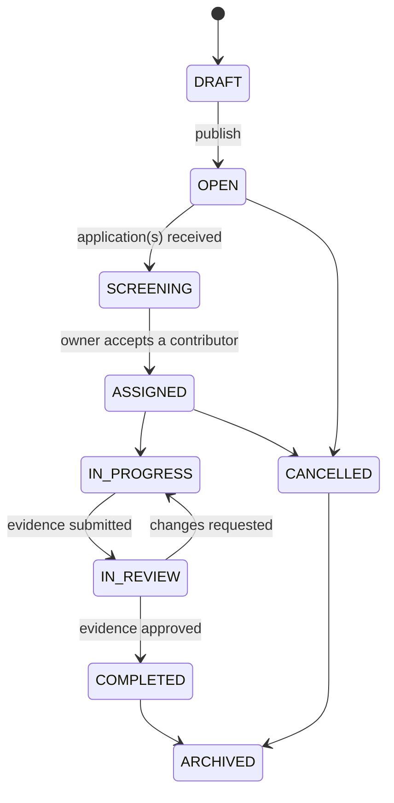
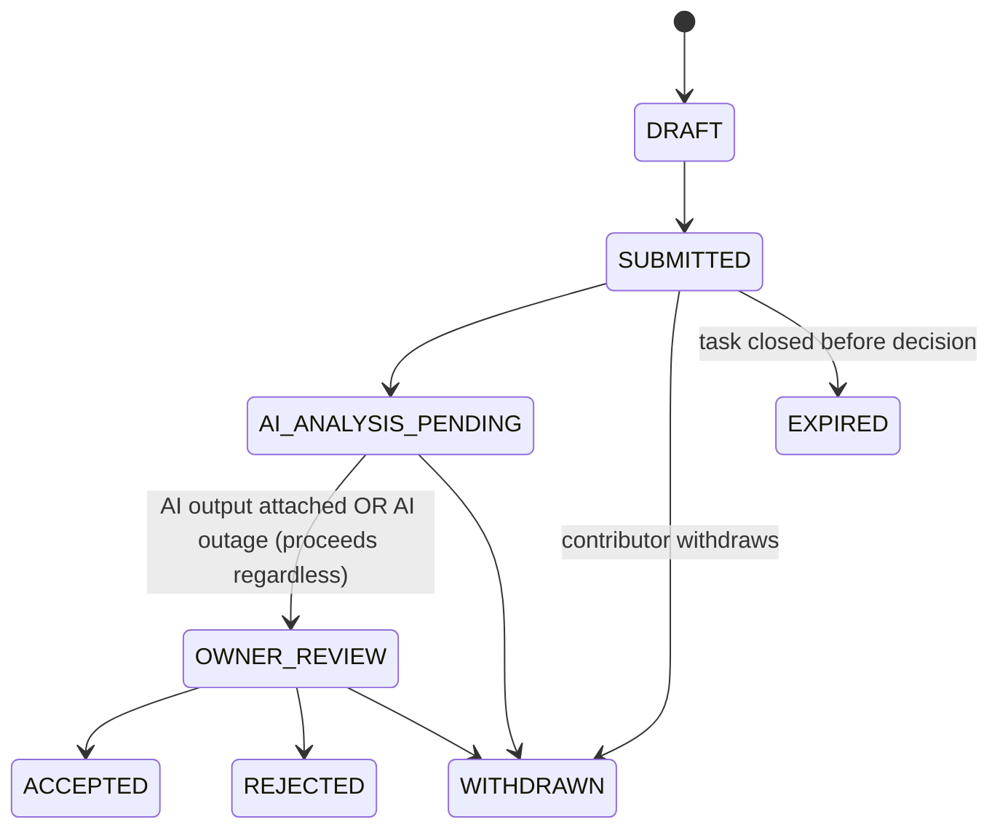
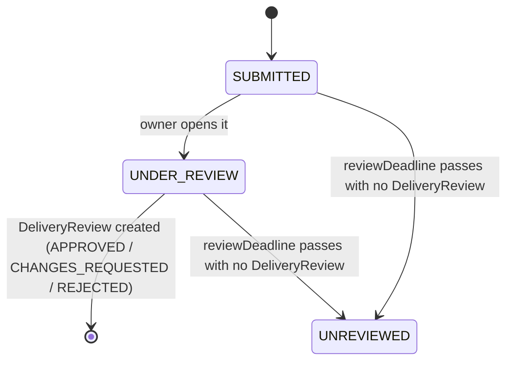
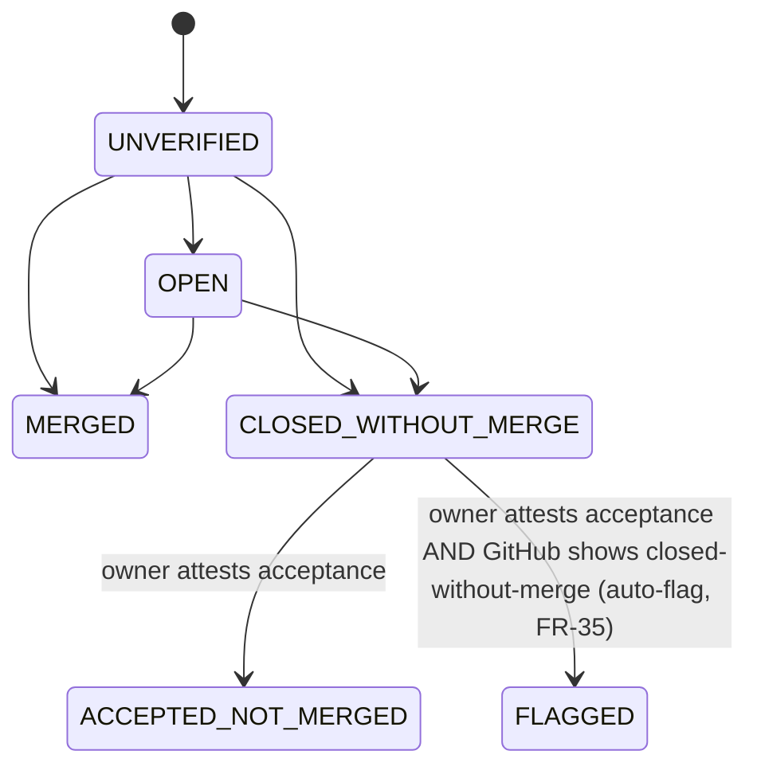
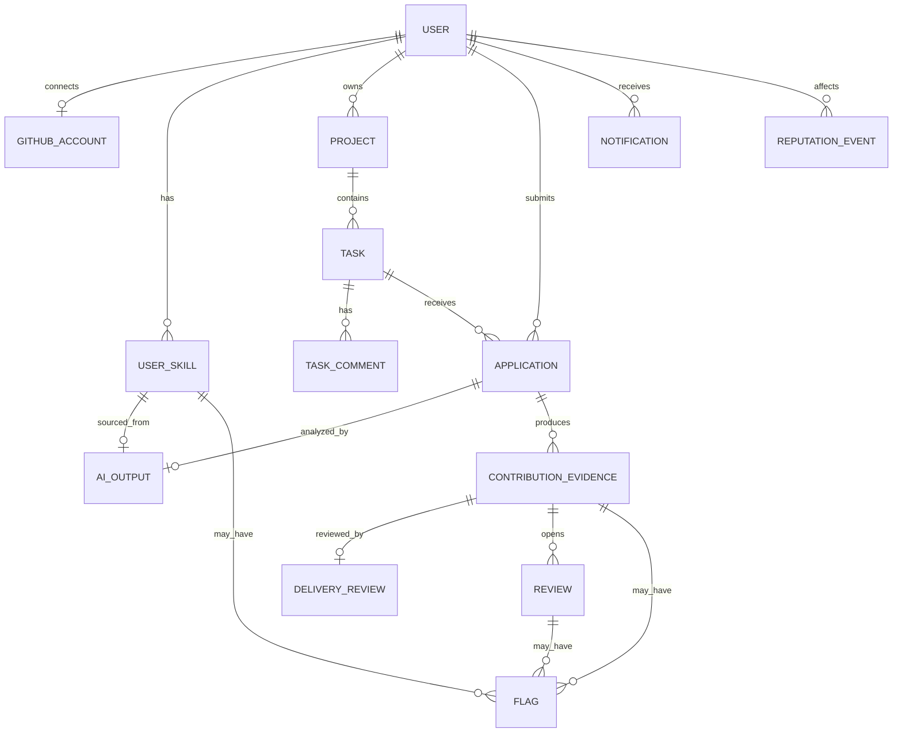

# ShareK — Data Model and ERD

**Status:** APPROVED
**Date:** 2026-07-17
**Depends on:** `prd.md`, `architecture.md` §5, §7
**Replaces:** `docs/archive/bmad-output/ERD/` (20 entities)

This is the **target** schema — it does not describe `prisma/schema.prisma` as it exists today. `architecture.md` §7 tracks the specific gap (dead models to drop, `User.role`/`User.status` to rework). No schema or code changes were made writing this document.

---

## 1. Entities (14)

Deliberately smaller than the old 20-entity ERD: no `Subscription`, `UsageTracker`, `AiMatchResult`, `SkillGapGuidance`, or a standalone rich `Dispute` entity (see `prd.md` §6 for why). `AiValidationResult` is replaced by the general-purpose `AiOutput` below — one shape for every AI call, not one table per AI feature.

| Entity | Owning module | One-line purpose |
|---|---|---|
| `User` | `identity` | Account. No fixed `role` enum — see §2. |
| `GitHubAccount` | `identity`/`github` | 1:1 OAuth connection, read-only scopes. |
| `UserSkill` | `contributor-profiles`/`skill-profiles` | One row per (user, skill), carrying the evidence-state ladder (FR-15). |
| `AiOutput` | `ai` | Every `AiPort` call, regardless of feature — skill profile or application fit. |
| `Project` | `projects` | Owner, status, optional linked repo. |
| `Task` | `contribution-tasks` | The unit applications/evidence/reputation attach to. |
| `TaskComment` | `contribution-tasks` | Flat coordination thread (FR-24) — no threading. |
| `Application` | `applications` | Contributor → task, with the AI fit output attached. |
| `ContributionEvidence` | `delivery-reviews` | Links-only submission (FR-31/32), typed. |
| `DeliveryReview` | `delivery-reviews` | Owner's verdict on one evidence submission. |
| `Review` | `reviews` | One side of a blind bilateral review (FR-40). |
| `ReputationEvent` | `reputation` | Immutable, append-only. |
| `Notification` | `notifications` | Polled, in-app only. |
| `Flag` | `admin` | The simplified "contest" mechanism (FR-45) — covers evidence, reviews, and skill claims. |

**Modeling note — no `ProjectMember` table.** `OWNER`/`CONTRIBUTOR`/`APPLICANT` (FR-07) are derived at query time, not stored: `OWNER` = `Project.ownerId === User.id`; `CONTRIBUTOR` = an `Application` for one of the project's tasks reached `ACCEPTED`; `APPLICANT` = any `Application` exists regardless of status. No `MAINTAINER` role exists in MVP (Post-MVP), so there's no case a stored membership table would need to cover that this derivation doesn't. If the contributor-list screen's query performance ever needs it, a materialized view is cheaper than a new writable table — revisit only if that turns out to matter.

## 2. Key fields per entity

### User
`id, email, username, passwordHash, firstName, lastName, avatarUrl, status (active|suspended|deactivated), isAdmin (bool — the only account-level role flag), preferredLanguage, createdAt, updatedAt, lastLoginAt`

No `pending` status — registration produces an immediately-usable account (FR-16, ADR "no per-account admin approval"). No `role` enum — see the modeling note above.

### GitHubAccount
`id, userId (unique), githubId (unique), username, accessToken (encrypted), avatarUrl, profileUrl, connectedAt, lastSyncedAt`. Read-only scopes only (FR-02) — no field for a write/repo scope exists because none is ever requested.

### UserSkill
`id, userId, skillName, evidenceState (SELF_DECLARED|AI_INFERRED|CONTRIBUTION_DEMONSTRATED|ADMIN_REVIEWED), confidence (nullable, AI-sourced only), aiOutputId (nullable, FK), adminReviewedBy (nullable), adminReviewedAt (nullable), contested (bool, FR-45), createdAt, updatedAt`. Unique on `(userId, skillName)`. `evidenceState` reflects the strongest evidence present — `CONTRIBUTION_DEMONSTRATED` and `ADMIN_REVIEWED` are independent upgrade paths off `AI_INFERRED` (FR-15), not a strict ladder.

### AiOutput
`id, kind (SKILL_PROFILE|APPLICATION_FIT), subjectType (USER|APPLICATION), subjectId, result (JSON), confidence, evidenceRefs (JSON), promptVersion, modelVersion, createdAt`. Never mutated after creation — a re-run creates a new row, referenced by the newer `UserSkill.aiOutputId` / `Application.aiOutputId`.

### Project
`id, ownerId, title, description, status (DRAFT|PUBLISHED|ACTIVE|PAUSED|COMPLETED|ARCHIVED|CANCELLED), repositoryStatus (NONE|PENDING_LINK|CONNECTED|SYNC_ERROR|DISCONNECTED), repositoryUrl (nullable), languages (JSON), createdAt, updatedAt`.

### Task
`id, projectId, title, description, requiredSkills (JSON), optionalSkills (JSON), difficulty, beginnerFriendly (bool), deadline (nullable), maxContributors, status (DRAFT|OPEN|SCREENING|ASSIGNED|IN_PROGRESS|IN_REVIEW|COMPLETED|CANCELLED|ARCHIVED), screeningMode (ADVISORY|STRICT), createdBy, createdAt, updatedAt`. `STRICT` is a config flag an owner sets (FR-30); no `MANUAL_ONLY` mode in MVP.

### TaskComment
`id, taskId, authorId, body, createdAt`. Flat — no `parentId`, no threading (FR-24).

### Application
`id, taskId, contributorId, message (nullable), status (DRAFT|SUBMITTED|AI_ANALYSIS_PENDING|OWNER_REVIEW|ACCEPTED|REJECTED|WITHDRAWN|EXPIRED), decisionReason (nullable), aiOutputId (nullable, FK), submittedAt, decidedAt (nullable)`. `aiOutputId` is nullable because AI is advisory — a missing fit analysis (AI outage) never blocks the state machine (see §3).

### ContributionEvidence
`id, applicationId, contributorId, type (GITHUB_PR|GITHUB_ISSUE|LIVE_DEPLOYMENT|FIGMA|GOOGLE_DRIVE_DOC|VIDEO_DEMO|DOCUMENTATION_LINK|OTHER), url, label, description, roleDescription (nullable — the contributor's individual role when a PR is shared by several contributors), prState (nullable, only meaningful when type=GITHUB_PR: MERGED|ACCEPTED_NOT_MERGED|OPEN|CLOSED_WITHOUT_MERGE|UNVERIFIED|FLAGGED), ownerAttestationStatus (nullable), ownerAttestationAt (nullable), status (SUBMITTED|UNDER_REVIEW|UNREVIEWED), submittedAt, reviewDeadline, expiredAt (nullable)`. `reviewDeadline = submittedAt + 14d` (FR-38), set at creation.

### DeliveryReview
`id, evidenceId (unique), reviewerId (the owner), outcome (APPROVED|CHANGES_REQUESTED|REJECTED), feedback (nullable), reviewedAt`. One review per evidence item, by the task's project owner. A `REJECTED` outcome on evidence whose `prState = MERGED` auto-creates a `Flag` (FR-35).

### Review
`id, contributionEvidenceId (the approved contribution this review is about), authorId, subjectId, direction (OWNER_TO_CONTRIBUTOR|CONTRIBUTOR_TO_OWNER), scores (JSON — 3 named dimensions, direction-dependent: contributor-side is quality/communication/reliability, owner-side is clarity/responsiveness/fairness), rationale (required if any score is extreme), submittedAt (nullable — null until submitted), reviewWindowEndsAt, publishedAt (nullable), counterpartSubmitted (bool), counterpartDidNotReview (bool), publicationReason (nullable)`. Two `Review` rows exist per approved contribution (one per direction), created empty when the review window opens (FR-40).

### ReputationEvent
`id, userId, type (CONTRIBUTION_APPROVED|REVIEW_PUBLISHED|EVIDENCE_INVALIDATED|REVIEW_INVALIDATED), refId, refType, createdAt`. **No `updatedAt` — this table is never updated, only inserted into.** Aggregate display values (verified-contribution count, per-dimension averages) are always computed from this log at read time, never stored as a mutable counter.

### Notification
`id, userId, type, payload (JSON), isRead (bool), createdAt`. No delivery-channel field — in-app only, no email/push (FR-43).

### Flag
`id, subjectType (EVIDENCE|REVIEW|AI_SKILL_CLAIM|AI_OUTPUT), subjectId, raisedBy, reason, status (OPEN|RESOLVED), adminNote (nullable), resolvedBy (nullable), resolvedAt (nullable), createdAt`. Deliberately one flat state pair (`OPEN`/`RESOLVED`), not the old five-state `Dispute` workflow (FR-45).

## 3. State machines

### Task



### Application



AI never transitions this machine on its own — every AI-adjacent edge (`AI_ANALYSIS_PENDING -> OWNER_REVIEW`) fires whether or not `AiOutput` exists (ADR-014, advisory-only).

### ContributionEvidence



Independently, `prState` (only for `type=GITHUB_PR`) tracks GitHub's own state, refreshed by the on-demand `pr-validation` job:



`UNREVIEWED` (the evidence-level state) and `FLAGGED` (the PR-level state) are independent — an item can be both.

### Review

Not a single state enum — a small set of booleans/timestamps that together determine display state (FR-40):

```text
submittedAt == null                                          -> not yet submitted (hidden)
submittedAt != null AND now < reviewWindowEndsAt              -> submitted, still hidden (blind)
now >= reviewWindowEndsAt AND counterpart also submitted       -> both published normally
now >= reviewWindowEndsAt AND counterpart did not submit       -> this one publishes alone, counterpartDidNotReview = true, publicationReason = "Counterpart did not submit a review"
now >= reviewWindowEndsAt AND this one never submitted         -> never publishes, no completion incentive for the counterpart either
```

### ReputationEvent

No state machine — rows are inserted, never updated or deleted (except admin invalidation, which inserts a new `EVIDENCE_INVALIDATED`/`REVIEW_INVALIDATED` event rather than mutating the original). Every display value is `SELECT`-derived from the event log at read time.

## 4. Relationship overview



---

Next: `frontend-spec.md`, drawing heavily on `/spec.md`'s already-decided module map, screens, and testing approach (path-corrected for the monorepo).
