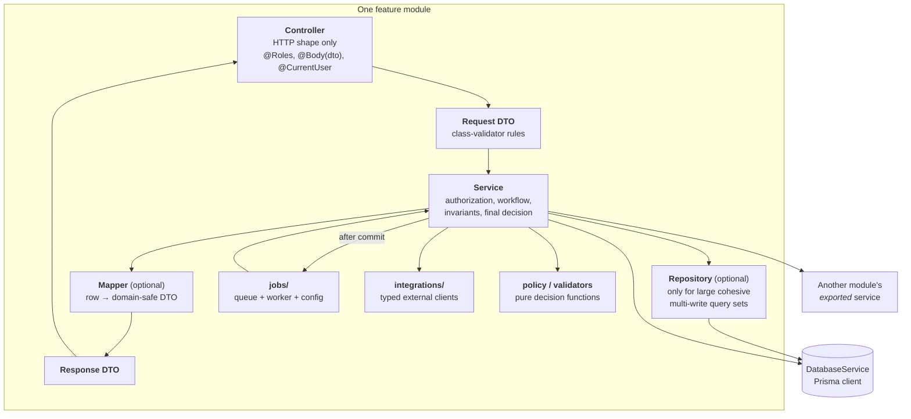
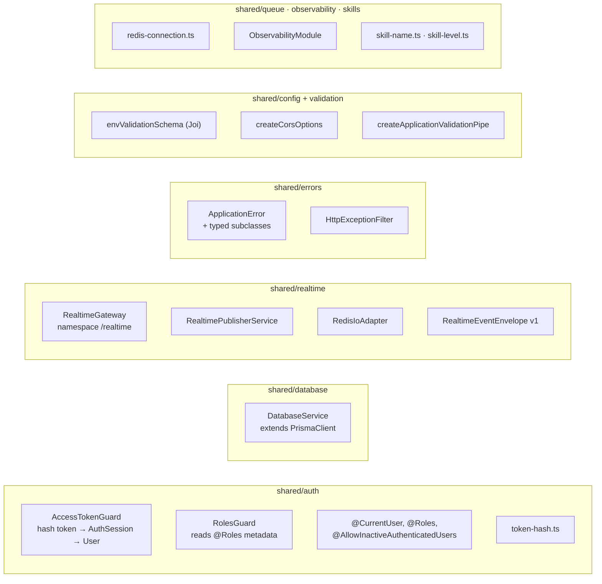
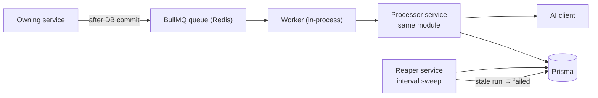
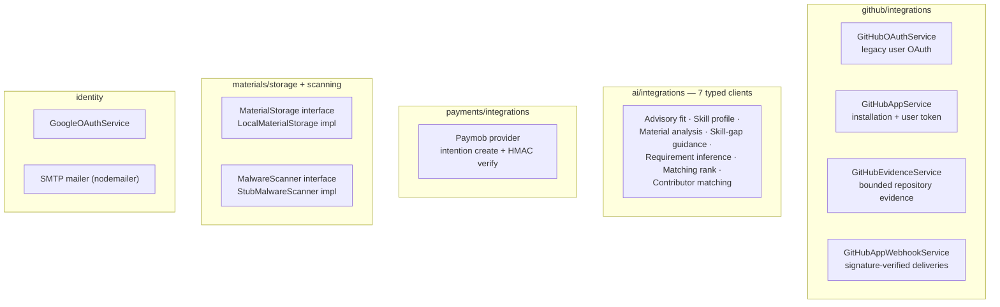
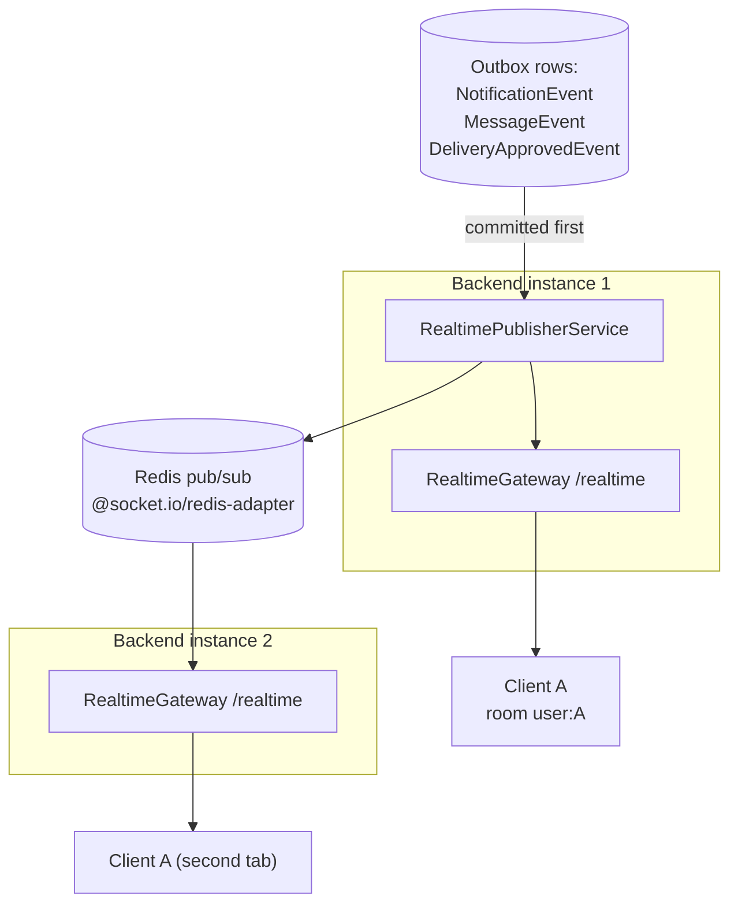

# Architecture (Component Level)

This document zooms in one level below
[`high-level-architecture.md`](./high-level-architecture.md): the internal
components of the NestJS backend, how a module is shaped, and where every
category of file belongs.

The governing decision (see [`../architecture.md`](../architecture.md)) is a
**feature-first modular monolith**: standard NestJS controllers, services, DTOs,
and Prisma — not Clean Architecture layers.

---

## 1. Layering Inside One Module



Rules that keep this shape honest:

- Controllers translate HTTP and nothing else. No business branching.
- Services own authorization, workflow, and the final decision. A service may
  use Prisma directly; a concrete repository is introduced only when a module
  has a large, cohesive set of complex queries (`skill-profiles` is the one that
  qualifies today).
- Responses are domain-safe DTOs, never raw Prisma rows.
- Pure policy lives in its own file so it can be unit-tested without a database
  (`application-review-window.policy.ts`, `skill-level-comparison.ts`,
  `payment-attempt-state.ts`, `match-ranker.ts`, `skill-fit.ts`).

### Canonical folder shapes

```text
# small module                    # large module
projects/                         identity/
  projects.module.ts                identity.module.ts
  projects.controller.ts            controllers/
  projects.service.ts               services/
  projects.service.spec.ts          security/
  dto/                              dto/
  mappers/        (when needed)     integrations/
  README.md                         validators/
                                    README.md
```

Optional folders — `events/`, `integrations/`, `jobs/`, `mappers/`,
`repositories/`, `security/`, `utils/`, `validators/` — are created only when
they hold real files. No empty architecture placeholders.

---

## 2. Shared Technical Kernel

`shared/` contains cross-cutting **technical** code only. No business policy
ever lives here.



| Component | Contract |
| --- | --- |
| `AccessTokenGuard` | Hashes the presented opaque bearer token, loads the matching non-revoked `AuthSession`, attaches `AuthenticatedUser`. Inactive users are rejected unless the handler opts in. |
| `RolesGuard` | Enforces `@Roles(...)` metadata after authentication. |
| `DatabaseService` | The only Prisma client. Injected everywhere; no module constructs its own. |
| `HttpExceptionFilter` | Turns `ApplicationError` into `{ code, message }` with a stable HTTP status. Error codes are part of the API contract. |
| `RealtimeGateway` | Authenticates the socket with the same access token, joins `user:<id>`, emits v1 envelopes. |
| `RealtimePublisherService` | Publishes one envelope to one user room; Redis adapter supplies cross-instance fan-out. |
| `envValidationSchema` | Boot-time Joi validation. Invalid configuration fails startup, not the first request. |
| `skill-name.ts` / `skill-level.ts` | Normalization and ordering shared by eligibility, matching, and skill requirements. |

---

## 3. Module Inventory

| Module | Owns (tables) | Exports to other modules | Async work |
| --- | --- | --- | --- |
| `identity` | `User`, `AuthSession`, `AuthProviderAccount`, `AuthOAuthState`, `EmailVerificationOtp`, `PasswordResetOtp` | `SessionService`, `IdentityAccountStatusService`, `PaymentCustomerProfileService` | — |
| `github` | `GitHubAccount`, `GitHubOAuthState`, `GitHubApp*`, `GitHubWebhookDelivery`, `GitHubEvidenceCutover` | `GitHubEvidenceService`, `GitHubAccountService`, `GitHubRepositoryService` | webhook processing |
| `contributor-profiles` | `ContributorProfile`, `ContributorField*`, `ContributorExperienceLevel` | profile reads | — |
| `subscriptions` | `Subscription`, `UsageTracker` | `EntitlementsService`, `SubscriptionStatusService` | — |
| `payments` | `PaymentAttempt`, `PaymentWebhookEvent` | — | — |
| `projects` | `Project`, `SavedProject`, `ProjectOperation`, `ProjectStateTransition` | project scope reads | — |
| `contribution-tasks` | `ContributionRequest`, `*Requirement`, `*SkillRequirement`, `*Audit` | `ContributionTasksService`, `ContributionRequestSkillRequirementsService` | `requirement-inference` |
| `contribution-proposals` | `ContributionProposal*`, `ProjectProposalIntake` | — | — |
| `materials` | `Material*`, `MaterialAnalysis*` | material access checks | `material-scan`, `material-analysis` |
| `eligibility` | `EligibilityEvaluation` | `EligibilityService` (the DEC-078 gate) | — |
| `applications` | `Application*`, `AssessmentRequest`, `AssessmentAttempt`, `AdvisoryFit*`, `OwnerDecision`, `Assignment` | `ApplicationsService.summarizePendingByContributionRequests()` | `advisory-fit-assessment`, `application-review-window` |
| `assignment-conversations` | `AssignmentConversation`, `Message`, `MessageEvent` | conversation opening | outbox publish |
| `delivery-reviews` | `Delivery`, `DeliverySubmission`, `DeliveryReview`, `DeliveryApprovedEvent` | — | `delivery-reputation` |
| `skill-profiles` | `SkillProfile`, `SkillProfileGeneration`, `SkillProfileReviewDecision` | `SkillProfilesReviewService`, `SkillProfileSummaryService` | `skill-profile-generation` |
| `skill-guidance` | `SkillGapGuidance`, `EligibilityGuidance` | — | `eligibility-guidance` |
| `matching` | `AiMatchResult` | — | — |
| `notifications` | `Notification*` | `NotificationsService` | `notification-event-recovery`, `notification-retention` |
| `reputation` | `ReputationRecord` | `ReputationService` | — |
| `badges` | `UserBadge` | `BadgesService` | — |
| `dashboard` | none (read model) | — | — |
| `admin` | none (delegates writes) | — | — |
| `ai` | none | `AiService` + 7 typed clients | — |
| `health` | none | — | — |

`admin` and `dashboard` are deliberately stateless: they compose reads and call
other modules' exported services rather than writing foreign tables.

---

## 4. Asynchronous Work

Every queue follows the same three-file shape — `*.config.ts` (flags and
timings), `*.queue.ts` (typed enqueue), `*.worker.ts` (bounded processing) —
and every one is behind its own `*_QUEUE_ENABLED` flag.



| Queue | Trigger | Worker does | Reaper |
| --- | --- | --- | --- |
| `skill-profile-generation` | Contributor submits repos + consent | Collect GitHub evidence → `AiService` → apply confidence rules → write pending `SkillProfile` rows → notify | — |
| `advisory-fit-assessment` | Owner requests an assessment | Load fixed snapshots → `AdvisoryFitClient` → write `AssessmentAttempt` + `AdvisoryFitAssessment` + findings | `advisory-fit-assessment-reaper` (`ADVISORY_FIT_STALE_AFTER_MS`) |
| `requirement-inference` | Draft Request saved | `RequirementInferenceClient` → write `ContributionRequestSkillRequirement` rows as `ai_inferred` | — |
| `material-scan` | Material version uploaded | Malware scan → set `scan_status` | `material-scan-reaper` |
| `material-analysis` | Owner starts an analysis run | Extract → chunk → embed (pgvector) → `MaterialAnalysisClient` → write draft suggestions | `material-analysis-reaper` |
| `eligibility-guidance` | Contributor blocked by the gate | `SkillGapGuidanceClient` → write `EligibilityGuidance` (`ready` or `failed`) | — |
| `application-review-window` | Interval sweep | Send review reminders, expire overdue Applications | — |
| `delivery-reputation` | `DeliveryApprovedEvent` committed | Project reputation facts, award badges | — |
| `notification-event-recovery` | Interval sweep | Republish unpublished `NotificationEvent` rows, cap at `NOTIFICATION_EVENT_MAX_PUBLISH_ATTEMPTS` | — |
| `notification-retention` | Interval sweep | Delete notifications past the user's `retention_days` | — |

Two invariants apply to all of them:

1. **Enqueue strictly after commit.** Enqueueing inside a transaction lets a
   worker start before the row it needs is visible.
2. **`failed` is a first-class state.** A provider outage produces a retriable
   failure row the user can see and act on — it is never silently dropped and
   never recorded as a business outcome.

---

## 5. Integration Adapters



Every adapter sits behind an interface or a typed client with an explicit
timeout, so the calling service depends on a shape it controls rather than on a
vendor SDK. `MaterialStorage` and `MalwareScanner` are interfaces specifically
so the local filesystem and stub scanner can be swapped without touching
service code, and `PAYMENT_PROVIDER` is an injection token for the same reason.

---

## 6. Realtime Transport



- Namespace `/realtime`, WebSocket transport only.
- Client authenticates with the same opaque access token used for HTTP, via
  `auth.token` or an `Authorization: Bearer` header.
- Envelope is version-one `RealtimeEventEnvelope`, emitted under its `type`.
- Current event types: `notification.created`,
  `notification.read_state_changed`, `conversation.message.created`.
- Room is `user:<authenticated-user-id>` — never a broadcast.
- Unauthorized sockets receive `realtime.error` with `REALTIME_UNAUTHORIZED`,
  then disconnect.
- Redis failure is deliberately non-fatal: startup continues, local Socket.IO
  delivery continues, and the durable rows plus the recovery worker remain
  authoritative (ADR 0013).

---

## 7. Cross-Cutting Concerns

| Concern | Mechanism |
| --- | --- |
| Authentication | Opaque access token hashed into `AuthSession`; refresh token rotation on `POST /auth/refresh` |
| Authorization | `RolesGuard` for coarse role gates; per-resource ownership checks inside services |
| Input validation | Global `ValidationPipe` with whitelist + transform; `class-validator` DTOs |
| Error contract | `ApplicationError` subclasses → `HttpExceptionFilter` → stable `code` strings |
| Idempotency | Client-supplied UUID key + server-computed command fingerprint, unique-indexed per aggregate |
| Concurrency | `Project.revision`, `NotificationPreference.revision`, `*.aggregate_version`, and `pg_advisory_xact_lock` for payment callbacks |
| Auditability | Append-only `*Audit` tables and `ProjectStateTransition` (ADR 0002) |
| Localization | Notifications stored semantically and rendered per `User.preferred_language` (ADR 0012) |
| Secrets | GitHub user tokens encrypted at rest (`GITHUB_TOKEN_ENCRYPTION_KEY`); webhook payloads minimized before storage |
| Observability | `ObservabilityModule`; per-run provider/model/version/latency/token columns on every AI-backed table |
| Schema evolution | Prisma migrations with SQL regression harnesses under `test/migrations/` run by `npm run test:migrations*` |
