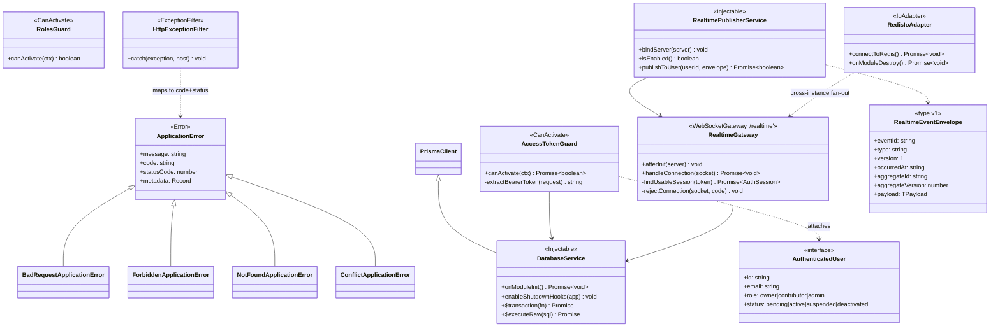
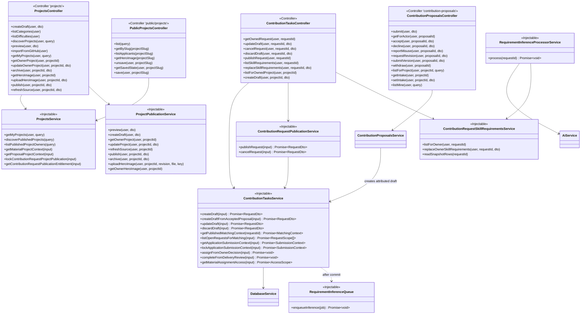
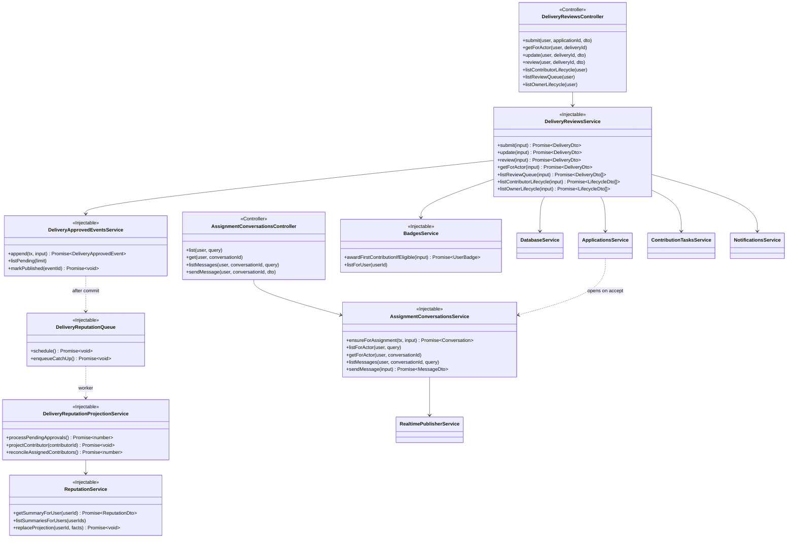
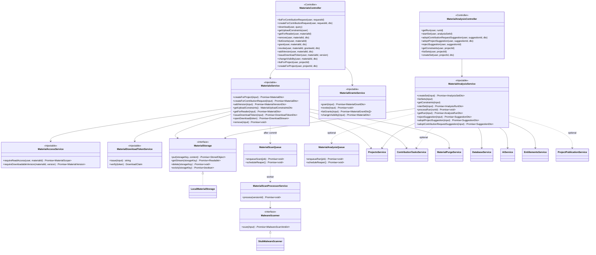
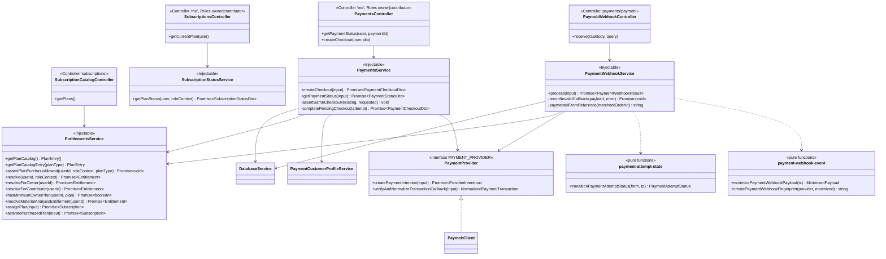
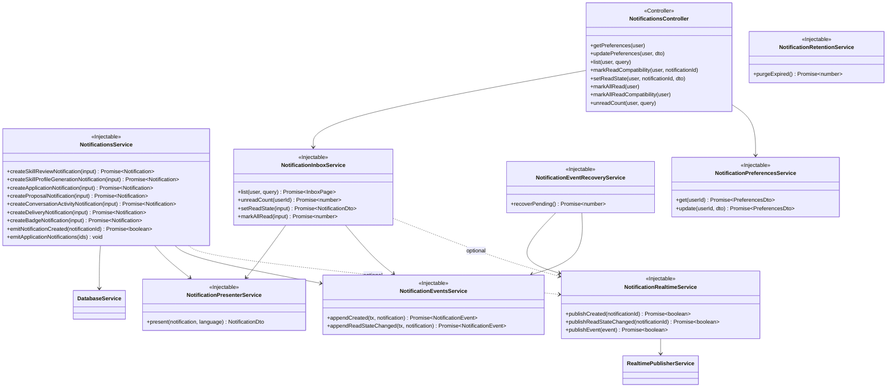

# Class Diagrams

These diagrams show the runtime classes of the NestJS backend — controllers,
services, repositories, guards, and integration clients — together with the
dependency edges that Nest's injector actually wires. They are drawn from
`src/`, and constructor signatures shown here match the real code.

Because 23 modules will not fit in one legible picture, the class model is
presented as one shared-kernel diagram plus one diagram per major workflow
slice. Method lists are the public contract of each class, trimmed of private
helpers.

Notation: `+` public, `-` private, `<<interface>>` for injection contracts,
dashed arrows for optional (`@Optional()`) or `forwardRef` dependencies.

---

## 1. Shared Kernel

---

## 2. Identity, Session & GitHub Access

```mermaid
classDiagram
  class ManualAuthController {
    <<Controller 'auth'>>
    +forgotPassword(dto)
    +login(dto)
    +register(dto)
    +resetPassword(dto)
    +checkUsernameAvailability(query)
    +verifyEmail(dto)
    +resendEmailVerification(dto)
  }

  class SessionController {
    <<Controller 'auth'>>
    +logout(user)
    +me(user)
    +updateMyDetails(user, dto)
    +updateMyEmail(user, dto)
    +exportMyAccountData(user)
    +uploadIdentityDocument(user, dto)
    +changeMyPassword(user, dto)
    +updateMyPhone(user, dto)
    +updateMyPreferences(user, dto)
    +updateMyPrivacy(user, dto)
    +updateMyUsername(user, dto)
    +refresh(dto)
    +assignRole(user, id, dto)
  }

  class GitHubAuthController {
    <<Controller 'auth/github'>>
    +disconnectGitHubAccount(user)
    +completeGitHubAccountConnection(user, dto)
    +completeGitHubGet()
    +completeGitHubPost(dto)
    +startGitHub(query)
  }

  class GoogleAuthController {
    <<Controller 'auth/google'>>
    +completeGoogleGet()
    +completeGooglePost(dto)
    +startGoogle(query)
  }

  class AuthService {
    <<Injectable>>
    +register(dto, context) Promise~AuthSessionDto~
    +checkUsernameAvailability(username)
    +verifyEmail(dto, context) Promise~AuthSessionDto~
    +resendEmailVerification(dto)
    +login(dto, context) Promise~AuthSessionDto~
    +getCurrentUser(userId) Promise~AuthUserDto~
    +assignRole(actor, userId, dto)
  }

  class SessionService {
    <<Injectable>>
    +create(user, context) Promise~AuthSessionDto~
    +refresh(dto, context) Promise~AuthSessionDto~
    +logout(sessionId) Promise~void~
    +canAuthenticate(user) boolean
    +updateCurrentUserPreferences(userId, dto)
  }

  class SocialAuthService {
    <<Injectable>>
    +start(provider, role, intent) StartDto
    +startGitHub(role, intent) StartDto
    +startGoogle(role, intent) StartDto
    +complete(input) Promise~AuthSessionDto~
    +completeGitHub(input) Promise~AuthSessionDto~
    +completeGoogle(input) Promise~AuthSessionDto~
    +connectGitHubAccount(input) Promise~void~
    +disconnectGitHubAccount(userId) Promise~void~
  }

  class AccountSettingsService {
    <<Injectable>>
    +updatePersonalDetails(userId, dto)
    +updatePrivacy(userId, dto)
    +updatePhone(userId, dto)
    +updateEmail(userId, dto)
    +updateUsername(userId, dto)
    +changePassword(userId, dto)
    +uploadIdentityDocument(userId, file)
    +exportAccountData(userId)
  }

  class PasswordHasher {
    <<Injectable>>
    +hash(plain) Promise~string~
    +verify(plain, hash) Promise~boolean~
  }

  class SessionTokenService {
    <<Injectable>>
    +generate() TokenPair
    +hash(token) string
  }

  class IdentityAccountStatusService {
    <<Injectable>>
    +activateContributorAfterSkillApproval(userId) Promise~void~
    +getGitHubIdentityForUser(userId)
  }

  class PaymentCustomerProfileService {
    <<Injectable>>
    +getForUser(userId) Promise~CustomerProfile~
  }

  class GitHubAppService {
    <<Injectable>>
    +startConnection(user, dto)
    +completeConnection(user, dto)
    +processBrowserCallback(query)
    +getConnectionAttempt(user, attemptId)
    +listInstallationLinks(user)
    +listSelectedRepositories(user, query)
    +disconnect(user, installationLinkId)
    +verifyRepositorySelection(linkId, repoIds)
    +lockRepositorySelectionAuthorization(linkId)
  }

  class GitHubEvidenceService {
    <<Injectable>>
    +getSelectedSkillProfilingEvidence(linkId, repoIds)
    +getGitHubAppSkillProfilingEvidence(linkId)
    +verifySelectedRepositoryControl(linkId, repoIds)
    +getProjectImportSnapshot(input)
    +getRepositoryReadme(input)
    +getRepositoryStatistics(input)
  }

  class GitHubAccountService {
    <<Injectable>>
    +getStatusForUser(userId)
    +getAccessToken(userId)
    +getConnectedUsername(userId)
    +markRepositoryImportPrepared(userId)
  }

  class GitHubAppWebhookService {
    <<Injectable>>
    +process(signature, event, payload) Promise~void~
  }

  ManualAuthController --> AuthService
  SessionController --> SessionService
  SessionController --> AccountSettingsService
  GitHubAuthController --> SocialAuthService
  GoogleAuthController --> SocialAuthService
  AuthService --> PasswordHasher
  AuthService --> SessionService
  SessionService --> SessionTokenService
  SessionService --> DatabaseService
  SocialAuthService --> SessionService
  GitHubAppService --> DatabaseService
  GitHubEvidenceService --> GitHubAppService
  GitHubAppWebhookService --> DatabaseService
```

---

## 3. Work Definition — Projects, Requests & Proposals

---

## 4. Eligibility, Applications & Advisory Fit

This is the slice where the "AI advises, backend decides" rule is enforced in
code: `EligibilityService` is deterministic, and `AdvisoryFitAssessmentService`
writes only into assessment tables.

```mermaid
classDiagram
  class ApplicationsController {
    <<Controller>>
    +getForActor(user, applicationId)
    +accept(user, applicationId)
    +getAssessment(user, applicationId)
    +requestAssessment(user, applicationId, dto)
    +presentAssessment(user, applicationId)
    +decline(user, applicationId, dto)
    +withdraw(user, applicationId)
    +listForOwner(user, requestId)
    +submit(user, requestId, dto)
  }

  class EligibilityController {
    <<Controller, Roles contributor>>
    +previewForRequest(user, requestId)
  }

  class ApplicationsService {
    <<Injectable>>
    +submit(input) Promise~ApplicationDto~
    +withdraw(input) Promise~ApplicationDto~
    +accept(input) Promise~ApplicationDto~
    +decline(input) Promise~ApplicationDto~
    +listForOwner(input) Promise~ApplicationDto[]~
    +getForActor(input) Promise~ApplicationDto~
    +summarizePendingByContributionRequests(input) Promise~Counts~
    +cancelPendingForRequest(input) Promise~void~
    +lockDeliverySubmissionContext(input) Promise~DeliveryContext~
    +listDeliveryLifecycleContextsForOwner(ownerId) Promise~Context[]~
  }

  class EligibilityService {
    <<Injectable>>
    +evaluateForRequest(input) Promise~EligibilityEvaluation~
    +computeVerdict(input) Promise~Verdict~
    +recordProposalEvaluation(input) Promise~EligibilityEvaluation~
    +recordBlocked(input) Promise~EligibilityEvaluation~
    +previewForRequest(input) Promise~EligibilityPreviewDto~
    +blockedError(blockingSkills) ApplicationBlockedBySkillGap
  }

  class skill-level-comparison {
    <<pure functions>>
    +meetsLevel(held, required) boolean
    +indexApprovedSkills(skills) Map
    +findBlockingSkills(required, held) BlockingSkill[]
  }

  class ApplicationDailyQuotaService {
    <<Injectable>>
    +reserve(userId, limit) Promise~void~
    +read(userId) Promise~number~
  }

  class application-review-window-policy {
    <<pure functions>>
    +APPLICATION_REVIEW_REMINDER_DAYS = 3
    +APPLICATION_REVIEW_OVERDUE_DAYS = 5
    +APPLICATION_REVIEW_EXPIRY_DAYS = 7
  }

  class ApplicationReviewWindowService {
    <<Injectable>>
    +processDue(now) Promise~SweepResult~
    +remindDueOwners(now) Promise~number~
    +expireDueApplications(now) Promise~number~
  }

  class AdvisoryFitAssessmentService {
    <<Injectable>>
    +request(input) Promise~AssessmentRequestDto~
    +getAssessment(input) Promise~AssessmentDto~
    +presentAssessment(input) Promise~AssessmentDto~
  }

  class AdvisoryFitAssessmentProcessorService {
    <<Injectable>>
    +process(assessmentRequestId) Promise~void~
  }

  class AdvisoryFitAssessmentReaperService {
    <<Injectable>>
    +reapStale(now) Promise~number~
  }

  class AdvisoryFitAssessmentQueue {
    <<Injectable>>
    +enqueueAssessment(job) Promise~void~
    +scheduleReaper() Promise~void~
  }

  class ApplicationBlockedBySkillGap {
    <<ApplicationError>>
    +blockingSkills: BlockingSkillDto[]
  }

  ApplicationsController --> ApplicationsService
  ApplicationsController --> AdvisoryFitAssessmentService
  EligibilityController --> EligibilityService

  ApplicationsService --> DatabaseService
  ApplicationsService --> ContributionTasksService
  ApplicationsService --> SkillProfileSummaryService
  ApplicationsService --> EligibilityService
  ApplicationsService --> IdentityUsernameService
  ApplicationsService --> NotificationsService
  ApplicationsService --> ContributorProfilesService
  ApplicationsService --> ApplicationDailyQuotaService
  ApplicationsService ..> AssignmentConversationsService : optional

  EligibilityService --> DatabaseService
  EligibilityService --> ContributionTasksService
  EligibilityService --> SkillProfileSummaryService
  EligibilityService ..> skill-level-comparison
  EligibilityService ..> ApplicationBlockedBySkillGap : raises

  AdvisoryFitAssessmentService --> DatabaseService
  AdvisoryFitAssessmentService --> ContributionTasksService
  AdvisoryFitAssessmentService --> AdvisoryFitAssessmentQueue
  AdvisoryFitAssessmentQueue ..> AdvisoryFitAssessmentProcessorService : worker
  AdvisoryFitAssessmentProcessorService --> AiService
  ApplicationReviewWindowService ..> application-review-window-policy
  ApplicationsService ..> application-review-window-policy
```

---

## 5. Assignment, Conversation & Delivery

---

## 6. Skill Profiles, Guidance & Matching

```mermaid
classDiagram
  class SkillProfilesController {
    <<Controller 'skill-profiles'>>
    +startGeneration(user, dto)
    +getGeneration(user, generationId)
    +retryGeneration(user, generationId, dto)
    +getLatestGeneration(user)
  }

  class AdminSkillReviewsController {
    <<Controller 'admin/skill-reviews', Roles admin>>
    +approve(user, skillProfileId, dto)
    +adjustProficiency(user, skillProfileId, dto)
    +reject(user, skillProfileId, dto)
    +listPending(user, query)
  }

  class RecommendationsController {
    <<Controller 'contributors/me', Roles contributor>>
    +list(user)
  }

  class OwnerContributorMatchingController {
    <<Controller, Roles owner>>
    +generate(user, requestId)
  }

  class SkillProfilesService {
    <<Injectable>>
    +startGeneration(input) Promise~GenerationDto~
    +retryGeneration(input) Promise~GenerationDto~
    +getGeneration(input) Promise~GenerationDto~
    +getLatestGeneration(userId) Promise~GenerationDto~
  }

  class SkillProfileGenerationService {
    <<Injectable>>
    +process(generationId) Promise~void~
    +transitionUnresolvedLegacyCandidates(now) Promise~number~
  }

  class SkillProfileGenerationRepository {
    <<Injectable>>
    +create(input) Promise~Generation~
    +findById(id)
    +findLatestForUser(userId)
    +updateStatus(id, status) Promise~void~
    +completeWithPendingSkills(id, candidates) Promise~void~
    +completeNeedsMoreEvidence(id, reason) Promise~void~
    +fail(id, reason) Promise~void~
    +transitionUnresolvedLegacyCandidates(now) Promise~number~
  }

  class SkillProfilesReviewService {
    <<Injectable>>
    +listPendingReviews(input)
    +approve(input) Promise~SkillProfileDto~
    +reject(input) Promise~SkillProfileDto~
    +adjustProficiency(input) Promise~SkillProfileDto~
  }

  class SkillProfileSummaryService {
    <<Injectable>>
    +listApprovedSkillsForEligibility(userId)
    +listAuthorizedSkillsForApplicationSnapshot(userId)
    +listApprovedContributorMatchingSnapshots(userIds)
    +listSkillsForProfile(userId)
  }

  class SkillProfileGenerationQueue {
    <<Injectable>>
    +enqueue(job) Promise~void~
    +hasJob(id) Promise~boolean~
    +isEnabled() boolean
  }

  class MatchingService {
    <<Injectable>>
    +shortlistForContributor(input) Promise~ShortlistedMatch[]~
  }

  class RecommendedTasksService {
    <<Injectable>>
    +listForContributor(user, query) Promise~RecommendedTaskDto[]~
  }

  class OwnerContributorMatchingService {
    <<Injectable>>
    +generate(user, requestId, dto) Promise~AiMatchResultDto[]~
  }

  class MatchRanker {
    <<pure functions>>
    +rerank(input)* Promise~ShortlistedMatch[]~
  }

  class skill-fit {
    <<pure functions>>
    +prepareApprovedSkills(skills) PreparedSkill[]
    +assessSkillFit(required, prepared) SkillFit
  }

  class AiMatchRanker {
    <<Injectable>>
    +rerank(input) Promise~ShortlistedMatch[]~
  }

  class SkillGapGuidanceController {
    <<Controller 'contributors/me/skill-gap-guidance'>>
    +generate(user, dto)
    +stream(user, query) Observable
  }

  class EligibilityGuidanceController {
    <<Controller 'contributors/me/eligibility-guidance'>>
    +list(user, query)
    +request(user, dto)
    +get(user, guidanceId)
  }

  class SkillGapGuidanceService {
    <<Injectable>>
    +generate(actor, contributionRequestId) Promise~SkillGapGuidanceDto~
  }

  SkillProfilesController --> SkillProfilesService
  AdminSkillReviewsController --> SkillProfilesReviewService
  RecommendationsController --> RecommendedTasksService
  OwnerContributorMatchingController --> OwnerContributorMatchingService
  SkillGapGuidanceController --> SkillGapGuidanceService
  EligibilityGuidanceController --> EligibilityGuidanceService

  SkillProfilesService --> SkillProfileGenerationRepository
  SkillProfilesService --> GitHubAppService
  SkillProfilesService ..> SkillProfileGenerationQueue : after commit
  SkillProfileGenerationQueue ..> SkillProfileGenerationService : worker
  SkillProfileGenerationService --> SkillProfileGenerationRepository
  SkillProfileGenerationService --> GitHubEvidenceService
  SkillProfileGenerationService --> AiService
  SkillProfileGenerationService ..> NotificationsService : optional
  SkillProfilesReviewService --> IdentityAccountStatusService
  SkillProfilesReviewService --> NotificationsService

  RecommendedTasksService --> MatchingService
  RecommendedTasksService ..> MatchRanker : optional, feature-flagged
  MatchRanker <|.. AiMatchRanker
  MatchingService --> EntitlementsService
  MatchingService --> SkillProfileSummaryService
  MatchingService --> ContributionTasksService
  MatchingService --> ApplicationsService
  MatchingService --> ReputationService
  MatchingService ..> skill-fit
  AiMatchRanker --> AiService
  OwnerContributorMatchingService --> AiService
  SkillGapGuidanceService --> AiService
  EligibilityGuidanceService ..> EligibilityGuidanceQueue : after commit
  EligibilityGuidanceQueue ..> AiService : worker
```

---

## 7. Materials & Material Analysis

---

## 8. Commerce — Subscriptions & Payments

---

## 9. Notifications

---

## 10. The AI Boundary as Classes

```mermaid
classDiagram
  class AiService {
    <<Injectable>>
    +generateSkillProfile(input) Promise~SkillProfileResult~
    +requestAdvisoryFit(input) Promise~AdvisoryFitAssessmentResult~
    +requestMaterialAnalysis(input) Promise~MaterialAnalysisResult~
    +requestSkillGapGuidance(input) Promise~SkillGapGuidanceResult~
    +inferRequirementSkills(input) Promise~RequirementInferenceResult~
    +rankMatches(input) Promise~MatchingRankResult~
    +requestContributorMatching(input) Promise~ContributorMatchingResult~
  }

  class FastApiSkillProfileClient {
    +generate(input) Promise~SkillProfileResult~
  }
  class AdvisoryFitClient {
    +assess(input) Promise~AdvisoryFitAssessmentResult~
  }
  class MaterialAnalysisClient {
    +analyze(input) Promise~MaterialAnalysisResult~
  }
  class SkillGapGuidanceClient {
    +generate(input) Promise~SkillGapGuidanceResult~
  }
  class RequirementInferenceClient {
    +infer(input) Promise~RequirementInferenceResult~
  }
  class MatchingRankClient {
    +rank(input) Promise~MatchingRankResult~
  }
  class ContributorMatchingClient {
    +generate(input) Promise~ContributorMatchingResult~
  }

  AiService --> FastApiSkillProfileClient
  AiService ..> AdvisoryFitClient : optional
  AiService ..> MaterialAnalysisClient : optional
  AiService ..> SkillGapGuidanceClient : optional
  AiService ..> RequirementInferenceClient : optional
  AiService ..> MatchingRankClient : optional
  AiService ..> ContributorMatchingClient : optional
```

Each client is constructed with `ConfigService` only and reads its own
`AI_*_PATH` and `AI_*_TIMEOUT_MS`. A missing client is not a crash: `AiService`
raises `ApplicationError` with a `*_CLIENT_NOT_CONFIGURED` code and HTTP `503`,
so an unconfigured AI feature degrades to an explicit, retriable unavailability
rather than a silent wrong answer.
