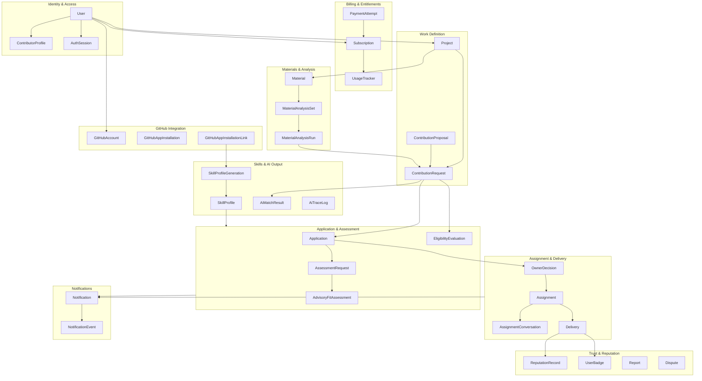
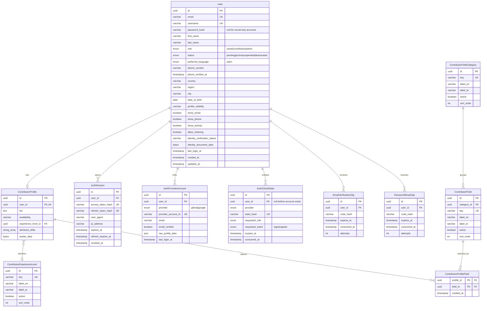
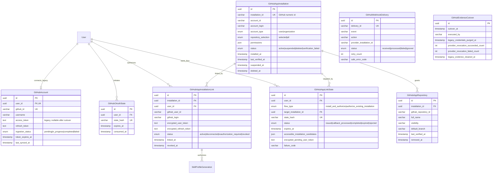
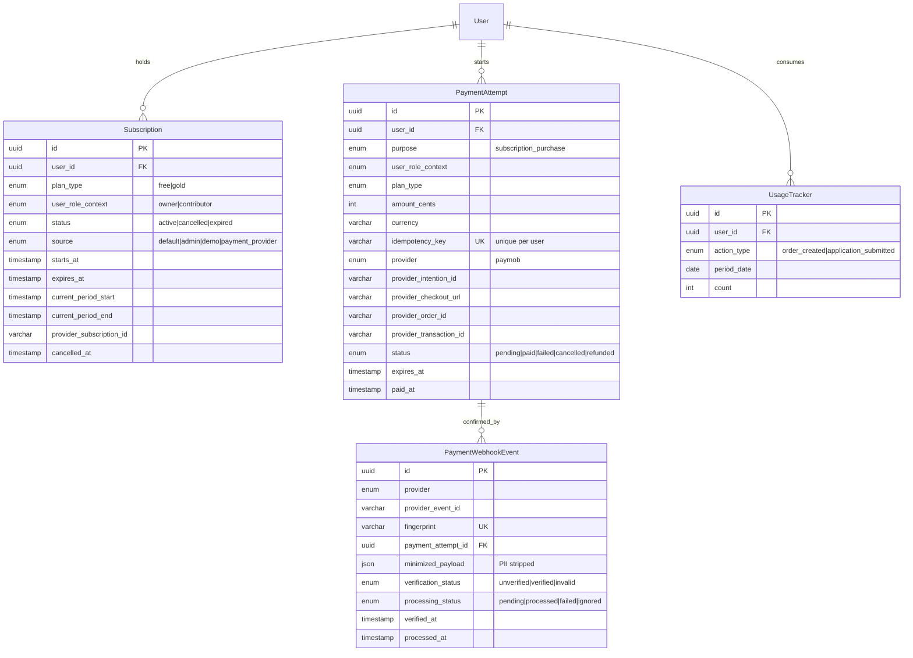
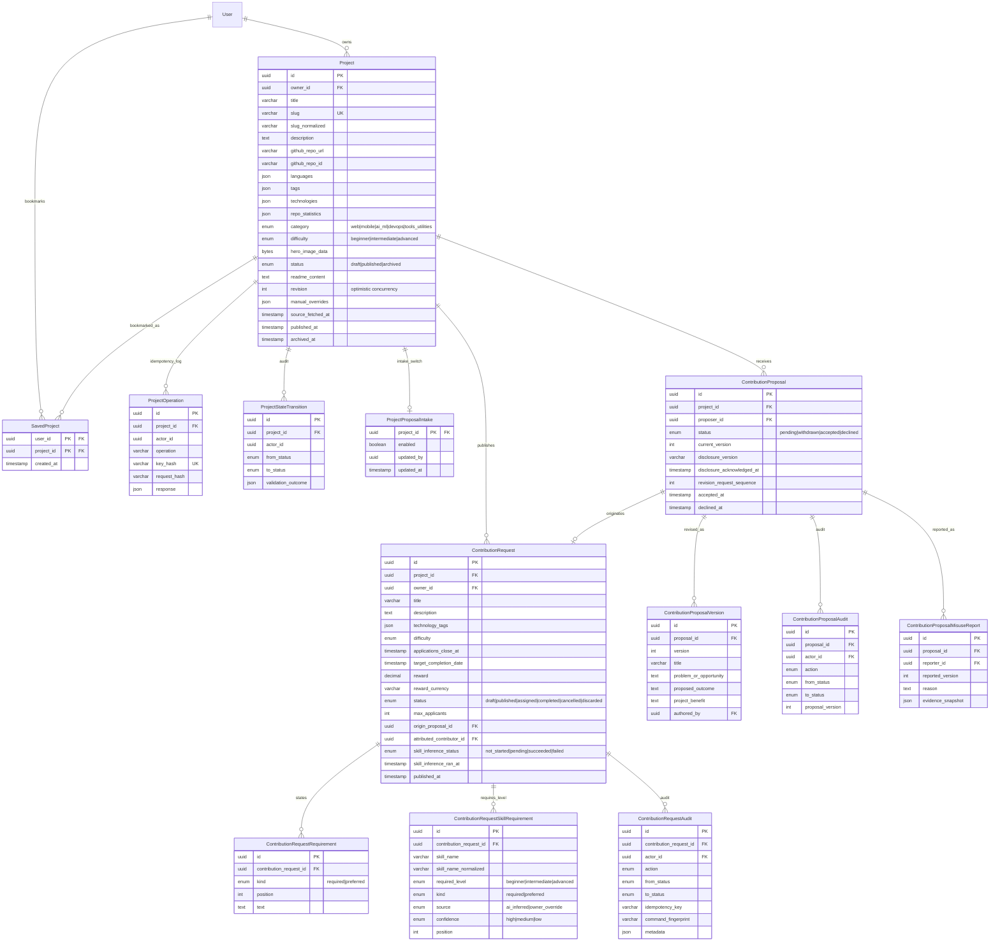
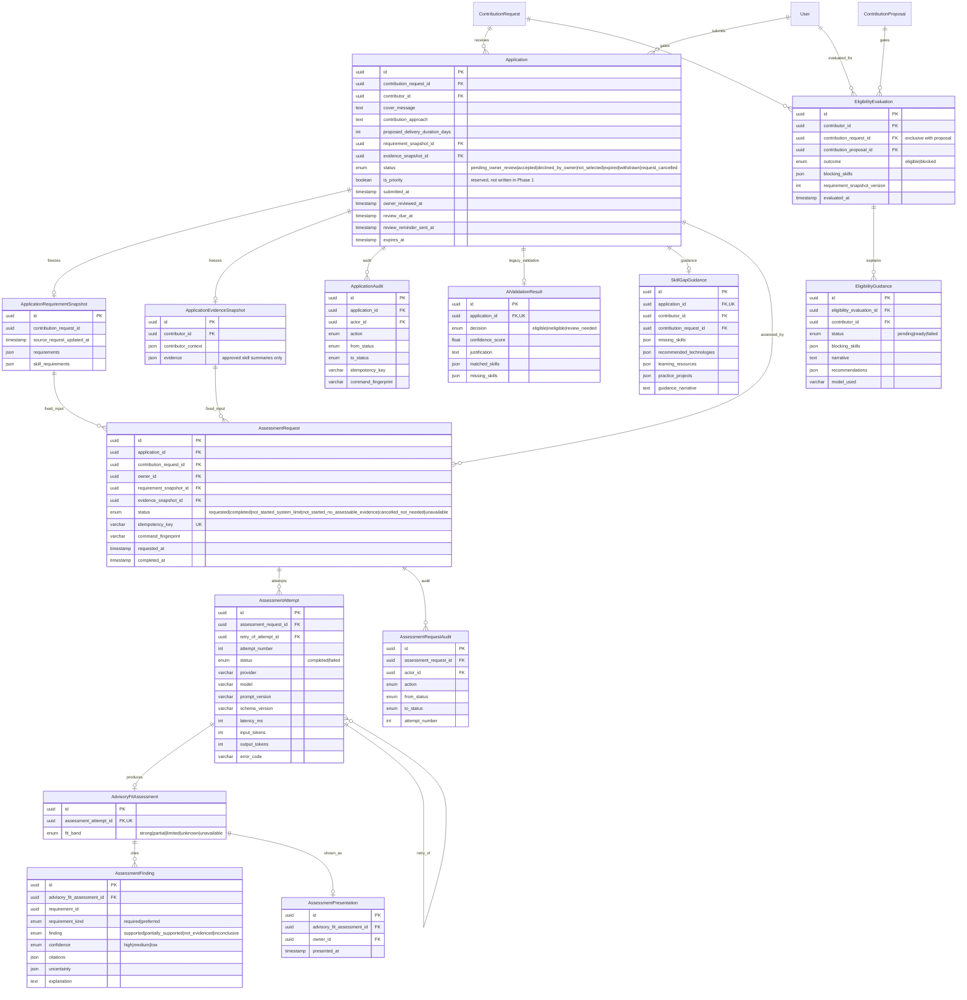
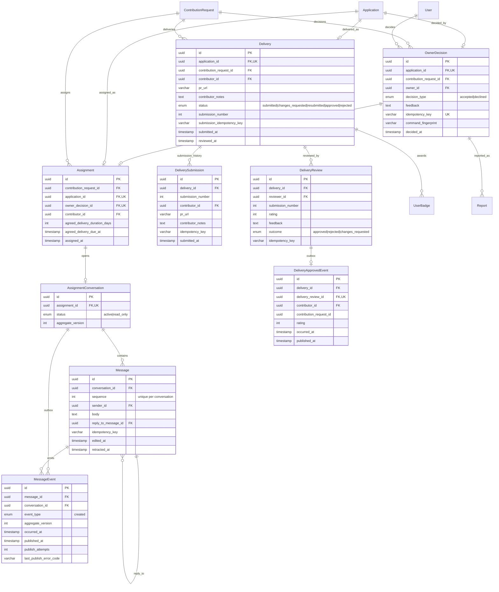
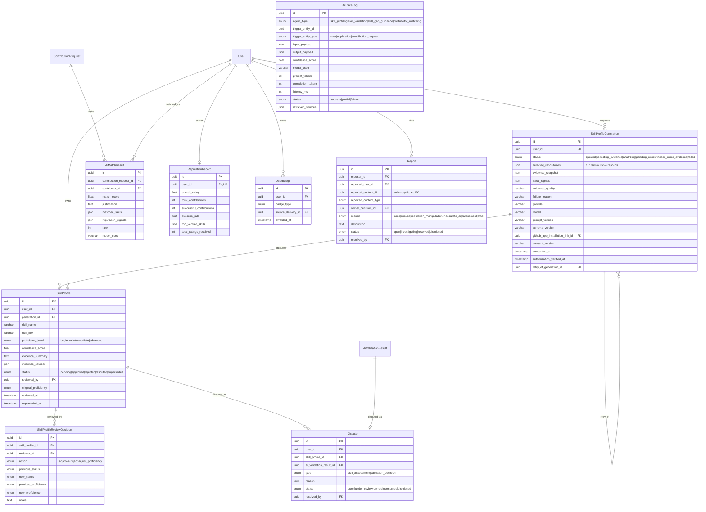
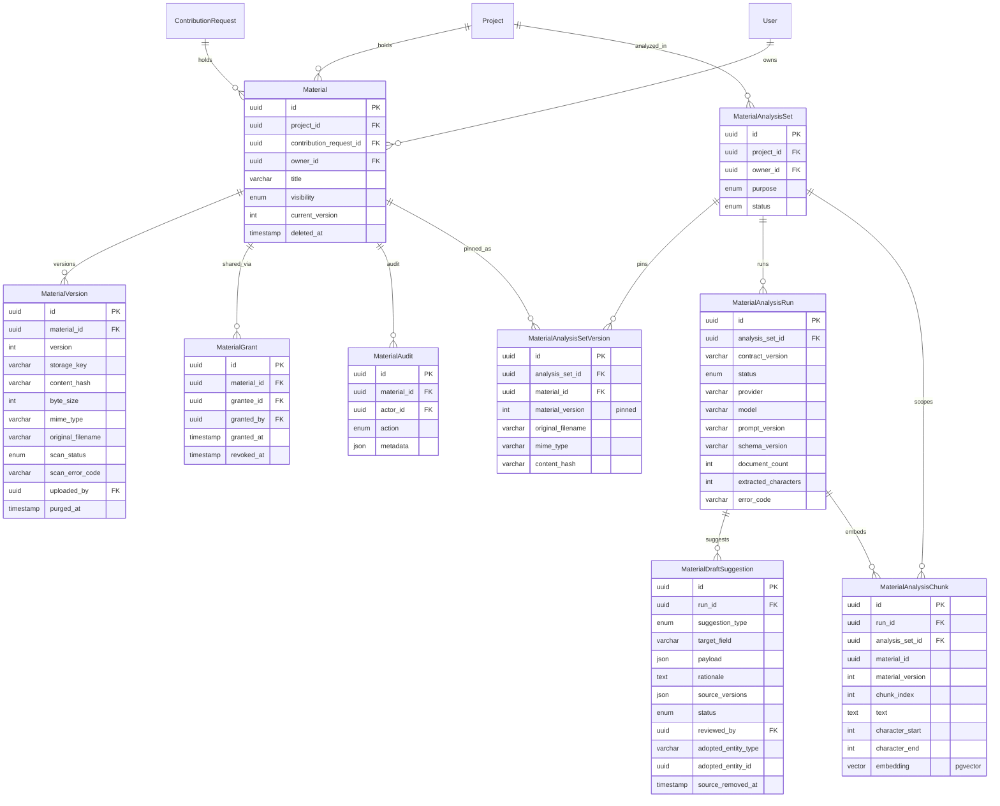
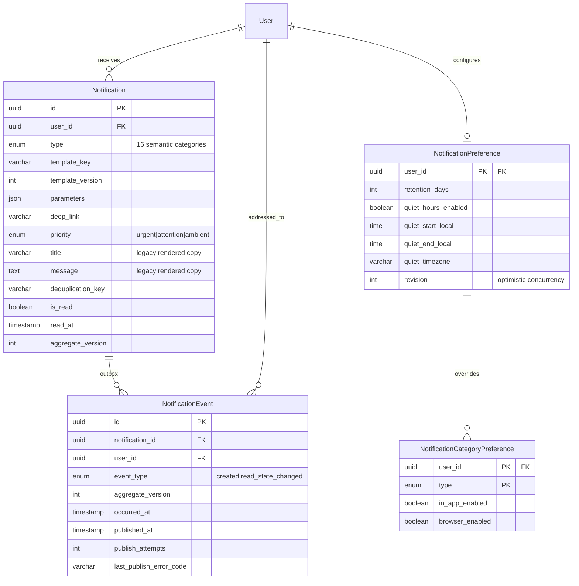

# Entity Relationship Diagram

Derived from `prisma/schema.prisma` (81 models, 67 applied migrations under
`prisma/migrations/`). PostgreSQL 16 with the `pgvector` extension.

The schema is too large for one readable diagram, so it is drawn as a context
map plus one ER diagram per bounded context. Every relationship below is a real
Prisma `@relation` unless it appears in the **Logical references** section at the
end, which lists columns that carry an entity ID without a database foreign key.

Conventions used in every diagram:

- `PK` primary key, `FK` foreign key, `UK` unique constraint.
- All primary keys are `uuid` unless stated otherwise.
- `||--o{` one-to-many, `||--||` one-to-one, `}o--||` optional many-to-one.

---

## 1. Context Map

---

## 2. Identity & Access

`User` is the single account row for all three roles (`owner`, `contributor`,
`admin`). Credentials, social provider links, OTPs, and sessions are separate
tables so that no auth mechanism owns the account record.

---

## 3. GitHub Integration

Two generations of GitHub access coexist. `GitHubAccount` is the legacy OAuth
credential; the GitHub App tables (`GitHubAppInstallation` and friends) are the
current evidence-authorization path, and `GitHubEvidenceCutover` records the
one-time migration between them.

---

## 4. Billing, Payments & Entitlements

`Subscription.source` exists so that a real checkout can never be confused with
a seeded or admin-granted plan (ADR/DEC-026). `PaymentAttempt` is the
idempotency anchor; `PaymentWebhookEvent` is the append-only provider callback
log.

---

## 5. Projects, Contribution Requests & Proposals

A `Project` wraps an imported GitHub repository. Work is published as
`ContributionRequest`. A contributor can also push work upward through
`ContributionProposal`; an accepted proposal originates a Request that stays
attributed to its proposer (ADR 0003).

---

## 6. Eligibility, Applications & Advisory Fit Assessment

This is the most safety-critical part of the schema. Three separate ideas are
deliberately kept apart:

- **`EligibilityEvaluation`** — the deterministic gate. It has exactly two
  outcomes; a provider outage is a retriable error, never a recorded outcome
  (ADR 0015).
- **`ApplicationRequirementSnapshot` / `ApplicationEvidenceSnapshot`** — what
  was true at submission time, frozen so later edits cannot rewrite history.
- **`AdvisoryFitAssessment`** — AI output that informs an owner and can never
  write Application state (ADR 0001).

---

## 7. Owner Decision, Assignment, Conversation & Delivery

`OwnerDecision` is the human decision record; `Assignment` is created in the
same transaction as an `accepted` decision. Conversations are per-Assignment and
expire into `read_only` after twelve months (ADR 0008). `MessageEvent` and
`DeliveryApprovedEvent` are transactional outboxes: the row is committed first,
realtime delivery second (ADR 0007).

---

## 8. Skill Profiles, AI Results & Trust

---

## 9. Materials & Material Analysis

Material sharing authorization (`MaterialGrant`) is deliberately separate from
AI authorization (`MaterialAnalysisSet`) — ADR 0004. Analysis produces
owner-reviewed **draft suggestions**, never direct writes to a Project or
Request — ADR 0005. `MaterialAnalysisChunk.embedding` is a pgvector column.

---

## 10. Notifications

Notifications are stored semantically (`template_key` + `parameters`) and
rendered into the reader's language at read time (ADR 0012). The durable row is
written before any realtime attempt (ADR 0007); `NotificationEvent` is the
outbox that a bounded BullMQ recovery worker republishes.

---

## Logical references (no database foreign key)

These columns carry an entity ID but are intentionally not constrained, either
because the target is polymorphic or because the row must survive the target's
deletion as an audit fact.

| Table | Column | Points at | Why unconstrained |
| --- | --- | --- | --- |
| `ProjectOperation` | `actor_id` | `User.id` | Idempotency log must outlive the actor row |
| `ProjectStateTransition` | `actor_id` | `User.id` | Append-only audit fact |
| `ProjectProposalIntake` | `updated_by` | `User.id` | Setting survives admin removal |
| `ApplicationRequirementSnapshot` | `contribution_request_id` | `ContributionRequest.id` | Snapshot is frozen evidence, not a live link |
| `Report` | `reported_content_id` | any of 7 types | Polymorphic, discriminated by `reported_content_type` |
| `MaterialDraftSuggestion` | `adopted_entity_id` | `Project.id` / `ContributionRequest.id` | Polymorphic adoption target |
| `MaterialAnalysisChunk` | `material_id` | `Material.id` | Pinned to a version, not the live Material |
| `DeliveryApprovedEvent` | `contribution_request_id` | `ContributionRequest.id` | Outbox payload is a frozen fact |
| `GitHubEvidenceCutover` | `executed_by` | `User.id` | One-time operational record |
| `AiTraceLog` | `trigger_entity_id` | `User` / `Application` / `ContributionRequest` | Polymorphic, discriminated by `trigger_entity_type` |

## Cross-cutting schema patterns

| Pattern | Where it appears | Purpose |
| --- | --- | --- |
| Append-only audit table | `ContributionRequestAudit`, `ApplicationAudit`, `AssessmentRequestAudit`, `ContributionProposalAudit`, `MaterialAudit`, `ProjectStateTransition` | State history without event sourcing (ADR 0002) |
| Transactional outbox | `NotificationEvent`, `MessageEvent`, `DeliveryApprovedEvent` | Commit durably, publish to realtime second (ADR 0007) |
| Idempotency key + command fingerprint | `Application*`, `OwnerDecision`, `AssessmentRequest`, `Delivery*`, `PaymentAttempt`, `ProjectOperation`, `Message` | Safe client retries; a replayed key with different content is rejected |
| Frozen snapshot | `ApplicationRequirementSnapshot`, `ApplicationEvidenceSnapshot`, `MaterialAnalysisSetVersion` | Later edits cannot rewrite what a decision was based on |
| Provider run metadata | `AssessmentAttempt`, `SkillProfileGeneration`, `MaterialAnalysisRun` | `provider`/`model`/`prompt_version`/`schema_version` recorded per run |
| Optimistic concurrency | `Project.revision`, `NotificationPreference.revision`, `*.aggregate_version` | Lost-update protection on concurrent edits |
| Soft delete | `Material.deleted_at`, `GitHubAppRepository.removed_at`, `MaterialVersion.purged_at` | Retention and audit obligations |
