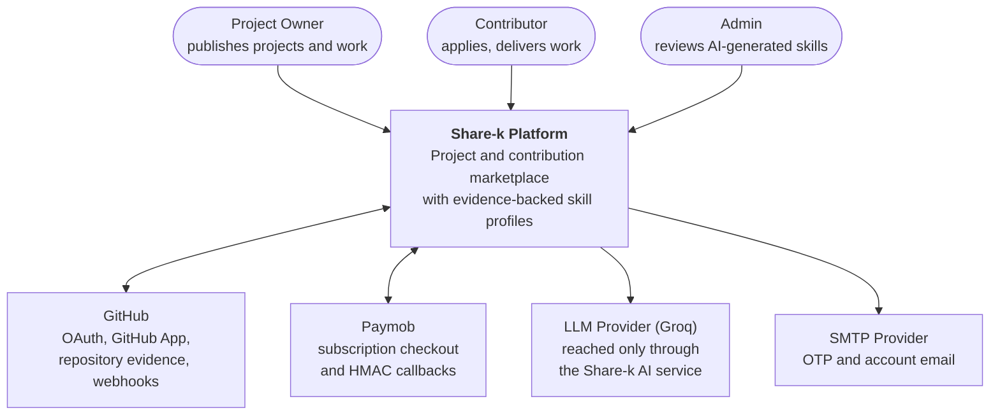
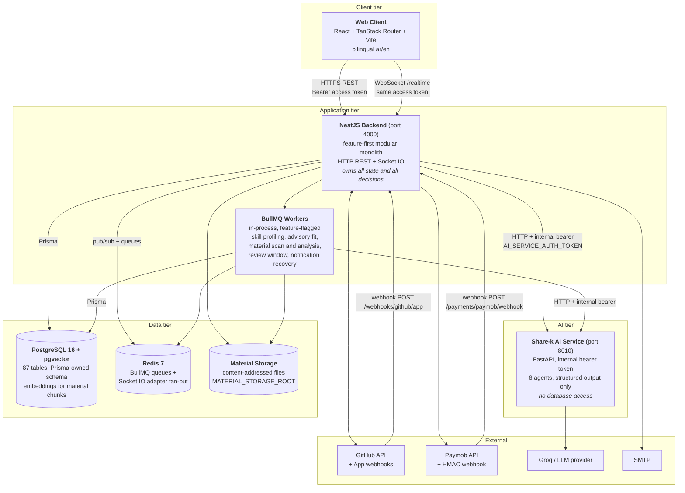
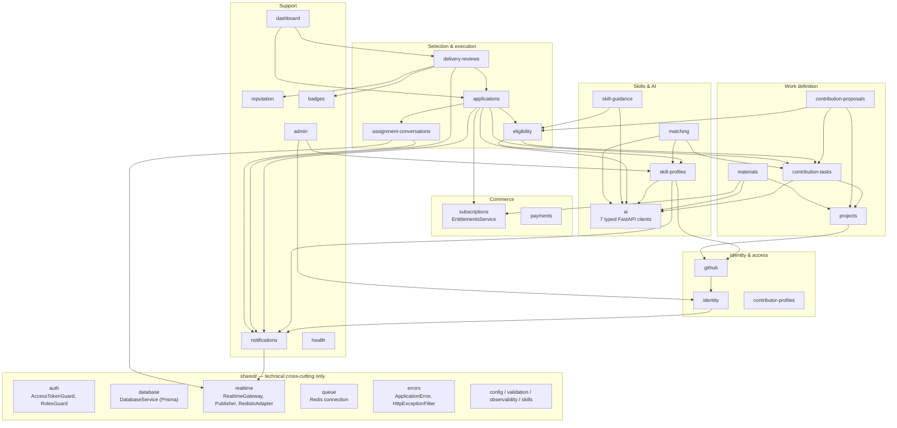
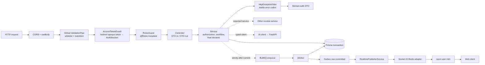
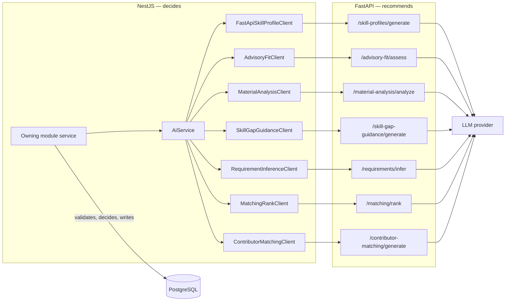
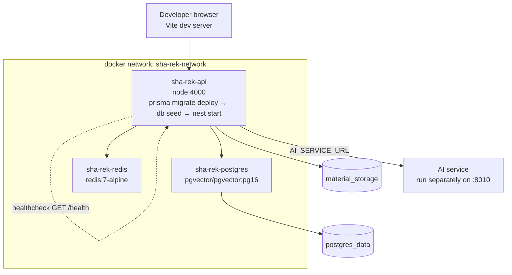

# High-Level Architecture

Share-k connects **project owners** who need work done on their GitHub
repositories with **contributors** whose skills are backed by evidence from
their own repositories. Everything an AI model produces is advisory: the NestJS
backend makes every final decision and owns every state write.

## 1. System Context

**Trust boundary:** the browser never talks to the AI service, the LLM provider,
or Paymob's server API directly. Every external call is made server-side by the
NestJS backend with server-held secrets.

## 2. Container Diagram

### Container responsibilities

| Container | Owns | Never does |
| --- | --- | --- |
| Web Client | Presentation, routing, localized copy | Call the AI service, LLM providers, or Paymob's server API |
| NestJS Backend | AuthN/AuthZ, business state, all database writes, audit snapshots, final decisions | Run prompts or call model providers itself |
| BullMQ Workers | Long-running and retriable work, reaping stale runs | Bypass the owning module's service to write tables |
| AI Service (FastAPI) | Prompts, provider calls, structured recommendation output | Touch the database, decide anything, hold user sessions |
| PostgreSQL | Single source of truth, pgvector similarity | — |
| Redis | Queue transport and cross-instance socket fan-out | Hold anything authoritative (ADR 0013) |

## 3. Backend Module Landscape

The backend is a **feature-first modular monolith** — not layered Clean
Architecture. One business capability, one module, one owner of its tables.
Cross-module access always goes through a service exported by the owning
module's `@Module`.

### Module boundary rules

1. Each business capability has exactly one owning module.
2. A module writes only its own tables.
3. Cross-module calls use services exported from the provider's `@Module`.
4. Never import another module's repository, client, security implementation,
   job, controller, mapper, validator, or utility.
5. `shared/` holds technical code only — no business policy.
6. Events describe completed facts; each listener updates its own state.

## 4. Request and Delivery Paths

Two rules make this shape safe:

- **Enqueue after commit.** Jobs are dispatched strictly after the database
  transaction commits, so a worker can never read a row that does not exist yet.
- **Durable before realtime.** A `Notification`, `MessageEvent`, or
  `DeliveryApprovedEvent` row is committed before any socket emit is attempted.
  A Redis outage degrades delivery latency, never correctness — the HTTP inbox
  and the recovery worker still converge (ADR 0007, ADR 0013).

## 5. AI Boundary

Invariants this boundary enforces:

| Invariant | Consequence |
| --- | --- |
| The AI service has no database credentials | It cannot change state even if compromised |
| Every client is timeout-bounded and typed | A provider hang cannot hold an HTTP request open |
| Clients revalidate every citation | Unmatched `evidenceId` values are discarded backend-side |
| A provider outage is a retriable error, never an outcome | No contributor is recorded as `blocked` because a model was down (ADR 0015) |
| AI output lands in its own tables | `AdvisoryFitAssessment`, `MaterialDraftSuggestion`, `AiMatchResult`, `SkillProfile(pending)` — never directly in `Application.status` or a published `Project` |
| Every run records `provider`/`model`/`prompt_version`/`schema_version` | Any output can be traced back to the exact configuration that produced it |

## 6. Deployment (local / Docker Compose)

Startup order is enforced by `depends_on` with health conditions: Postgres must
report healthy before the API container runs migrations and seeds.

## 7. Configuration Surface

Environment variables are validated at boot by a Joi schema
(`shared/config/env.validation.ts`); the process refuses to start on an invalid
configuration.

| Group | Representative keys | Controls |
| --- | --- | --- |
| Core | `PORT`, `NODE_ENV`, `DATABASE_URL`, `REDIS_URL`, `CORS_ORIGINS`, `FRONTEND_URL` | Runtime and connectivity |
| Sessions | `JWT_ACCESS_SECRET`, `JWT_REFRESH_SECRET` | Token hashing for `AuthSession` |
| GitHub | `GITHUB_CLIENT_*`, `GITHUB_APP_*`, `GITHUB_TOKEN_ENCRYPTION_KEY` | Legacy OAuth and current GitHub App |
| Google | `GOOGLE_CLIENT_*`, `GOOGLE_OAUTH_CALLBACK_URL` | Social sign-in |
| AI | `AI_SERVICE_URL`, `AI_SERVICE_AUTH_TOKEN`, per-route `*_PATH` / `*_TIMEOUT_MS` | AI boundary and timeouts |
| Payments | `PAYMENTS_PAYMOB_ENABLED`, `PAYMOB_SECRET_KEY`, `PAYMOB_HMAC_SECRET`, `PAYMOB_INTEGRATION_IDS` | Checkout and callback verification |
| Materials | `MATERIAL_STORAGE_ROOT`, `MATERIAL_MAX_BYTES`, `MATERIAL_ALLOWED_MIME_TYPES`, `MATERIAL_DOWNLOAD_TOKEN_SECRET` | Upload, scan, and signed download |
| Realtime | `REALTIME_NOTIFICATIONS_ENABLED`, `NOTIFICATION_EVENT_*` | Socket transport and outbox recovery |
| Queues | `*_QUEUE_ENABLED`, `*_INTERVAL_MS`, `*_STALE_AFTER_MS` | Per-feature worker rollout and reaping |

Every worker is behind its own `*_QUEUE_ENABLED` flag, so asynchronous features
roll out — and roll back — independently of the HTTP surface.
