# Sequence Diagrams

Eleven end-to-end flows through the Share-k backend, drawn from the actual
controller/service/worker code in `src/`. Each one names the real classes and
the real HTTP paths, so a diagram can be checked against the code rather than
believed.

Two conventions recur in almost every diagram and are worth reading once:

- **Enqueue after commit.** Background jobs are dispatched strictly after the
  database transaction commits. A job that starts before its row is visible is
  a race the code deliberately avoids.
- **Durable before realtime.** Notification, message, and delivery events are
  committed as rows first, published to sockets second. A Redis outage delays
  delivery; it never loses an event.

**Contents**

1. [Registration and email verification](#1-registration-and-email-verification)
2. [Social sign-in (GitHub / Google)](#2-social-sign-in-github--google)
3. [Authenticated request and token refresh](#3-authenticated-request-and-token-refresh)
4. [GitHub App linking and skill-profile generation](#4-github-app-linking-and-skill-profile-generation)
5. [Admin skill review and account activation](#5-admin-skill-review-and-account-activation)
6. [Project import and Contribution Request publication](#6-project-import-and-contribution-request-publication)
7. [Eligibility gate and Application submission](#7-eligibility-gate-and-application-submission)
8. [Advisory Fit Assessment](#8-advisory-fit-assessment)
9. [Owner decision, Assignment and Conversation](#9-owner-decision-assignment-and-conversation)
10. [Delivery, review, reputation and badges](#10-delivery-review-reputation-and-badges)
11. [Subscription checkout and Paymob callback](#11-subscription-checkout-and-paymob-callback)
12. [Material upload, scan and analysis](#12-material-upload-scan-and-analysis)
13. [Durable notification to realtime delivery](#13-durable-notification-to-realtime-delivery)

---

## 1. Registration and email verification

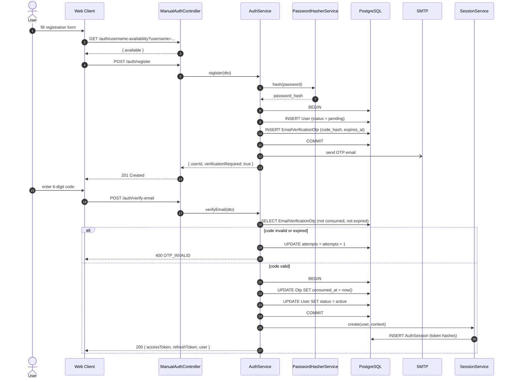

`User.status` starts at `pending`. Nothing in the platform accepts a `pending`
account except the verification routes themselves — the guard rejects it
everywhere else unless the handler opts in explicitly.

---

## 2. Social sign-in (GitHub / Google)

The `SocialAuthIntent` enum exists to close a real hole: a **login** flow may
only issue a session for an account that already exists, and a **register** flow
may only create a new one. Binding the intent to the state row makes it
impossible for a callback to silently do the other thing.

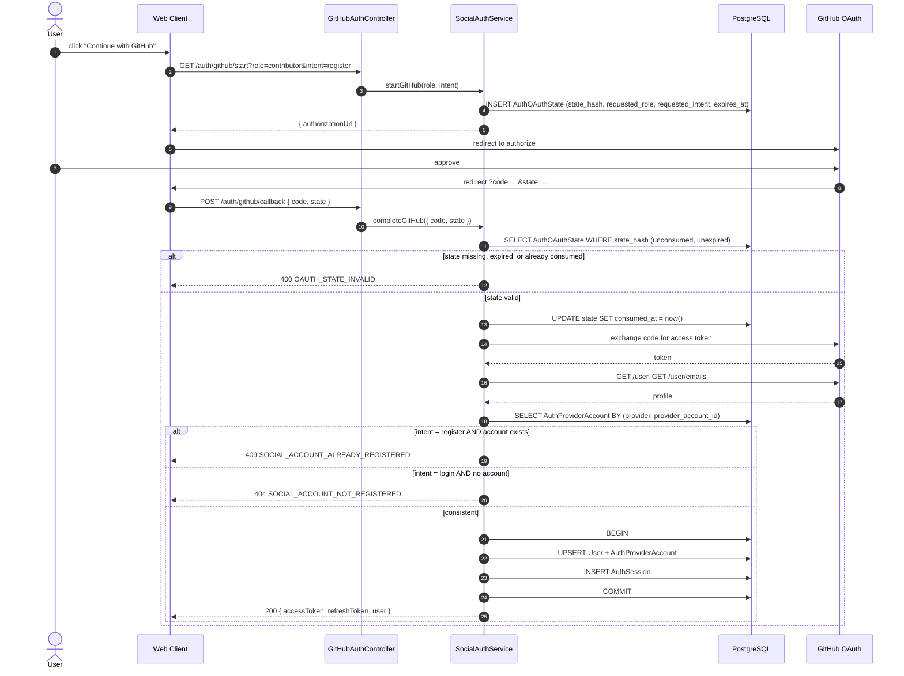

---

## 3. Authenticated request and token refresh

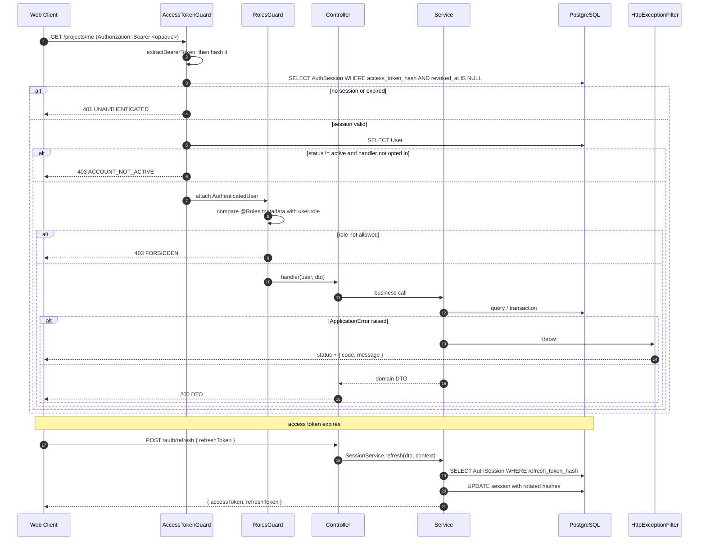

Access tokens are opaque and stored only as hashes; the database row is the
authority, so `POST /auth/logout` revokes access immediately rather than waiting
for a JWT to expire.

---

## 4. GitHub App linking and skill-profile generation

Installing the GitHub App and selecting repositories **never** starts analysis on
its own. Generation begins only when the contributor submits an owned
`installationLinkId`, one to ten immutable repository IDs, and the accepted
consent version.

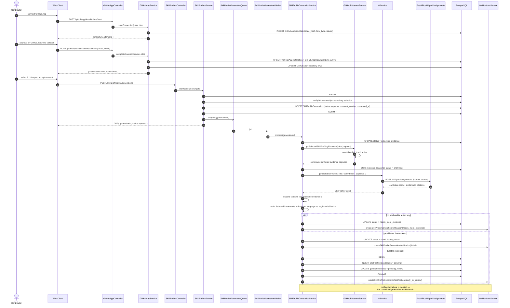

Retry is allowed only for the contributor's own `failed` or
`needs_more_evidence` generation, requires fresh consent, revalidates access,
and creates a **new** generation row linked to the previous one via
`retry_of_generation_id`.

---

## 5. Admin skill review and account activation

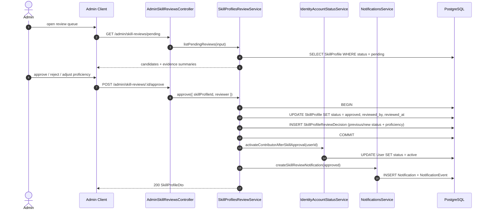

Note the direction of the arrows: the `admin` module owns no tables. It calls
services exported by `skill-profiles`, `identity`, and `notifications`, and each
of those writes only its own rows.

---

## 6. Project import and Contribution Request publication

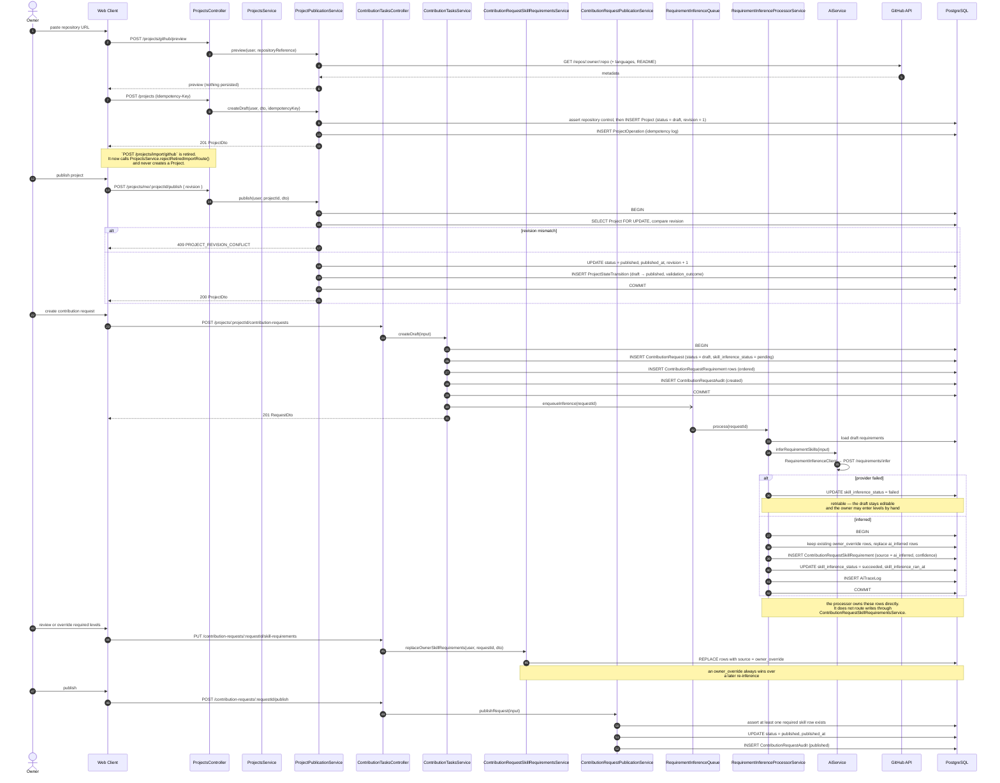

---

## 7. Eligibility gate and Application submission

The gate is deterministic and runs **inside** the submission transaction, so a
Request whose required levels changed a millisecond ago cannot be applied to
under stale rules.

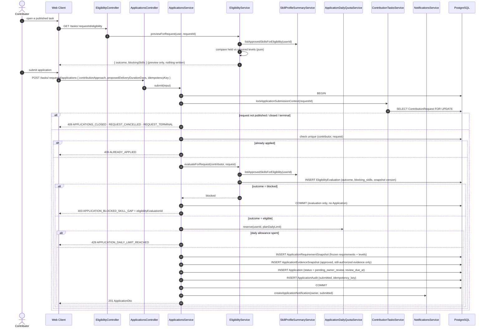

A blocked contributor can then ask for an explanation, which is the only place
a model is involved in this flow:

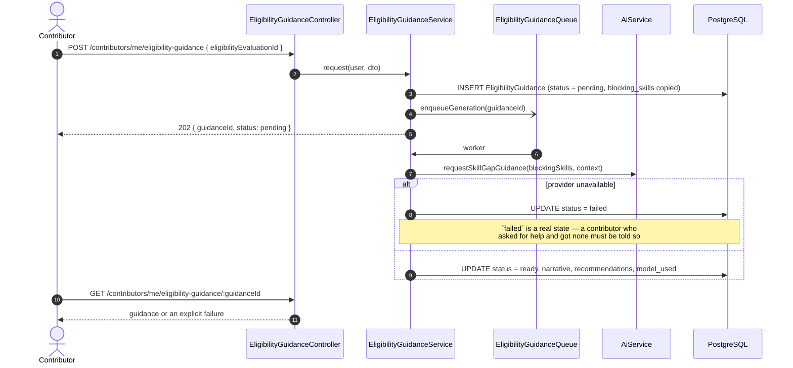

The deterministic blocking-skill list survives either branch. The narrative is
an addition to the reason, never the reason itself.

---

## 8. Advisory Fit Assessment

An assessment informs the owner. It cannot write `Application.status`, and its
inputs are the snapshots frozen at submission — not the live Request.

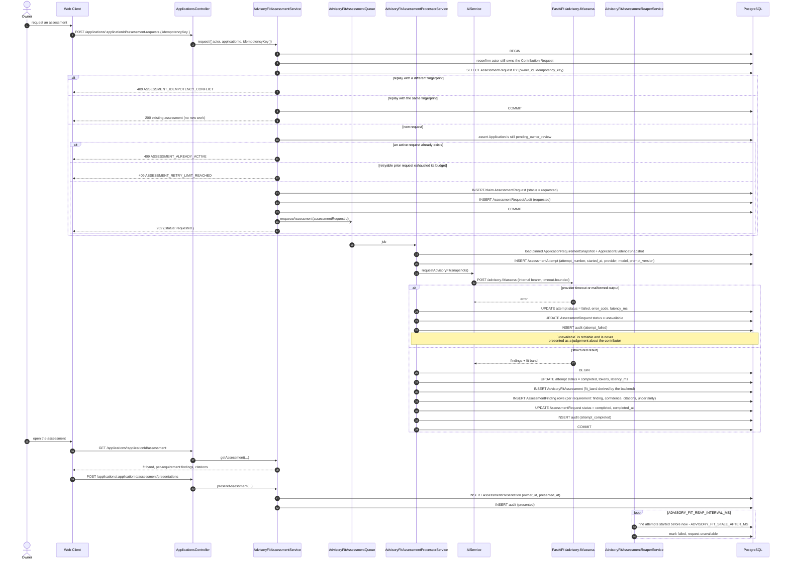

The `fit_band` is computed by NestJS from the returned findings — the model does
not hand over a band to be trusted (ADR 0001).

---

## 9. Owner decision, Assignment and Conversation

Accepting an Application does four things atomically: record the decision,
create the Assignment, move the Request to `assigned`, and close out every other
pending Application on that Request.

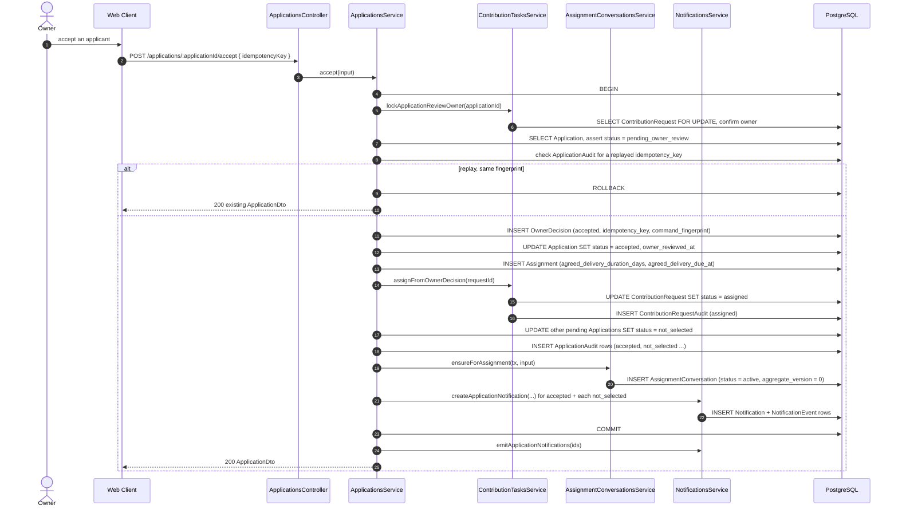

Messaging on the resulting conversation:

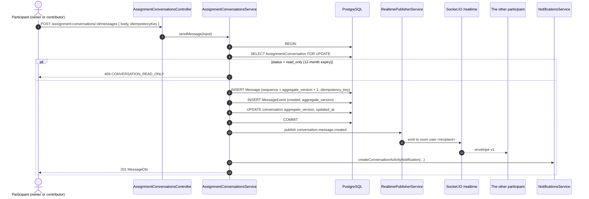

Conversations become `read_only` twelve months after the assignment (ADR 0008);
history stays readable, writes stop.

---

## 10. Delivery, review, reputation and badges

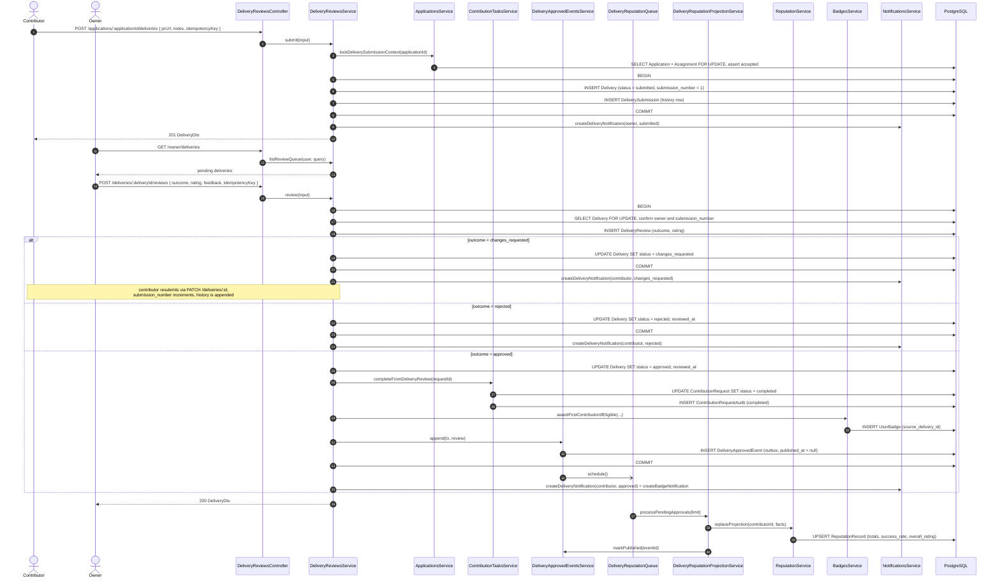

Reputation is a **projection**: `DeliveryApprovedEvent` is the committed fact,
and `ReputationRecord` is rebuilt from it. A worker crash delays the score; it
cannot invent or lose an approval.

---

## 11. Subscription checkout and Paymob callback

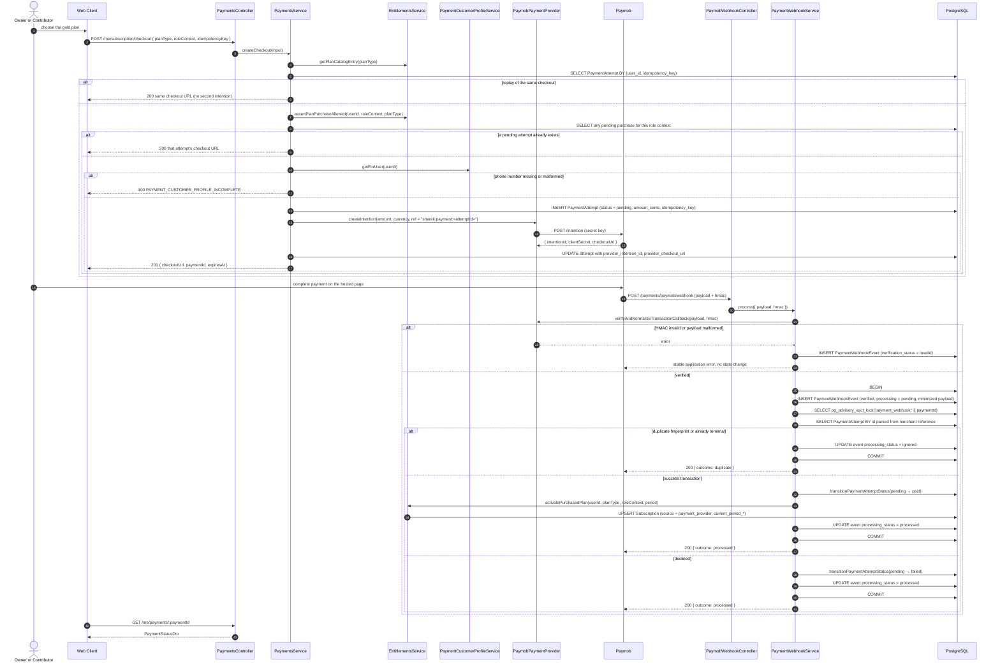

Three things make this callback safe under retry, reorder, and replay: the
advisory transaction lock, the unique webhook `fingerprint`, and the fact that
only `source = payment_provider` can be written by this path.

---

## 12. Material upload, scan and analysis

Sharing a file with a contributor and letting a model read it are two separate
authorizations (ADR 0004), and analysis produces owner-reviewed **suggestions**,
never direct writes (ADR 0005).

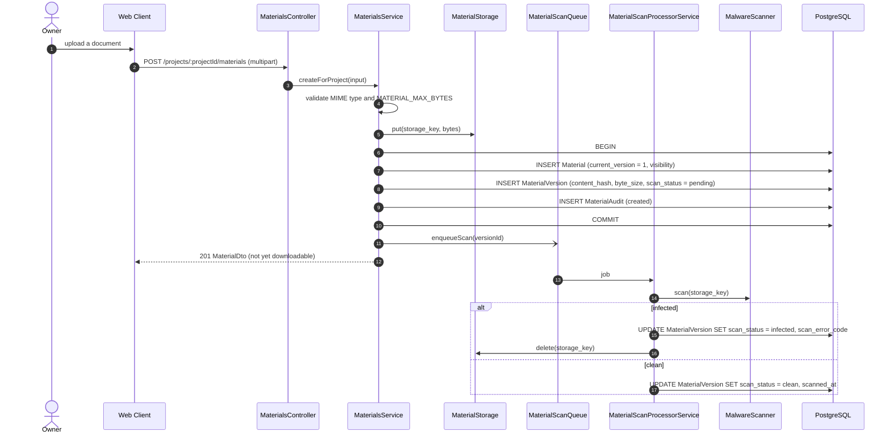

Sharing and download:

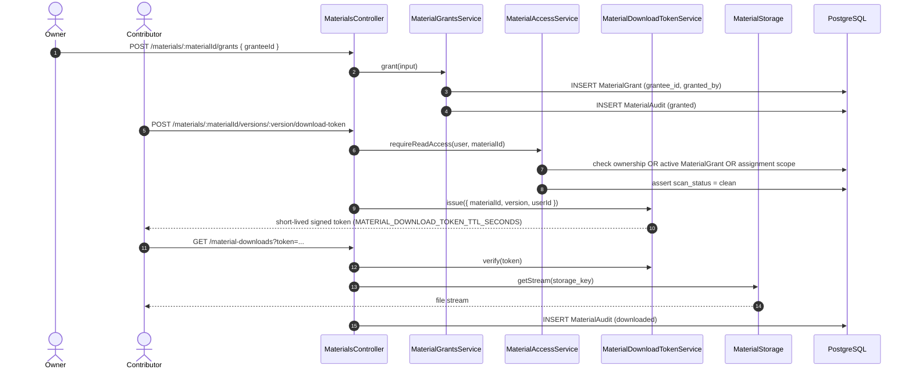

Analysis:

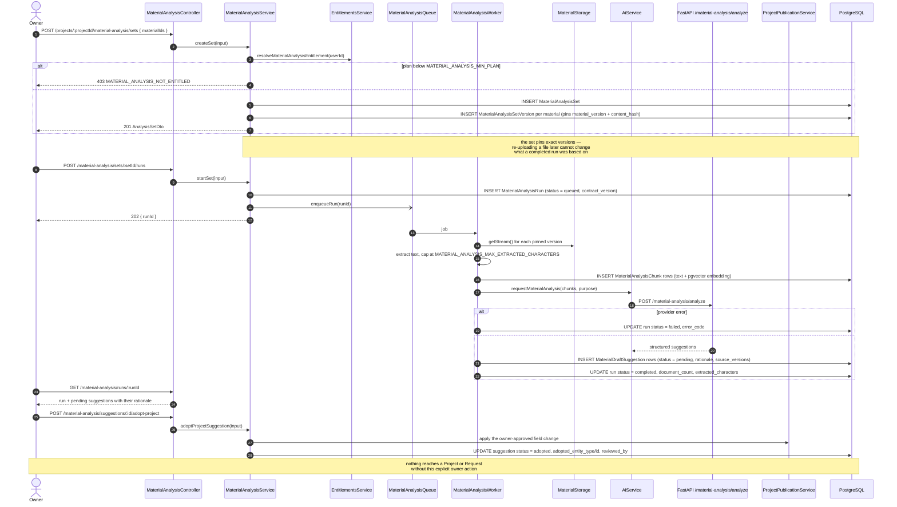

---

## 13. Durable notification to realtime delivery

Every notification in the platform takes this path, whichever module produced
it.

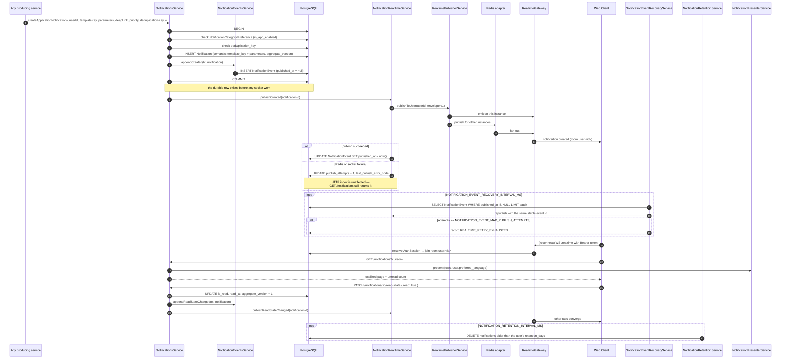

Notifications are stored **semantically** — `template_key` plus `parameters` —
and rendered into the reader's language at read time (ADR 0012). Changing a
translation therefore changes old notifications too, and one row serves an
Arabic and an English reader correctly.
