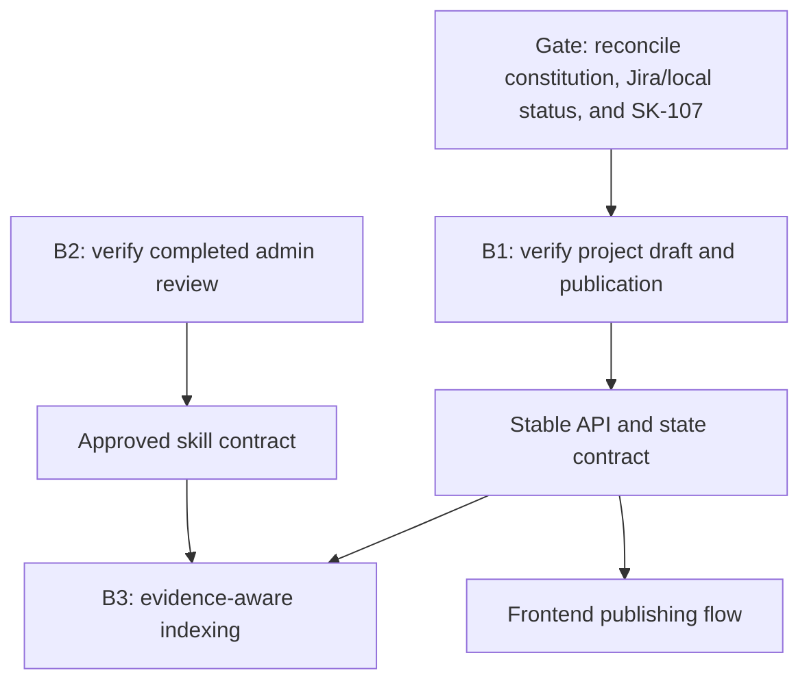
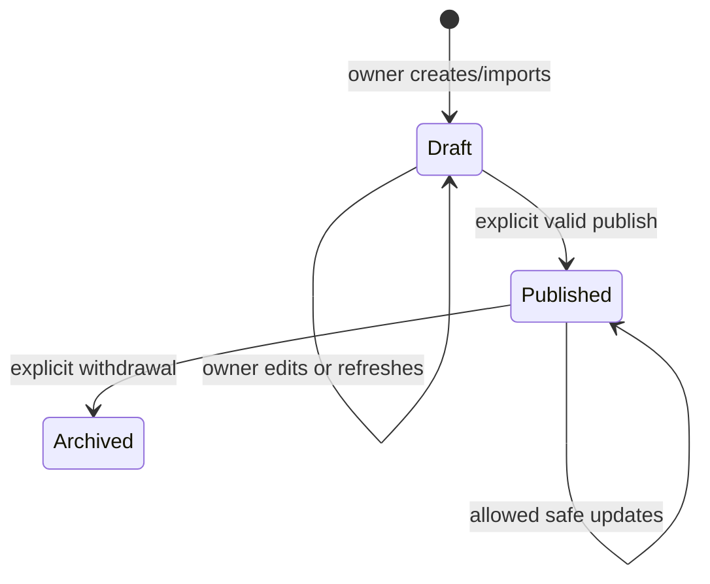

# ShareK Sprint 2 - Backend-First Planning and Spec Kit Prompt Pack

**Prepared:** 2026-07-21

**Scope:** Planning only. No implementation, migrations, API changes, Jira mutations, or commits.
**Primary sources:** canonical PRD decision log; accepted ADRs; current backend docs, contracts, Prisma schema, modules, tests, and tracker; Jira project `SK`, board 34; `../docs/product/backlog/sharek-backlog.md`; and the business documents under `../docs/archive/source-material/` as historical product context.

## 1. Executive decision

Do not treat Sprint 2 as one Spec Kit feature.

Use three separate workstreams:

1. **B1 - GitHub-backed project draft and publication correction** - the local tracker, API contract, module README, service, and tests show the core of Jira [SK-112](https://karimmuhammad.atlassian.net/browse/SK-112) was implemented on 2026-07-20. The clarified specification at `specs/003-github-project-publication/spec.md` now defines the bounded target gaps; plan against it without reimplementing completed behavior.
2. **B2 - Admin skill review verification** - Jira [SK-113](https://karimmuhammad.atlassian.net/browse/SK-113) is already Done. Do not create a second implementation. Audit its contracts, tests, privacy behavior, and fit with current decisions.
3. **B3 - Evidence-aware indexing** - the later AI/indexing feature derived from Jira [SK-114](https://karimmuhammad.atlassian.net/browse/SK-114). Keep it separate from B1 because it has different ownership, privacy, failure modes, and infrastructure decisions.

Frontend items [SK-110](https://karimmuhammad.atlassian.net/browse/SK-110) and [SK-111](https://karimmuhammad.atlassian.net/browse/SK-111) should wait until the B1 API contract and state model are stable.

### Recommended immediate sequence

1. Use constitution v3.0.0 and the synchronized canonical account-capability decision.
2. Reconcile Jira status with the local evidence that SK-112 and SK-113 have implementations; do not mutate Jira during this planning pass.
3. Confirm why dependency [SK-107](https://karimmuhammad.atlassian.net/browse/SK-107) was reopened and classify the current broad repository OAuth flow as current behavior, not the approved GitHub App target.
4. Use the completed and clarified B1 specification at `specs/003-github-project-publication/spec.md`; do not create a duplicate specification.
5. Run `$speckit-plan` for the approved corrective scope, then `$speckit-checklist`, `$speckit-tasks`, and `$speckit-analyze`.
6. Review the generated plan and tasks against the brownfield gap audit before implementation.
7. Stop before `$speckit-implement` until the artifacts and dependency status are approved.

## 2. Source authority and conflict rules

The supplied business PDFs, PRD, and backlog are valuable product history. They correctly establish `OWNER`, `CONTRIBUTOR`, and `ADMIN` account roles, but some implementation and policy details are now superseded or need reconciliation: broad GitHub OAuth repository access, ambiguous pending-versus-active onboarding language, Pinecone as a fixed solution, and AI authority to block applications.

Use this order when sources conflict:

1. The latest explicitly approved project-wide decision, recorded in the canonical decision log or in a ratified constitution amendment pending synchronization back to that log.
2. Accepted, non-superseded ADRs for architecture and technology decisions.
3. The current constitution.
4. Approved active feature specifications and reconciled Jira acceptance criteria.
5. Current API contracts, schema, code, tests, and tracker as evidence of current behavior, not automatic approval of that behavior.
6. PRD/backlog/business documents that have not been superseded.
7. Legacy PDFs, historical plans, and informal notes.

Current ShareK invariants that must override legacy wording:

- ShareK has three account roles: `OWNER`, `CONTRIBUTOR`, and `ADMIN`. Public registration requires `OWNER` or `CONTRIBUTOR`; it never accepts `ADMIN`.
- The selected role controls the primary journey rather than an exclusive capability silo. Eligible `OWNER` and `CONTRIBUTOR` accounts may create and own projects and may contribute elsewhere without changing role.
- Account role alone does not authorize a resource. Authorization is contextual: persisted project owner, active applicant, accepted contributor assignment, profile subject, or an explicit Admin path.
- Project creation accepts an eligible authenticated `OWNER` or `CONTRIBUTOR`; later mutation requires persisted `Project.ownerId`. Request-supplied `userId`, `ownerId`, `role`, or Admin flags are never authorization evidence.
- Terminal application or assignment states revoke the capability derived from that relationship. Admin bypass is explicit, auditable, and tested.
- GitHub OAuth establishes identity only.
- A GitHub App installation and explicit repository selection authorize private repository evidence access.
- Repository/evidence access is read-only and revocable.
- AI output is advisory and must include evidence, provenance, confidence, uncertainty, freshness, and visibility handling.
- AI must not automatically accept, reject, hide, or eliminate an application.
- Private evidence details must not leak into public project data, profiles, or AI claims.
- NestJS owns authentication, business state, persistence, jobs, and public APIs. Any AI service is bounded behind explicit contracts.
- GitHub-connected and repository-free project/contribution workflows must remain possible, even when one feature covers only the GitHub-backed path.

### Known authority gaps requiring reconciliation

- The 2026-07-21 canonical decision supersedes the earlier AI validation-gating entry, but PRD FR-005, FR-018, and FR-051 through FR-059 still contain AI-driven blocking language. Synchronize their editorial wording before specifying the applications workflow; do not treat the stale PRD text as authority.
- Current API contracts and tests authorize repository evidence with broad OAuth scopes, while constitution v3.0.0 requires GitHub App installation plus explicit selection for private access. Treat the OAuth flow as current behavior and plan a migration; do not claim the GitHub App target is already implemented.
- OWNER and CONTRIBUTOR may both own projects and contribute elsewhere, but application/assignment modules are placeholders. Future feature specs must define allowed relationship states without inventing them in Sprint 2.

## 3. Jira Sprint 2 snapshot

The following Jira snapshot was captured when this plan was prepared and was not re-queried during the constitution-only update. Revalidate external status before Jira mutation. Local repository evidence is listed separately because it is more recent than some issue descriptions.

Jira reported Sprint 2 as **Sprint 2 - Onboarding & Pub**, active from 2026-07-11 through 2026-07-25. The issue descriptions contained 42 planned story points, while the Jira story-point field was empty for Sprint 2 items.

| Jira | Work item | Snapshot status | Local repository evidence | Backend-first treatment |
|---|---|---|---|---|
| [SK-110](https://karimmuhammad.atlassian.net/browse/SK-110) | Design onboarding, admin review, and publishing screens | To Do | Frontend is outside this backend repository | Defer; use later to validate API states |
| [SK-111](https://karimmuhammad.atlassian.net/browse/SK-111) | Build onboarding and publishing frontend | To Do | Backend contracts exist; frontend is outside this repository | Defer until the reconciled B1 contract is approved |
| [SK-112](https://karimmuhammad.atlassian.net/browse/SK-112) | Project metadata fetch and publication APIs | In Progress | `ProjectsService`, API docs, tests, and tracker record implementation on 2026-07-20 | Verify and create only bounded corrective work |
| [SK-113](https://karimmuhammad.atlassian.net/browse/SK-113) | Admin skill review backend | Done | Spec tasks complete; service, audit migration, API/E2E tests, and tracker exist | Verify; do not reimplement |
| [SK-114](https://karimmuhammad.atlassian.net/browse/SK-114) | RAG indexing for GitHub and project metadata | To Do | No visibility-aware index implementation exists | Separate B3 specification; avoid Pinecone lock-in |
| [SK-115](https://karimmuhammad.atlassian.net/browse/SK-115) | Sprint 2 unit and integration tests | To Do | Relevant backend unit/E2E tests already cover implemented B1/B2 paths | Reconcile coverage; add only missing risk tests |
| [SK-116](https://karimmuhammad.atlassian.net/browse/SK-116) | API contract checks | To Do | API docs and an admin OpenAPI contract exist; CI drift coverage is incomplete | Reconcile existing contracts; keep CI wiring separate if needed |

### Dependency finding

[SK-112](https://karimmuhammad.atlassian.net/browse/SK-112) depends on [SK-107](https://karimmuhammad.atlassian.net/browse/SK-107), the GitHub ingestion foundation. The captured Jira snapshot said SK-107 was reopened to In Progress on 2026-07-19 without an explanatory comment. Confirm that status externally before relying on it.

The local implementation is known: identity-only social OAuth is narrow, but the repository connection requests `repo` for contributors or `public_repo` for owners/admins, stores encrypted OAuth tokens, and has no GitHub App installation or repository-selection persistence. Treat this as current MVP behavior that conflicts with the newly approved private-access target. The B1 audit must classify the reusable public-import path separately from the private-evidence migration gap.

- reusable as-is;
- reusable after a bounded correction;
- missing a required contract;
- or incompatible with the current security decision.

## 4. Sprint 2 issues that need refinement

### 4.1 Jira and local implementation status have drifted

The local tracker and tests record SK-112 and SK-113 backend implementation, while the captured Jira snapshot still showed SK-112 in progress and general QA/contract items open. Reconcile status and acceptance evidence before creating any new Spec Kit feature. A missing test or privacy rule should become a bounded corrective item, not a duplicate implementation.

### 4.2 Jira dependencies are textual, not real issue links

Sprint 2 issues contain dependency names in their descriptions, while the Jira linked-issues field is empty. This makes blockers invisible to board automation.

Planning recommendation: after team review, add real `blocks/is blocked by` links. Do not do this automatically as part of this planning exercise.

### 4.3 Story points are duplicated in prose

Sprint 2 descriptions state story points, but the Jira estimate field is null. Choose one authoritative estimate field and avoid maintaining two values.

### 4.4 SK-113 uses obsolete eligibility language

The acceptance statement says pending or rejected skills are excluded from "eligibility decisions." Under current ShareK policy, this must mean:

- they are not presented as approved/verified skills;
- they are not used as positive verified evidence in advisory fit explanations;
- they cannot cause automatic rejection, hiding, or ranking-out;
- the output must preserve uncertainty when approved evidence is insufficient.

### 4.5 SK-114 prematurely fixes Pinecone

The work item should specify the required indexing and retrieval behavior, not force a provider before the current architecture decision is confirmed. Required behavior includes provenance, visibility, deletion/revocation, freshness, re-indexing, idempotency, namespace/tenant isolation, and retrieval filters.

### 4.6 SK-115 mixes frontend and backend completion

Split the acceptance boundary:

- B1 backend unit, integration, authorization, contract, and external-provider tests can finish before the UI.
- UI state and browser tests belong to the later frontend feature.

## 5. Backend-first feature map



### Why B1 verification is first

- The owner outcome already has a local implementation, so verification can prevent duplicate work and isolate only real gaps.
- It is the upstream source of published project metadata for discovery and indexing.
- It exposes current contract gaps around account-neutral creation plus contextual authorization, draft/public/archive separation, provenance/freshness, provider failure behavior, and GitHub App private access.
- It can be tested through API and integration tests before frontend work starts.

## 6. B1 feature definition - GitHub-backed project draft and publication

### 6.0 Current implementation baseline

The local backend already provides owner/admin-guarded `POST /projects/import/github` and `GET /projects/me`. `ProjectsService` imports through `GitHubEvidenceService.getPublicImportSnapshot`, persists `Project.owner_id` from the authenticated user, defaults new imports to `draft`, accepts explicit `published` with required category/difficulty, and can currently move a published project back to `draft`. The project response is mapped through an explicit DTO. Unit and GitHub onboarding E2E tests cover the principal path.

Confirmed target gaps: the current OWNER/ADMIN creation gate conflicts with account-neutral project capability; import persists immediately instead of returning a non-persistent preview; import can publish without a separately saved draft; refresh can overwrite manual values; global repository uniqueness prevents intentional parallel drafts; published projects can return directly to draft instead of archived; source freshness/provenance and public discovery coverage are incomplete; public publication lacks the clarified repository-control proof; Admin bypass semantics are not audited; and private access lacks the required GitHub App model. These are bounded correction inputs, not permission to reimplement the feature.

### 6.1 Goal

Verify and correct the workflow so an eligible authenticated `OWNER` or `CONTRIBUTOR` can preview an allowed GitHub repository, create a private platform draft, review and edit permitted project metadata, and explicitly confirm publication without changing role. The same account may contribute to other users' projects through later contextual workflows. Nothing is publicly discoverable before publication succeeds.

### 6.2 User value

The owner receives a trustworthy starting draft instead of copying repository information manually. The platform receives a controlled, attributable project record that can later support discovery, tasks, collaboration, and evidence without exposing private source details.

### 6.3 Primary user stories

1. As an eligible authenticated `OWNER` or `CONTRIBUTOR`, I can submit a supported GitHub repository reference and receive normalized preview metadata or a clear actionable error without creating a project.
2. As the project owner, I can review imported metadata, edit owner-controlled fields, and save an unpublished draft.
3. As the project owner, I can explicitly publish a valid draft.
4. As a visitor or contributor, I cannot discover or read an unpublished project.
5. As the project owner, I can see source freshness and refresh status without confusing imported data with my edits.
6. As a privacy-conscious repository owner, I can use a private repository only through an active GitHub App installation and explicit selection, and revocation stops later reads safely.

### 6.4 Scope

In scope:

- repository reference validation and canonicalization;
- public repository validation plus GitHub App-authorized private repository validation;
- metadata preview/import through the existing GitHub module boundary;
- draft creation and owner review;
- explicit publication transition;
- owner-only draft reads and updates;
- public exclusion of unpublished projects;
- source attribution, import timestamp, and freshness state;
- repeat-request/idempotency behavior;
- multiple intentional private drafts with at most one published project per canonical repository;
- personal-repository identity proof and organization/shared installation proof before publication;
- explicit published-to-archived withdrawal without direct return to draft;
- safe external-provider failure mapping;
- unit, integration, authorization/security, API contract, and relevant E2E tests.

Out of scope:

- frontend implementation;
- semantic indexing implementation;
- contributor discovery UI;
- contribution request/task creation;
- applications, chat, discussion, ratings, and reputation;
- AI-written descriptions or automatic project classification unless separately approved;
- repository write permissions;
- automatically publishing a project after metadata fetch;
- implementing the repository-free project path in this slice, although B1 must not prevent it.

### 6.5 Required state model

Reuse the explicit `ProjectStatus` model already present in Prisma. The clarified specification requires a non-persistent preview, an explicitly saved draft before publication, and published-to-archived withdrawal without direct return to draft; the plan must not invent a parallel lifecycle.



Rules:

- Metadata preview alone does not create a public project.
- Draft creation does not imply publication.
- Project creation allows an eligible authenticated `OWNER` or `CONTRIBUTOR`. Later mutation requires persisted project ownership; any Admin path must be explicit, active, audited, and tested.
- Public project queries and contributor discovery exclude drafts at the database/query boundary, not only in frontend filtering.
- Publishing is an explicit, auditable service-validated business action.
- A published project may be withdrawn only to `archived`; direct return to `draft` is a corrective gap. Reactivation or republishing from archived remains outside this feature.

### 6.6 Data responsibility

Keep these concepts distinct:

| Data class | Examples | Authority |
|---|---|---|
| Repository identity | provider, owner/name, canonical URL, provider repository ID | GitHub snapshot |
| Imported metadata | repository description, languages, topics, statistics | GitHub snapshot with fetched-at time |
| Owner-controlled project data | platform description, category, difficulty, collaboration intent | Project owner |
| Platform state | ownerId, draft/published state, publishedAt, audit data | Owning NestJS service |
| Evidence/privacy metadata | source visibility, selected permission, freshness, redaction | Evidence/GitHub contracts |

Do not silently overwrite owner edits when metadata is refreshed. The specification must decide whether fields use separate source and effective values or another explicit merge rule.

### 6.7 Authorization and privacy requirements

- Allow eligible `OWNER` and `CONTRIBUTOR` accounts to create projects without a role change, then derive later owner capability from the authenticated session plus persisted project relationship.
- Do not accept an owner/user ID, role, or Admin flag from request input as authority.
- Preserve the product rule that either account mode may contribute to projects it does not own only through valid application/assignment relationships; project ownership grants no contributor workspace access elsewhere.
- OAuth connection alone must not authorize private repository reads.
- Private repositories require an active GitHub App installation and explicit repository selection.
- Private repository reads require an active GitHub App installation and explicit selection and must stop after installation revocation or repository unselection.
- Public personal-repository publication requires the authenticated GitHub identity to match its owner; organization/shared publication requires an active GitHub App installation and explicit selection.
- Never return provider tokens, installation tokens, internal errors, private file paths, or private evidence excerpts.
- Whitelist public fields. Do not serialize database records directly.
- Public publication must not accidentally change underlying evidence visibility.
- Admin bypass must be explicit, testable, and auditable.

### 6.8 Reliability requirements

The feature specification and plan must define:

- invalid or unsupported URL behavior;
- repository not found versus inaccessible behavior without unsafe information disclosure;
- empty or missing README/description/topics;
- archived, disabled, transferred, renamed, or deleted repositories;
- GitHub rate limits and timeouts;
- partial metadata availability;
- repeated preview, save, and publish requests;
- duplicate repository imports;
- stale snapshot behavior;
- concurrent owner updates;
- transaction boundary for publication;
- retry safety and observability.

### 6.9 Minimum acceptance scenarios

1. An eligible authenticated `OWNER` or `CONTRIBUTOR` previews an allowed repository and receives normalized metadata without creating a project.
2. Either account mode can create a private draft, but a non-owner cannot manage another user's project solely because they are authenticated or have repository access.
3. OAuth alone cannot authorize a private repository; an active GitHub App installation and explicit selection can, without leaking inaccessible content.
4. The owner saves a draft and it is absent from public listing/detail/discovery queries.
5. A different authenticated user cannot read or mutate the draft.
6. The owner edits an allowed field without changing source-owned repository identity.
7. Refresh does not silently destroy owner edits.
8. Explicit publication succeeds only when mandatory project fields are valid.
9. A repeated publish request has documented idempotent behavior.
10. A failed GitHub refresh does not corrupt an existing valid draft.
11. Any explicit Admin path is active-admin-only, auditable, and covered by authorization tests.
12. API responses match explicit DTO allowlists and expose no secret/private database or provider fields.
13. Multiple intentional private drafts may reference one canonical repository, but concurrent publication attempts result in at most one published project.
14. Public personal-repository publication requires a matching authenticated GitHub identity; organization/shared publication requires active GitHub App selection.
15. Owner withdrawal transitions a published project to `archived`, never directly to `draft`.

## 7. B1 proposed planning task breakdown

These are planning candidates for Spec Kit to refine after it inspects the repository. They are not implementation instructions yet.

### Phase 0 - Current-state audit

- Locate the existing projects, GitHub, identity, auth/capability, Prisma, config, and API documentation modules.
- Inspect current project schema and state fields.
- Inspect SK-107 repository service outputs and authorization assumptions.
- Locate any existing project create/publish endpoints and tests.
- Record current behavior versus target behavior.
- Identify existing uncommitted work and avoid overwriting it.

### Phase 1 - Contract and workflow decisions

- Define canonical repository normalization while preserving the approved multiple-private-drafts/one-published-project policy.
- Include private import through the approved GitHub App installation and explicit-selection boundary.
- Preserve identity-only OAuth and define personal versus organization/shared publication-control proof.
- Define imported versus owner-controlled fields.
- Apply the clarified preview -> draft -> published -> archived state rules; exclude archived reactivation.
- Define refresh/merge behavior and freshness representation.
- Define public DTO allowlist and error taxonomy.
- Define idempotency and concurrency behavior.

### Phase 2 - Persistence plan

- Reuse existing fields where they express the approved model.
- Plan only necessary forward migrations.
- Preserve existing rows and sessions.
- Plan constraints that allow multiple private drafts but at most one published project per canonical repository.
- Include audit and timestamps required by acceptance scenarios.

### Phase 3 - Service plan

- Orchestrate repository preview through exported GitHub services.
- Keep provider API/encryption details private to the GitHub module.
- Reuse the existing import service; separate preview, draft update, or publication operations only when an approved contract gap requires it.
- Enforce account-mode journey rules and persisted contextual capabilities inside the owning service.
- Design safe refresh and external-failure handling.

### Phase 4 - HTTP/API plan

- Define request validation and canonical response DTOs.
- Define owner draft endpoints/actions and public published views.
- Document status/error mapping.
- Update OpenAPI or the repository's established contract format.
- Keep the contract consumable by the later TanStack frontend.

### Phase 5 - Verification plan

- service state-transition tests;
- capability/authorization matrix tests;
- GitHub client/service contract tests;
- public/draft visibility plus private authorization/revocation tests;
- redaction tests;
- idempotency and concurrency tests;
- rate-limit, timeout, missing metadata, partial-failure, installation-revocation, repository-control, duplicate-publication, and archive-transition tests;
- migration validation if persistence changes;
- API schema/contract checks suitable for CI;
- relevant E2E coverage for the owner draft/publication flow.

## 8. B2 - Completed admin skill review: verification plan

SK-113 is Done. The backend-first plan should not reopen implementation merely because Sprint 2 is being re-specified.

Verify the existing feature against these checks:

- only Admin can list or decide pending skill claims;
- review decisions are persisted with actor, time, previous value, new value, and reason where required;
- proficiency changes retain original AI output and evidence provenance rather than rewriting history;
- rejected/pending claims are not presented as approved claims;
- rejected/pending status cannot automatically reject or hide a contributor application;
- private evidence remains redacted in admin responses unless the admin has a separate valid evidence capability;
- decision operations are idempotent or reject invalid repeated transitions clearly;
- concurrent review is handled safely;
- list endpoints are paginated and filterable;
- unit, integration, authorization/security, API contract, audit, and relevant E2E tests exist.

If a gap exists, create a small corrective Jira item and a bounded Spec Kit feature. Do not fold it into B1.

## 9. B3 - Evidence-aware indexing: refined future scope

Do not start B3 until B1 publishes a stable, visibility-aware project event or snapshot contract and SK-107 is resolved.

Rewrite the feature intent as:

> Index eligible GitHub evidence and published project metadata for later skill inference and semantic discovery while preserving source ID, visibility, selection/permission, freshness, version, confidence/uncertainty context, redaction, revocation, deletion, and retrievable provenance.

Important corrections to SK-114:

- Specify capabilities before choosing Pinecone or another vector store.
- Never index private source text into a public namespace.
- Repository selection and visibility must travel with every indexed unit.
- Revocation and deletion must propagate to the index.
- Re-indexing must be idempotent and version-aware.
- Indexing failure must not roll back a valid project publication; use an explicit asynchronous status/retry model.
- Public discovery consumes published project metadata only.
- AI retrieval output stays advisory and evidence-linked.

## 10. Proposed Jira refinements and missing work items

No Jira items were created or changed. The following changes should be reviewed with the team first.

### Recommended changes to existing issues

- **SK-112:** reconcile Jira with the local implementation first; add only confirmed missing state, authorization, privacy, failure, or test scenarios as bounded corrective acceptance criteria.
- **SK-113:** replace automatic eligibility wording with approved-claim and advisory-fit wording.
- **SK-114:** rename to "Implement visibility-aware evidence and published-project indexing" and make the provider a plan decision.
- **SK-115:** split backend verification from later frontend tests.
- **SK-116:** enumerate the exact owned API schemas and drift checks.

### Candidate subtasks under SK-112

1. Audit SK-107, the implemented SK-112 project workflow, existing contracts, and tests.
2. Define repository authorization and canonical identity.
3. Define draft/publication state machine and owner capability matrix.
4. Define imported versus owner-controlled metadata and refresh merge rules.
5. Plan any forward-only Prisma migration.
6. Plan metadata preview/import service orchestration.
7. Plan draft save/update and explicit publish actions.
8. Plan public DTO allowlist and draft exclusion.
9. Plan provider failure, freshness, idempotency, and concurrency behavior.
10. Plan unit/integration/security/contract test coverage.

### Recommended real issue links

- SK-107 blocks only corrective SK-112 work that actually depends on authenticated GitHub repository access; it does not block the existing anonymous public-import path.
- SK-112 blocks the project-publication portion of SK-111.
- SK-112 blocks published-project indexing in SK-114.
- SK-112 and SK-113 block their backend portions of SK-115 and SK-116.

## 11. Constitution reconciliation status

**Completed on 2026-07-21 as constitution v3.0.0. Do not recreate it for every feature.**

The constitution is project-wide governance. It now records ShareK's three account roles, contextual resource authorization, ADR-002 module structure, GitHub App private-access target, evidence privacy, advisory AI, migrations, contracts, testing, and brownfield safety. B1 verification must use that version.

Run the constitution command again only when a project-wide principle changes. Feature requirements belong in `$speckit-specify`, not the constitution.

### Reusable constitution amendment prompt

Retain this only for a future approved project-wide amendment; do not rerun it as part of ordinary B1 work:

```text
$speckit-constitution

Update the existing ShareK project constitution; do not replace valid principles blindly and do not implement product code.

First inspect the current `.specify/memory/constitution.md`, the repository structure, canonical decision log/ADRs, architecture and API documentation, package manifests, tests, and current modules. Preserve useful existing rules, remove obsolete contradictions, and produce a concise change summary after updating the constitution.

The constitution must govern all ShareK features with these non-negotiable principles:

1. Source authority and traceability
   - Approved decision log and ADRs override legacy PDF/backlog wording.
   - Distinguish current behavior, approved target behavior, assumptions, and unresolved decisions.
   - Every feature artifact must reference its Jira key and relevant decision IDs where available.

2. Account roles and contextual authorization
   - ShareK has three account roles: OWNER, CONTRIBUTOR, and ADMIN.
   - Public registration must require OWNER or CONTRIBUTOR, must reject ADMIN, and must validate and persist the selected role in the backend.
   - The account role controls the primary journey rather than an exclusive capability silo.
   - Eligible OWNER and CONTRIBUTOR accounts may create and own projects and may contribute elsewhere without changing role, subject to persisted contextual relationships.
   - Account role alone never authorizes a resource. Project mutation requires persisted Project.ownerId; applicant and private-workspace access require allowed persisted application/assignment states.
   - Terminal relationship states revoke capability. Admin bypass is explicit, auditable, and tested.
   - Never trust request-supplied userId, ownerId, role, or Admin flags as authorization evidence.
   - Role changes after registration remain outside scope except through an already approved authenticated workflow.

3. GitHub identity and evidence access
   - GitHub OAuth establishes identity only.
   - Private repository/evidence access requires a GitHub App installation plus explicit repository selection.
   - Access is read-only, revocable, least-privilege, and never inferred from OAuth alone.
   - Only the GitHub module may decrypt provider tokens or write GitHub-owned persistence.

4. Evidence privacy and AI safety
   - Preserve evidence ID, source, visibility, selected permission, freshness, version, provenance, confidence, uncertainty, and redaction across service boundaries.
   - Private evidence details must never leak into public project/profile/AI output.
   - AI is advisory: it cannot automatically accept, reject, hide, or eliminate applications.
   - Insufficient evidence must produce uncertainty, not invented certainty.

5. Backend ownership and boundaries
   - NestJS owns auth, business state, persistence, jobs, and public APIs.
   - External providers and any AI service are behind explicit typed contracts and cannot directly own platform business state.
   - Modules expose services/DTOs intentionally; provider clients, encryption, and persistence details stay private.
   - Follow accepted ADR-002: standard NestJS controllers, services, DTOs, and Prisma. Do not add Clean Architecture layers, use-case classes, reader ports, or one-implementation abstract repositories.

6. State, data, and migrations
   - Business lifecycles use explicit validated state transitions.
   - Public visibility is enforced at backend/query boundaries.
   - Database migrations are forward-only, preserve existing data, and include rollback/repair thinking without destructive history rewriting.
   - Repository-free and GitHub-connected workflows must coexist.

7. Contract-first delivery
   - Specifications define what and why; plans define how; tasks are small, dependency-ordered, and independently verifiable.
   - Public API DTOs are allowlisted, documented, version-conscious, and protected against response-shape drift.
   - Do not expose ORM/provider objects directly.

8. Security, reliability, and testing
   - Validate at trust boundaries; enforce ownership server-side; redact secrets and private metadata.
   - External API timeout, rate-limit, revocation, retry, idempotency, and partial-failure paths are required planning concerns.
   - Every feature includes unit, integration, authorization/security, contract, and relevant E2E acceptance coverage.

9. Brownfield safety and workflow
   - Inspect existing code, tests, docs, migrations, and uncommitted changes before planning modifications.
   - Preserve compatible behavior; do not invent parallel modules or duplicate features.
   - Use a feature branch, one logical task at a time, atomic Conventional Commits, and validation before each commit during implementation.
   - Specification and planning commands must not implement product code.

Add a governance section that explains amendment, versioning, compliance review, and what evidence is required before an exception. Keep the constitution enforceable and concise; feature-specific endpoint names or UI details do not belong in it.

Stop after updating and validating the constitution artifact. Report preserved principles, changed principles, removed contradictions, unresolved decisions, and files changed. Do not implement Sprint 2.
```

## 12. B1 Spec Kit command sequence and exact prompts

This prompt pack uses constitution -> specify -> optional clarify -> plan -> optional checklist -> tasks -> analyze -> implement. In Codex skills mode, the equivalent command names use `$speckit-*`.

### Step 1 - Specify B1

This step completed at `specs/003-github-project-publication/spec.md`; do not
rerun it unless the approved feature is intentionally replaced:

```text
$speckit-specify

Only after a read-only audit proves a bounded gap, create a corrective feature specification for ShareK Jira SK-112: "Verify and correct GitHub-backed public project draft, metadata review, and explicit publication." The local repository already implements the core import/publication path. Do not duplicate it, implement code, or design the frontend.

Focus on WHAT users need and WHY, not framework classes, endpoint paths, database tables, or vendor-specific implementation.

Goal:
An eligible authenticated `OWNER` or `CONTRIBUTOR` can preview an allowed GitHub repository, create a private platform project draft, review and edit permitted project metadata, save the draft, and explicitly confirm publication without changing role. The same account may contribute to projects it does not own through valid application/assignment relationships. Unpublished projects are never publicly discoverable.

Required user stories:
- Submit a supported public repository reference and receive normalized imported metadata or the repository's documented preview response, without inventing a parallel API.
- Save owner-reviewed metadata as a private draft.
- Edit owner-controlled project fields without corrupting source-owned repository identity.
- Refresh imported metadata without silently overwriting owner edits.
- Explicitly publish a valid draft.
- Keep every draft absent from public listing, detail, search, discovery, indexing, and contributor APIs.
- Show source attribution and freshness to the owner.
- Handle rate limits, missing metadata, duplicates, repeated requests, revocation, and partial provider failures safely.

Product and security constraints:
- ShareK has OWNER, CONTRIBUTOR, and ADMIN account roles. Public registration accepts only OWNER or CONTRIBUTOR and never ADMIN.
- Eligible OWNER and CONTRIBUTOR accounts may create projects without changing role. Later mutation requires authenticated identity plus persisted project ownership, not request input.
- Either account mode may contribute to another user's project only through allowed application and accepted-assignment states; terminal states revoke that access.
- Never trust request-supplied userId, ownerId, role, or Admin flags. Any Admin path must be explicit, auditable, and tested.
- GitHub OAuth is identity only.
- Private repository reads require an active GitHub App installation and explicit repository selection; the current broad repository OAuth grant is not the target authorization model.
- Publishing a personal public repository requires a matching authenticated GitHub identity; publishing an organization/shared repository requires active GitHub App installation and explicit selection.
- Repository access is read-only and revocable.
- Public responses must not leak private repository content, provider tokens, installation details, internal errors, or private evidence.
- Publication is explicit and auditable; preview/import must never auto-publish.
- Multiple intentional private drafts may reference one canonical repository, but only one project may be published for it at a time.
- Owner withdrawal moves a published project to archived; direct return to draft is prohibited.
- Preserve repository/evidence visibility, permission selection, freshness, version, and provenance.
- Do not require AI or indexing to complete publication; those are later asynchronous concerns.
- Keep repository-free projects possible, although this feature covers only the existing public GitHub-backed path.

Include:
- account roles, contextual capabilities, and explicit Admin behavior;
- user journeys and prioritized user stories;
- functional requirements;
- state-transition requirements;
- imported versus owner-controlled data behavior;
- privacy and redaction requirements;
- external failure and recovery scenarios;
- idempotency, duplicate, concurrency, and freshness expectations;
- measurable acceptance scenarios and success criteria;
- explicit out-of-scope list;
- assumptions and open questions requiring clarification;
- traceability to SK-112, dependency SK-107, current implementation/test evidence, and the exact confirmed corrective gap.

Before writing, inspect existing repository documentation, `ProjectsService`, GitHub exported services, Prisma schema, API contracts, tests, tracker records, and uncommitted changes. Treat the old comprehensive PDF/backlog as historical context. Mark conflicts with the constitution, decision log, or ADR-002, and do not recreate completed SK-112 behavior.

Stop after generating and validating the feature specification. Report the feature branch/artifact path, open questions, conflicts, and files changed. Do not implement.
```

### Step 2 - Clarify B1

Completed on 2026-07-21. The specification records five decisions: both OWNER
and CONTRIBUTOR may create projects; public personal-repository control uses a
matching authenticated GitHub identity while organization/shared control uses
GitHub App selection; multiple private drafts but one published project per
canonical repository; and published withdrawal goes only to archived. Do not
rerun clarification unless a material feature-policy ambiguity is introduced.

### Step 3 - Generate a requirements checklist

Run after clarification and before or after the plan, depending on your installed Spec Kit workflow:

```text
$speckit-checklist

Generate a requirements-quality checklist for the SK-112 feature specification. Do not implement.

The checklist must test the quality and completeness of the written requirements, not the future code. Cover:
- account-neutral OWNER/CONTRIBUTOR project creation, persisted project ownership, cross-project contribution context, and explicit Admin behavior;
- public and GitHub App-authorized private repository workflows;
- OAuth versus GitHub App separation;
- draft/publication state transitions;
- public exclusion of drafts;
- imported versus owner-edited metadata and refresh merge rules;
- provenance, freshness, visibility, and redaction;
- duplicate, idempotency, concurrency, and audit behavior;
- GitHub timeout, rate limit, missing data, rename/transfer/deletion, partial failure, and GitHub App revocation;
- repository-free workflow compatibility;
- API consumer clarity for the later frontend;
- measurable acceptance scenarios and explicit non-goals.

Flag ambiguous, untestable, contradictory, or solution-biased requirements. Stop after creating the checklist and report failures that should be fixed before planning.
```

### Step 4 - Create the technical plan

Run only after the spec and clarifications are approved:

```text
$speckit-plan

Create the technical implementation plan for the approved SK-112 specification. Planning only; do not implement or modify product code.

This is an existing ShareK backend using the ADR-002 NestJS feature-first modular monolith, standard controllers/services/DTOs, Prisma, PostgreSQL, Redis where already justified, and the established test stack. Inspect the repository before choosing exact files or patterns. Reuse the existing projects, GitHub, identity/auth, Prisma, config, documentation, and test modules. Do not add Clean Architecture layers, use-case classes, reader ports, abstract repository ceremony, parallel modules, or duplicate behavior.

Mandatory architecture constraints:
- NestJS owns platform business state, persistence, jobs, and public APIs.
- Use the existing GitHub module's exported services/DTOs; provider API clients, token decryption, and GitHub-owned tables remain private to that module.
- OAuth is identity only. Reuse the current anonymous public-repository path where compatible, and add the approved GitHub App installation plus explicit-selection boundary for private repositories. Personal public-repository control uses matching GitHub identity; organization/shared control uses GitHub App selection.
- Eligible OWNER and CONTRIBUTOR accounts may create projects without changing role. Later mutation derives from authenticated identity plus persisted Project.ownerId; request fields are not authority. Either account mode may contribute elsewhere only through allowed application/assignment context.
- Use explicit service-validated preview -> draft -> published -> archived behavior. Reject direct published -> draft and exclude archived reactivation.
- Enforce draft exclusion at repository/query/service boundaries.
- Preserve imported source provenance and owner-controlled values. If the approved corrective specification requires refresh, define a merge rule that cannot silently destroy owner edits.
- Preserve visibility, selection permission, freshness, provider repository identity, and provenance.
- Publication must not depend synchronously on AI/vector indexing. Plan an existing job/event/outbox mechanism only if the repository already supports it or the need is proven.
- Use forward-only data migration if required and preserve existing rows.
- Public DTOs are allowlisted and contract-tested; never expose ORM/provider records directly.

The plan must contain:
1. Current-state repository audit with exact existing modules, routes, schema, tests, tracker evidence for the implemented SK-112 behavior, and reusable SK-107 public-import behavior.
2. Constitution compliance gate and list of unresolved violations.
3. Proposed component responsibilities and call flow.
4. Workflow state model and account-role/contextual authorization matrix, including explicit Admin behavior.
5. Data model impact and migration strategy, including multiple private drafts, one published project per canonical repository, and concurrency enforcement.
6. API contract design for only the confirmed corrective operations, reusing the existing import and owner-list routes unless an approved gap requires preview, draft update, refresh, or a separate publish action.
7. GitHub error mapping, retry, timeout, rate-limit, private/inaccessible behavior, installation revocation, personal/organization control proof, and freshness behavior.
8. Transaction, idempotency, duplicate, and concurrency strategy.
9. Observability and audit plan without logging secrets/private content.
10. Testing strategy: unit, integration, authorization/security, API/provider contract, migration, response schema, and relevant E2E tests.
11. Documentation and OpenAPI/contract updates.
12. Backward compatibility, rollout, rollback/repair, and risk analysis.
13. Dependency map for SK-107, SK-115, SK-116, SK-114, and later frontend SK-111.

Research uncertain details from the existing code and official primary documentation only. Record decisions in research.md instead of guessing. Stop after generating plan/research/data-model/contracts/quickstart artifacts and validating them. Report files created, decisions, unresolved blockers, and constitution exceptions. Do not implement.
```

### Step 5 - Generate executable tasks

```text
$speckit-tasks

Generate the actionable task list for the approved SK-112 specification and plan. Do not implement.

Requirements for tasks.md:
- Start with a read-only current-state and SK-107 dependency audit.
- Group tasks by user story/independently testable increment, not by arbitrary technical layer alone.
- Make every task small, concrete, dependency-ordered, and mapped to an acceptance scenario.
- Include exact file paths only when confirmed by repository inspection.
- Mark safely parallel tasks with [P] only when they do not touch overlapping files or contracts.
- Put contract/test preparation before or alongside the behavior it verifies.
- Separate any Prisma migration, GitHub module correction, project service workflow, HTTP contract work, and CI contract checks.
- Include account-neutral OWNER/CONTRIBUTOR creation, persisted ownership, explicit Admin behavior, redaction, draft exclusion, idempotency, duplicate-publication concurrency, provider failure, private authorization/revocation, repository-control proof, archive transitions, and migration tests.
- Include documentation/OpenAPI updates and final end-to-end verification.
- Include a task to reconcile SK-115/SK-116 coverage without duplicating tests.
- Do not include frontend implementation, AI/RAG indexing, task/application/chat/reputation work, or speculative refactors.
- Each task should contain task ID, Jira traceability, purpose, target files, dependencies, validation command/expected result, and completion evidence.
- Require one logical task per atomic Conventional Commit during the later implementation phase.

Finish with a dependency graph, parallelization notes, MVP slice, and completion checklist. Stop after producing tasks.md. Report task count, critical path, parallel groups, blockers, and files changed. Do not implement.
```

### Step 6 - Analyze artifact consistency

```text
$speckit-analyze

Perform a read-only cross-artifact consistency and coverage analysis for the SK-112 constitution, spec, clarification decisions, plan, contracts, checklist, and tasks. Do not implement and do not silently rewrite approved requirements.

Check for:
- missing or contradictory acceptance coverage;
- violations of contextual authorization;
- OAuth/GitHub App confusion;
- private evidence leakage or missing redaction;
- drafts accidentally visible through any public path;
- imported/owner-edited metadata ambiguity;
- missing refresh, freshness, duplicate, idempotency, concurrency, external-failure, GitHub App revocation, repository-control proof, and archive-transition behavior;
- provider-specific decisions appearing in the specification instead of the plan;
- plan components with no requirement;
- requirements with no tasks/tests;
- task ordering or overlapping parallel work;
- duplicated SK-115/SK-116 work;
- unintended frontend, AI/indexing, or repository-free expansion;
- unsupported assumptions about SK-107 current behavior.

Return a severity-ranked findings table with artifact references, recommended corrections, and a go/no-go decision for implementation. Stop after analysis.
```

### Step 7 - Implementation command for later only

Do **not** run this during the current planning phase. Save it until the spec, plan, tasks, dependency SK-107, and team review are all approved.

```text
$speckit-implement

Implement only the approved, bounded SK-112 corrective tasks in dependency order. Before changing files, verify the branch, cleanly identify pre-existing user changes, re-check constitution compliance, confirm SK-107's required public-import contract is available, and prove each task is not duplicating the existing implementation. Stop if a blocker would require inventing product policy or modifying work outside the approved corrective slice.

Execute one logical task at a time, run its specified validation, update task evidence, and use an atomic Conventional Commit referencing SK-112. Do not implement frontend, AI/RAG indexing, unrelated refactors, or unapproved lifecycle states. Never expose secrets or private repository evidence. At completion, run the full agreed quality gates and report implemented tasks, tests, migrations, API changes, deviations, risks, and remaining work.
```

### Step 8 - Post-implementation convergence for later

```text
$speckit-converge

Assess the implemented SK-112 codebase against its approved specification, plan, contracts, checklist, and tasks. Do not broaden scope. Append only evidence-backed remaining work to tasks.md, classify each gap by severity and Jira traceability, and report whether the feature satisfies its acceptance scenarios and constitution.
```

## 13. B3 seed prompt for the later indexing feature

Use this only after B1 is stable:

```text
$speckit-specify

Create a separate feature specification for ShareK Jira SK-114, refined as "visibility-aware evidence and published-project indexing." Do not implement and do not commit to Pinecone or another provider in the specification.

Define what the platform needs:
- index eligible GitHub evidence and published project metadata for later skill inference and semantic discovery;
- preserve source/evidence ID, provider repository identity, visibility, selected permission, freshness, version, provenance, confidence/uncertainty context, and redaction metadata;
- prevent private content from entering public retrieval paths;
- propagate repository unselection, installation revocation, project unpublication where approved, deletion, and source version changes;
- make ingestion/re-indexing idempotent and tenant/namespace safe;
- return retrievable source attribution;
- keep indexing asynchronous and non-blocking for valid project publication;
- expose observable pending, succeeded, retryable-failure, permanent-failure, and stale states without leaking content;
- keep all AI use advisory.

Include user/system stories, functional requirements, privacy invariants, lifecycle and deletion requirements, failure/retry behavior, acceptance scenarios, non-goals, assumptions, and open questions. Trace dependencies to SK-107, SK-112, the bounded evidence envelope, and the completed admin skill review contract. Stop after the specification; do not implement.
```

## 14. Definition of Ready for B1

B1 corrective planning is ready only when:

- constitution v3.0.0 is used as the compliance baseline;
- SK-107's reopened status and usable contract are known if the confirmed corrective gap depends on authenticated repository access;
- the local SK-112 implementation and Jira status are reconciled, and a bounded gap is proven;
- canonical decision sources are identified;
- public import and private GitHub App-dependent authorization boundaries are explicit;
- draft/publication states and mandatory publish fields are agreed;
- duplicate repository and metadata-refresh policies are agreed;
- the clarification session has no remaining feature-policy questions;
- B1 scope excludes frontend and indexing implementation.

B1 is ready for implementation only when:

- specification, clarification, checklist, plan, contracts, and tasks pass `$speckit-analyze`;
- every critical requirement maps to tasks and tests;
- no critical constitution violation remains;
- dependency SK-107 is ready or a bounded correction is included and owned when the corrective slice actually depends on authenticated repository access;
- migration and backward-compatibility risks are reviewed;
- the team approves the contract that SK-111 will consume.

## 15. Final recommendation

Use the clarified specification and constitution v3.0.0 as the planning baseline. Run `$speckit-plan` next, ensuring its brownfield audit reuses completed SK-112 behavior and plans only the confirmed target gaps; then run checklist/tasks/analyze. Do not run implementation yet.

Treat the current Jira board as a useful execution tracker, not a complete specification. Its short acceptance criteria and legacy architecture assumptions are not sufficient for safe implementation of repository access, project visibility, evidence privacy, and publication state.

## References

- [ShareK Jira backlog board](https://karimmuhammad.atlassian.net/jira/software/projects/SK/boards/34/backlog)
- [GitHub Spec Kit official repository and command workflow](https://github.com/github/spec-kit)
- Canonical decision log: `../docs/product/prd/.decision-log.md`
- Accepted architecture: `../docs/archive/bmad/adr-002-standard-nestjs-module-architecture.md`
- Local business source: `../docs/archive/source-material/Sharek_Comprehensive_documentation.pdf`
- Local business source: `../docs/archive/source-material/Sharek_Project_Pitch.pdf`
- Local backlog: `../docs/product/backlog/sharek-backlog.md`
